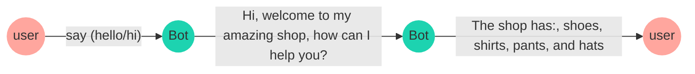
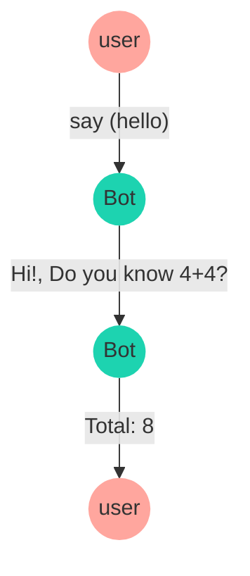

export const description =
  'In this guide, we will talk about what happens when something goes wrong while you work with the API.'

# Features

## addKeyword

This function is imported from *@bot-whastapp/bot*, allows to start a conversation based on the given settings.

The function `addKeyword` is the starting point of a conversation flow, just need to pass an __array of keywords__,
when someone text those keywords in the chatbot, the function will trigger the predefined dialog you have set up.

In the following example is stablished a conversation flow that received the keywords 'hello' and 'hi',
then the chatbot will send a message using `addAnswer` with the text 'Hi, welcome to my amazing shop, how can I help you?'
and 'The shop offers: shoes, shirts, pants, and hats'.


<CodeGroup>
```ts {{ title: 'app.ts' }}
  import { addKeyword } from '@bot-whatsapp/bot';

  const mainFlow = addKeyword(['hello', 'hi'])
      .addAnswer(['Hi, welcome to my amazing shop', 'how can I help you?'])
      .addAnswer(['The shop has: ', 'shoes, shirts, pants, and hats'])
```
```js {{ title: 'app.js' }}
  import { addKeyword } from '@bot-whatsapp/bot';

  const mainFlow = addKeyword(['hello', 'hi'])
      .addAnswer(['Hi, welcome to my amazing shop', 'how can I help you?'])
      .addAnswer(['The shop has: ', 'shoes, shirts, pants, and hats'])
```
</CodeGroup>



---

<Note>
The addKeywords function also has a number of properiedaes that will help you solve different use cases.
Some of these functions are: [regex](/add-functions#regex), [sensitive](/add-functions#sensitive)
</Note>

The conversation flow can be limited to a specific __keyword__, in example the word 'purchase' to trigger the next dialog

<CodeGroup>
```ts {{ title: 'app.ts' }}
  import { addKeyword } from '@bot-whatsapp/bot';

  const mainFlow = addKeyword('buy')
      .addAnswer(['Great! ', 'What do you want to buy?'])
```
```js {{ title: 'app.js' }}
  import { addKeyword } from '@bot-whatsapp/bot';

  const mainFlow = addKeyword('purchase')
      .addAnswer(['Great! ', 'What do you want to buy?'])
```
</CodeGroup>


## Regex {{ not:'true'}} 

The chatbot supports regex validation, in the following example an object is passed as the second parameter to the `addKeyword` function, the object has a property `regex` set to `true` and the __keywords__ property is a regex pattern.

<CodeGroup>
```ts {{ title: 'app.ts' }}
  import { addKeyword } from '@bot-whatsapp/bot';

  const REGEX_CREDIT_CARD = `/(^4[0-9]{12}(?:[0-9]{3})?$)|(^(?:5[1-5][0-9]{2}|222[1-9]|22[3-9][0-9]|2[3-6][0-9]{2}|27[01][0-9]|2720)[0-9]{12}$)|(3[47][0-9]{13})|(^3(?:0[0-5]|[68][0-9])[0-9]{11}$)|(^6(?:011|5[0-9]{2})[0-9]{12}$)|(^(?:2131|1800|35\d{3})\d{11}$)/gm`;

  const mainFlow = addKeyword(REGEX_CREDIT_CARD, { regex: true })
      .addAnswer(`This seems to be a valid credit card number`)
      .addAnswer(`That's it, your credit card has been validated`)
```
```js {{ title: 'app.js' }}
  import { addKeyword } from '@bot-whatsapp/bot';

  const REGEX_CREDIT_CARD = `/(^4[0-9]{12}(?:[0-9]{3})?$)|(^(?:5[1-5][0-9]{2}|222[1-9]|22[3-9][0-9]|2[3-6][0-9]{2}|27[01][0-9]|2720)[0-9]{12}$)|(3[47][0-9]{13})|(^3(?:0[0-5]|[68][0-9])[0-9]{11}$)|(^6(?:011|5[0-9]{2})[0-9]{12}$)|(^(?:2131|1800|35\d{3})\d{11}$)/gm`;

  const mainFlow = addKeyword(REGEX_CREDIT_CARD, { regex: true })
      .addAnswer(`This seems to be a valid credit card number`)
      .addAnswer(`That's it, your credit card has been validated`)
```
</CodeGroup>

## Sensitive {{ not:'true'}} 

The chatbot detects an specific keyword in any part of a message, but passing the `sensitive` property as `true` the chatbot will trigger the dialog if the user write down the exact same __keyword__.
Please follow the next example:

<CodeGroup>
```ts {{ title: 'app.ts' }}
  import { addKeyword } from '@bot-whatsapp/bot';

  const mainFlow = addKeyword('buy', { sensitive: true })
      .addAnswer(['Great! ', 'What do you want to buy?'])
```
```js {{ title: 'app.js' }}
  import { addKeyword } from '@bot-whatsapp/bot';

  const mainFlow = addKeyword('buy', { sensitive: true })
      .addAnswer(['Great! ', 'What do you want to buy?'])
```
</CodeGroup>

---

## addAnswer

This function is imported from *@bot-whastapp/bot*.

The function `addAnswer` is used to send a message to the user, it can be a simple text or a file attached.

In the following example is stablished a conversation flow that received the keyword 'hello',
then the chatbot will send a message using `addAnswer` with the text __'Hi, welcome to my amazing shop, how can I help you?'__

<CodeGroup>
```ts {{ title: 'app.ts' }}
  import { addKeyword, addAnswer } from '@bot-whatsapp/bot';

  const mainFlow = addKeyword('hello')
      .addAnswer('Hi, welcome to my amazing shop, how can I help you?')
```
```js {{ title: 'app.js' }}
  import { addKeyword, addAnswer } from '@bot-whatsapp/bot';

  const mainFlow = addKeyword('hello')
      .addAnswer('Hi, welcome to my amazing shop, how can I help you?')
``` 
</CodeGroup>

<Note>
There are different settings for sending messages, some functions such as sending files, images, video, delays, line breaks:
[line breaks](/add-functions#send-consecutive-messages), [consecutive](/add-functions#send-consecutive-messages), [delay](/add-functions#message-with-delay)
, [callback](/add-functions#message-with-callback)
</Note>

## Send consecutive messages {{ not:'true'}} 

The chatbot can send multiple messages just adding the `addAnswer` function one after another.
In the following example the chatbot will send (3) messages __'Hi'__, __'Welcome to my amazing shop'__ and __'how can I help you?'__ in that order.

<CodeGroup>
```ts {{ title: 'app.ts' }}
  import { addKeyword, addAnswer } from '@bot-whatsapp/bot';

  const mainFlow = addKeyword('hello')
      .addAnswer('Hi')
      .addAnwer('Welcome to my amazing shop')
      .addAnswer('how can I help you?')
```
```js {{ title: 'app.js' }}
  import { addKeyword, addAnswer } from '@bot-whatsapp/bot';

  const mainFlow = addKeyword('hello')
      .addAnswer('Hi')
      .addAnwer('Welcome to my amazing shop')
      .addAnswer('how can I help you?')
```
</CodeGroup>

## Send message with line breaks {{ not:'true'}} 

Whenever you need to send a message with line breaks, you can use an array of string as you can see in the following example.

<CodeGroup>
```ts {{ title: 'app.ts' }}
  import { addKeyword, addAnswer } from '@bot-whatsapp/bot';

  const mainFlow = addKeyword('hello')
      .addAnswer(['Hi', 'Welcome to my amazing shop', 'how can I help you?'])
```
```js {{ title: 'app.js' }}
  import { addKeyword, addAnswer } from '@bot-whatsapp/bot';

  const mainFlow = addKeyword('hello')
      .addAnswer(['Hi', 'Welcome to my amazing shop', 'how can I help you?'])
``` 
</CodeGroup>

## Message with delay {{ not:'true'}} 

The chatbot can send a message with a delay, just add the `addAnswer` function with the `delay` property set to the amount of milliseconds you want to wait before sending the message.

<CodeGroup>
```ts {{ title: 'app.ts' }}
  import { addKeyword, addAnswer } from '@bot-whatsapp/bot';

  const mainFlow = addKeyword('hello')
      .addAnswer('This message will after 2 seconds', { delay: 2000 })
```
```js {{ title: 'app.js' }}
  import { addKeyword, addAnswer } from '@bot-whatsapp/bot';

  const mainFlow = addKeyword('hello')
      .addAnswer('This message will after 2 seconds', { delay: 2000 })
``` 
</CodeGroup>

## Message with callback {{ not:'true'}} 

When using callback functions in an addAnswers the operation prioritizes the sending of the message and then the execution of the function.


<CodeGroup>
```ts {{ title: 'app.ts' }}
  import { addKeyword, addAnswer } from '@bot-whatsapp/bot';

  const mainFlow = addKeyword('hello')
      .addAnswer('Hi!, Do you know 4+4?', null, async (_, {flowDynamic}) => {
          const sum = 4 + 4
          await flowDynamic(`Total: ${sum}`)
      })
```
```js {{ title: 'app.js' }}
  import { addKeyword, addAnswer } from '@bot-whatsapp/bot';

  const mainFlow = addKeyword('hello')
      .addAnswer('This message will after 2 seconds', { delay: 2000 })
``` 
</CodeGroup>



---

## addAction

This function is imported from *@bot-whastapp/bot*.

The function `addAction` is used to define specific actions as a response when a whatsapp message has been received, 
this function allows to trigger conversation flows based on the user's input and define how the chatbot should act.

In the folowing example you can see how you can trigger a function when the user sends a message with the keyword 'buy'.

<CodeGroup>
```ts {{ title: 'app.ts' }}
  import { addKeyword, addAction } from '@bot-whatsapp/bot';

  const mainFlow = addKeyword('buy')
      .addAnswer('Great! What do you want to buy?')
      .addAction(async (_, { fowDynamic }): void => {
          return console.log('The user wants to buy something');
      })
```
```js {{ title: 'app.js' }}
  import { addKeyword, addAction } from '@bot-whatsapp/bot';

  const mainFlow = addKeyword('buy')
      .addAnswer('Great! What do you want to buy?')
      .addAction(async (_, { fowDynamic }) => {
          return console.log('The user wants to buy something');
      })
```
</CodeGroup>


You can use the `addAction` function with `capture` as you can see in the example below

<CodeGroup>
```ts {{ title: 'app.ts' }}
  import { addKeyword, addAction } from '@bot-whatsapp/bot';

  const mainFlow = addKeyword(['Hello', 'Hi'])
      .addAction(async (_, { fowDynamic }): void => {
          return flowDynamic('Hi! how can I help you?');
      })
      .addAction({ capture: true }, async (ctx, { fowDynamic, state }): void => {
          await state.udpate({ name: ctx.body})
          return console.flowDynamic(`The user said: ${ctx.body}`);
      })
```
```js {{ title: 'app.js' }}
  import { addKeyword, addAction } from '@bot-whatsapp/bot';

  const mainFlow = addKeyword(['Hello', 'Hi'])
      .addAction(async (_, { fowDynamic }) => {
          return flowDynamic('The user wants to buy something');
      })
```
</CodeGroup>

### Example 1

In this example, we have created a conversation flow using the keyword 'Hello' and 'Hi'.

When the user text one of these keywords the chatbot will send a greeting message and 
the chatbot will capture the user's response and send back the same repeated message to the user.

We hope this will help you to get the main idea of how to use the `addAction` function on your whatsapp chatbot.
If you have any questions, please let us know.

<CodeGroup>
```ts {{ title: 'app.ts' }}
  import { addKeyword, addAction } from '@bot-whatsapp/bot';

  const mainFlow = addKeyword(['Hola', 'Hi'])
      .addAction(async (_, { fowDynamic }): void => {
          return flowDynamic('Hi! This is Luis, how can I help you?');
      })  
      .addAction(async (_, { fowDynamic }): void => {
          const message = ctx.body;
          return console.flowDynamic(`The user said: ${message}`);
      })
```
```js {{ title: 'app.js' }}
  import { addKeyword, addAction } from '@bot-whatsapp/bot';

  const mainFlow = addKeyword(['Hola', 'Hi'])
      .addAction(async (_, { fowDynamic }) => {
          return flowDynamic('Hi! This is Luis, how can I help you?');
      })  
      .addAction(async (_, { fowDynamic }) => {
          const message = ctx.body;
          return console.flowDynamic(`The user said: ${message}`);
      })
```
</CodeGroup>

<Note>
The `addAction` function is a powerful tool to trigger specific actions when the user sends a message with a specific keyword,
so we strongly recommend to use it for more complex logic than just sending a message to the user.
</Note>

### Example 2

In the following example, we have created some conversation flows using 


```ts {{ title: 'app.ts' }}
  import { addKeyword, addAction } from '@bot-whatsapp/bot';

  // Create main flow
  const mainFlow = addKeyword(['Hello', 'Hi'])
    .addAction(async (_, { fowDynamic }) => {
        return flowDynamic('Hi, this is Luis, how can I help you?');
    });

  // Create a product request flow
  const productRequestFlow = addKeyword(['product'])
    .addAction(async (_, { fowDynamic }) => {
        return flowDynamic('Great! What do you want to buy?');
    })

  // Create support flow
  const suportFlow = addKeyword(['Hello', 'Hi'])
    .addAction(async (_, { fowDynamic }) => {
        return flowDynamic('Hi, may you describe your issue?');
    });

  // Create another request flow
  const anotherRequestFlow = addKeyword(['request'])
    .addAction(async (_, { fowDynamic }) => {
      return flowDynamic('Please specify the request you want to make');
    });

  // Create help flow
  const helpFlow = addKeyword(['help'])
    .addAction({ capture: true }, async (ctx, { fowDynamic }) => {
      const option = parseInt(ctx.body);
      switch (option) {
        case 1:
          return flowDynamic('You can buy a product by typing the word "product"');
        case 2:
          return flowDynamic('You can request a service by typing the word "request"');
        case 3:
          return flowDynamic('You can ask for support by typing the word "support"');
        default:
          return flowDynamic('I did not understand your request');
      }
    });

  // Create bot and add flows
  const bot = createBot([mainFlow, productRequestFlow, suportFlow, anotherRequestFlow, helpFlow]);
```

---
