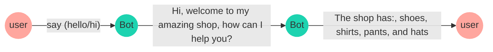
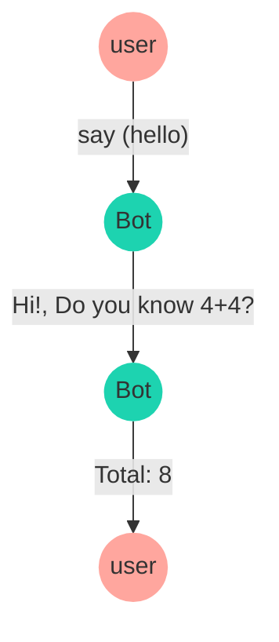

import { Contributors } from '@/components/Contributors'
import { Resources } from '@/components/Resources'
import { Guides } from '@/components/Guides'

export const description =
  'In this guide, we will talk about what happens when something goes wrong while you work with the API.'

# Features

These are the most important functions that you should learn when creating flows or dynamic interactions with the bot

## Add keyword

__`addKeyword`__  is the starting point of a conversation flow, just need to pass an __array of keywords__,
when someone text those keywords in the chatbot, the function will trigger the predefined dialog you have set up.

In the following example is stablished a conversation flow that received the keywords 'hello' and 'hi',
then the chatbot will send a message using `addAnswer` with the text 'Hi, welcome to my amazing shop, how can I help you?'
and 'The shop offers: shoes, shirts, pants, and hats'.

<Note>
The addKeywords function also has a number of proprieties that will help you solve different use cases.
Some of these functions are: [regex](add-functions#regex), [sensitive](add-functions#sensitive)
</Note>


<CodeGroup>
```ts {{ title: 'app.ts' }}
  import { addKeyword } from '@builderbot/bot';

  const mainFlow = addKeyword(['hello', 'hi'])
      .addAnswer(['Hi, welcome to my amazing shop', 'how can I help you?'])
      .addAnswer(['The shop has: ', 'shoes, shirts, pants, and hats'])
```
```js {{ title: 'app.js' }}
  import { addKeyword } from '@builderbot/bot';

  const mainFlow = addKeyword(['hello', 'hi'])
      .addAnswer(['Hi, welcome to my amazing shop', 'how can I help you?'])
      .addAnswer(['The shop has: ', 'shoes, shirts, pants, and hats'])
```
</CodeGroup>





The conversation flow can be limited to a specific __keyword__, in example the word 'purchase' to trigger the next dialog

<CodeGroup>
```ts {{ title: 'app.ts' }}
  import { addKeyword } from '@builderbot/bot';

  const mainFlow = addKeyword('buy')
      .addAnswer(['Great! ', 'What do you want to buy?'])
```
```js {{ title: 'app.js' }}
  import { addKeyword } from '@builderbot/bot';

  const mainFlow = addKeyword('purchase')
      .addAnswer(['Great! ', 'What do you want to buy?'])
```
</CodeGroup>

---

## Regex {{ not:'true', tag:'addKeyword' }}

<Row>
  <Col>
The chatbot supports regex validation, in the following example an object is passed as the second parameter to the addKeyword function, the object has a property regex set to true and the keywords property is a regex pattern.

  </Col>
  <Col sticky>
<CodeGroup>
```ts {{ title: 'app.ts' }}
  import { addKeyword } from '@builderbot/bot';

  const REGEX_GMAIL_EMAIL = /(\w+)@gmail\.com/g;

  const mainFlow = addKeyword(REGEX_GMAIL_EMAIL, 
      { regex: true })
      .addAnswer(`Thanks for the gmail address`)
```
```js {{ title: 'app.js' }}
  import { addKeyword } from '@builderbot/bot';

  const REGEX_GMAIL_EMAIL = /(\w+)@gmail\.com/g;

  const mainFlow = addKeyword(REGEX_GMAIL_EMAIL, 
      { regex: true })
      .addAnswer(`Thanks for the gmail address`)
```
</CodeGroup>

  </Col>
</Row>

## Sensitive {{ not:'true', tag:'addKeyword' }}

<Row>
  <Col>
The chatbot detects an specific keyword in any part of a message, but passing the `sensitive` property as `true` the chatbot will trigger the dialog if the user write down the exact same __keyword__.

  </Col>
  <Col sticky>
<CodeGroup>
```ts {{ title: 'app.ts' }}
  import { addKeyword } from '@builderbot/bot';

  const mainFlow = addKeyword('buy', { sensitive: true })
      .addAnswer(['Great! ', 'What do you want to buy?'])
```
```js {{ title: 'app.js' }}
  import { addKeyword } from '@builderbot/bot';

  const mainFlow = addKeyword('buy', { sensitive: true })
      .addAnswer(['Great! ', 'What do you want to buy?'])
```
</CodeGroup>

  </Col>
</Row>

---

## Add answer

__`addAnswer`__ is used to send a message to the user, it can be a simple text or a file attached. 
In the following example is stablished a conversation flow that received the keyword 'hello',
then the chatbot will send a message using `addAnswer` with the text __'Hi, welcome to my amazing shop, how can I help you?'__

<CodeGroup>
```ts {{ title: 'app.ts' }}
  import { addKeyword, addAnswer } from '@builderbot/bot';

  const mainFlow = addKeyword('hello')
      .addAnswer('Hi, welcome to my amazing shop, how can I help you?')
```
```js {{ title: 'app.js' }}
  import { addKeyword, addAnswer } from '@builderbot/bot';

  const mainFlow = addKeyword('hello')
      .addAnswer('Hi, welcome to my amazing shop, how can I help you?')
``` 
</CodeGroup>

<Note>
There are different settings for sending messages, some functions such as sending files, images, video, delays, line breaks:
[line breaks](/add-functions#send-consecutive-messages), [consecutive](/add-functions#send-consecutive-messages), [delay](/add-functions#message-with-delay)
, [callback](/add-functions#message-with-callback)
</Note>

---

## Consecutive Messages {{ not:'true', tag:'addAnswer' }}

<Row>
  <Col>
The chatbot can send multiple messages just adding the addAnswer function one after another. In the following example the chatbot will send (3) messages:
`Hi`, `Welcome to my amazing shop`, `how can I help you?` in that order.

  </Col>
  <Col sticky>
<CodeGroup>
```ts {{ title: 'app.ts' }}
  import { addKeyword, addAnswer } from '@builderbot/bot';

  const mainFlow = addKeyword('hello')
      .addAnswer('Hi')
      .addAnswer('Welcome to my amazing shop')
      .addAnswer('how can I help you?')
```
```js {{ title: 'app.js' }}
  import { addKeyword, addAnswer } from '@builderbot/bot';

  const mainFlow = addKeyword('hello')
      .addAnswer('Hi')
      .addAnswer('Welcome to my amazing shop')
      .addAnswer('how can I help you?')
```
</CodeGroup>

  </Col>
</Row>

## Message with line breaks {{ not:'true', tag:'addAnswer' }}

<Row>
  <Col>
Whenever you need to send a message with line breaks, you can use an array of string as you can see in the following example.
  </Col>
  <Col sticky>
<CodeGroup>
```ts {{ title: 'app.ts' }}
  import { addKeyword, addAnswer } from '@builderbot/bot';

  const mainFlow = addKeyword('hello')
      .addAnswer([
        'Hi', 'Welcome to my amazing shop', 
        'how can I help you?'
      ])
```
```js {{ title: 'app.js' }}
  import { addKeyword, addAnswer } from '@builderbot/bot';

  const mainFlow = addKeyword('hello')
      .addAnswer([
        'Hi', 'Welcome to my amazing shop', 
        'how can I help you?'
      ])
``` 
</CodeGroup>

  </Col>
</Row>

## Message with delay {{ not:'true', tag:'addAnswer' }}

<Row>
  <Col>
The chatbot can send a message with a `delay`, just add the addAnswer function with the delay property set to the amount of milliseconds you want to wait before sending the message.
  </Col>
  <Col sticky>
<CodeGroup>
```ts {{ title: 'app.ts' }}
import { addKeyword, addAnswer } from '@builderbot/bot';

const mainFlow = addKeyword('hello')
  .addAnswer('This message will after 2 seconds',
    { delay: 2000 }
  )
```
```js {{ title: 'app.js' }}
import { addKeyword, addAnswer } from '@builderbot/bot';

const mainFlow = addKeyword('hello')
  .addAnswer('This message will after 2 seconds',
    { delay: 2000 }
  )
``` 
</CodeGroup>

  </Col>
</Row>

---

## Message with callback {{ not:'true'}} 

When using callback functions in an addAnswers the operation prioritizes the sending of the message and then the execution of the function.

<CodeGroup>
```ts {{ title: 'app.ts' }}
  import { addKeyword, addAnswer } from '@builderbot/bot';

  const mainFlow = addKeyword('hello')
      .addAnswer('Hi!, Do you know 4+4?', null, async (_, {flowDynamic}) => {
          const sum = 4 + 4
          await flowDynamic(`Total: ${sum}`)
      })
      .addAction(async (_, {flowDynamic}) => {
          await flowDynamic(`Other message`)
      })
```
```js {{ title: 'app.js' }}
  import { addKeyword, addAnswer } from '@builderbot/bot';

  const mainFlow = addKeyword('hello')
      .addAnswer('Hi!, Do you know 4+4?', null, async (_, {flowDynamic}) => {
          const sum = 4 + 4
          await flowDynamic(`Total: ${sum}`)
      })
      .addAction(async (_, {flowDynamic}) => {
          await flowDynamic(`Other message`)
      })
``` 
</CodeGroup>



---

## Add Action

__`addAction`__ is used to define specific actions as a response when a whatsapp message has been received, 
this function allows to trigger conversation flows based on the user's input and define how the chatbot should act.

In the folowing example you can see how you can trigger a function when the user sends a message with the keyword 'buy'.

<CodeGroup>
```ts {{ title: 'app.ts' }}
  import { addKeyword, addAction } from '@builderbot/bot';

  const mainFlow = addKeyword('buy')
      .addAnswer('Great! What do you want to buy?')
      .addAction(async (_, { fowDynamic }): void => {
          return console.log('The user wants to buy something');
      })
```
```js {{ title: 'app.js' }}
  import { addKeyword, addAction } from '@builderbot/bot';

  const mainFlow = addKeyword('buy')
      .addAnswer('Great! What do you want to buy?')
      .addAction(async (_, { fowDynamic }) => {
          return console.log('The user wants to buy something');
      })
```
</CodeGroup>


You can use the `addAction` function with `capture` as you can see in the example below

<CodeGroup>
```ts {{ title: 'app.ts' }}
  import { addKeyword, addAction } from '@builderbot/bot';

  const mainFlow = addKeyword(['Hello', 'Hi'])
      .addAction(async (_, { fowDynamic }): void => {
          return flowDynamic('Hi! how can I help you?');
      })
      .addAction({ capture: true }, async (ctx, { fowDynamic, state }): void => {
          await state.udpate({ name: ctx.body})
          return console.flowDynamic(`The user said: ${ctx.body}`);
      })
```
```js {{ title: 'app.js' }}
  import { addKeyword, addAction } from '@builderbot/bot';

  const mainFlow = addKeyword(['Hello', 'Hi'])
      .addAction(async (_, { fowDynamic }) => {
          return flowDynamic('The user wants to buy something');
      })
```
</CodeGroup>

---

<Guides />

<Resources />

<Contributors users={['leifermendez','lualreye']} />