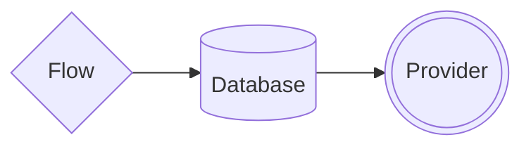

import { Contributors } from '@/components/Contributors'
import { Guides } from '@/components/Guides'
import { Resources } from '@/components/Resources'

export const description =
  'In this guide, we will talk about what happens when something goes wrong while you work with the API.'

# Concepts

The library is based on three key components for its correct functioning: the Flow, in charge of building the context of the conversation and offering a friendly interface to the developer; the Provider, which acts as a connector allowing to easily switch between WhatsApp providers without the risk of affecting other parts of the bot; and the Database, which in line with this connector philosophy, facilitates changing the data persistence layer without the need to rewrite the workflow.



---

## Flow

Refers to creating structured sequences of interactions, as in building conversation flows. Two key methods are addKeyword and addAnswer, which allow keywords to be associated with specific responses, providing options for customizing the conversation flow.

<CodeGroup>
```ts {{ title: 'app.ts' }}
import { addKeyword } from '@bot-whatsapp/bot'

addKeyword(['hello','hi']).addAnswer('Ey! welcome')
```

```js {{ title: 'app.js' }}
const { addKeyword } = require('@bot-whatsapp/bot') 

addKeyword(['hello','hi']).addAnswer('Ey! welcome')
```
</CodeGroup>


Some examples of how to use the addKeyword in which you can place the __keyword__ or a list of __keywords__ that will be used to start a conversational flow


```ts
// Example with single keyword
addKeyword('hello').addAnswer('Ey! welcome')

// Example with multi keywords
addKeyword(['hello','hi']).addAnswer('Ey! welcome')
```

For a quick understanding of the operation we have prepared a basic example of how to implement

<div className="not-prose aling-block">
  <Button
    href="/uses-cases"
    variant="text"
    arrow="right"
    children="View more examples"
  />
</div>

---

## Provider

It is a key piece used to deliver the message to the chosen supplier. In a case you are building a bot for whatsapp you should use an adapter like __Meta__, __Twilio__, __Baileys__, etc or even if you want to connect to Telegram.


<CodeGroup>
```ts {{ title: 'app.ts' }}
import { addKeyword, MemoryDB, createProvider, createFlow } from '@bot-whatsapp/bot'
import { BaileysProvider } from '@bot-whatsapp/provider-baileys'

// ...stuff code...

const main = async () => {
    
    await createBot({
        database: new MemoryDB(),
        provider: createProvider(BaileysProvider),
        flow: createFlow([flowDemo])
    })
}

main()
```

```ts {{ title: 'provider.wppconnect.ts' }}
import { addKeyword, MemoryDB, createProvider, createFlow } from '@bot-whatsapp/bot'
import { WPPConnectProviderClass } from '@bot-whatsapp/provider-wppconnect'

// ...stuff code...

const main = async () => {
    
    await createBot({
        database: new MemoryDB(),
        provider: createProvider(WPPConnectProviderClass),
        flow: createFlow([flowDemo])
    })
}

main()
```

```ts {{ title: 'provider.meta.ts' }}
import { addKeyword, MemoryDB, createProvider, createFlow } from '@bot-whatsapp/bot'
import { MetaProvider } from '@bot-whatsapp/provider-meta'

// ...stuff code...

const main = async () => {
    
    await createBot({
        database: new MemoryDB(),
        provider: createProvider(MetaProvider, {
              jwtToken: 'jwtToken',
              numberId: 'numberId',
              verifyToken: 'verifyToken',
              version: 'v16.0',
        }),
        flow: createFlow([flowDemo])
    })
}

main()
```
</CodeGroup>

<div className="not-prose aling-block">
  <Button
    href="/providers"
    variant="text"
    arrow="right"
    children="More information about the providers "
  />
</div>

---

## Database

Just as providers can be easily exchanged between adapters, we can do the same with the database. Now the important thing to understand is how it works. The main purpose of the database inside the bot is to provide the bot with a record of the different events that have occurred between different conversations.

It is ready to implement adapters from [Mongo](/databases#mongo), [MySQL](/databases#my-sql), [Postgres](/databases#postgres), among others.

<CodeGroup>
```ts {{ title: 'app.ts' }}
import { addKeyword, MemoryDB, createProvider, createFlow } from '@bot-whatsapp/bot'
import { BaileysProvider } from '@bot-whatsapp/provider-baileys'

// ...stuff code...

const main = async () => {
    
    await createBot({
        database: new MemoryDB(),
        provider: createProvider(BaileysProvider),
        flow: createFlow([flowDemo])
    })
}

main()
```

```ts {{ title: 'provider.wppconnect.ts' }}
import { addKeyword, MemoryDB, createProvider, createFlow } from '@bot-whatsapp/bot'
import { WPPConnectProviderClass } from '@bot-whatsapp/provider-wppconnect'

// ...stuff code...

const main = async () => {
    
    await createBot({
        database: new MemoryDB(),
        provider: createProvider(WPPConnectProviderClass),
        flow: createFlow([flowDemo])
    })
}

main()
```

```ts {{ title: 'provider.meta.ts' }}
import { addKeyword, MemoryDB, createProvider, createFlow } from '@bot-whatsapp/bot'
import { MetaProvider } from '@bot-whatsapp/provider-meta'

// ...stuff code...

const main = async () => {
    
    await createBot({
        database: new MemoryDB(),
        provider: createProvider(MetaProvider, {
              jwtToken: 'jwtToken',
              numberId: 'numberId',
              verifyToken: 'verifyToken',
              version: 'v16.0',
        }),
        flow: createFlow([flowDemo])
    })
}

main()
```
</CodeGroup>

<div className="not-prose aling-block">
  <Button
    href="/databases"
    variant="text"
    arrow="right"
    children="More information about the databases "
  />
</div>

----

<Guides />

<Resources />

<Contributors users={['leifermendez']} />