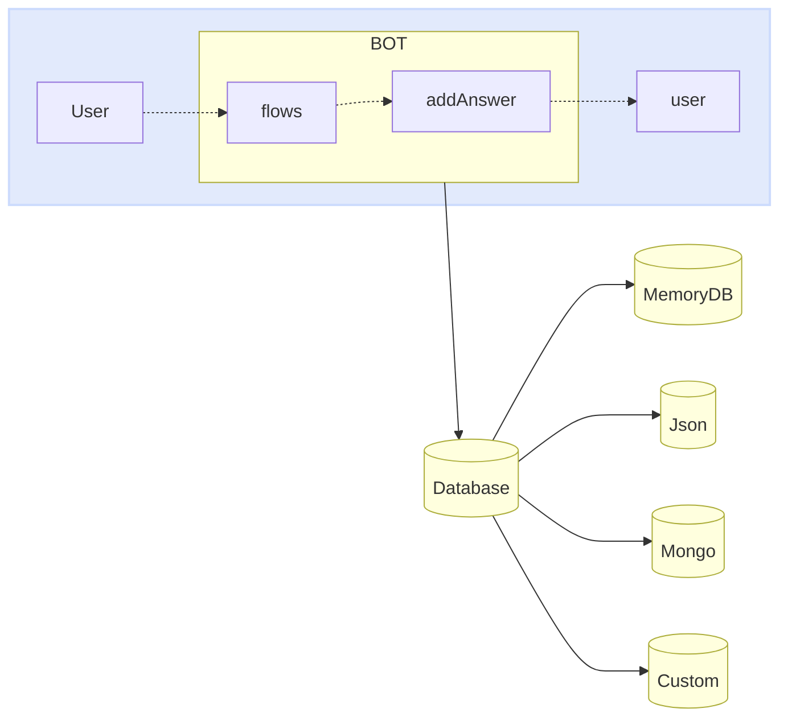

import { Contributors } from '@/components/Contributors'

export const description =
  'In this guide, we will talk about what happens when something goes wrong while you work with the API.'

# Databases

Just as providers can be easily exchanged between adapters, we can do the same with the database. Now the important thing to understand is how it works.
The main purpose of the database inside the bot is to provide the bot with a record of the different events that have occurred between different conversations.

Many people use it as a chat history (in fact, it can also be used for that purpose), but you may find strange data in your logs because it stores not only messages, but also events.


<Warning>
Connectors: [MemoryDB](databases#memory-db), [Json](databases#json), [Mongo](databases#mongo), [MySQL](databases#my-sql), [Postgres](databases#postgres), [Custom Database](databases#custom-database)
</Warning>




Each database may need to adjust the access keys, configuration, among other properties that will be implemented as configuration of the implemented class. 
<CodeGroup>
```ts {{ title: 'memory-database.ts' }}
import { MemoryDB } from "@builderbot/bot";

export type IDatabase = typeof MemoryDB
export const adapterDB = new MemoryDB();
```

```ts {{ title: 'json-database.ts' }}
import { JsonFileDB } from '@builderbot/database-json';

export type IDatabase = typeof JsonFileDB
export const adapterDB = new JsonFileDB({ filename: 'db.json' });
```

```ts {{ title: 'mongo-database.ts' }}
import { MongoDB } from '@builderbot/database-mongo'

export type IDatabase = typeof MongoDB
export const adapterDB = new MongoDB({
    dbUri: MONGO_DB_URI,
    dbName: MONGO_DB_NAME,
})
```

```ts {{ title: 'mysql-database.ts' }}
import { MysqlDB } from '@builderbot/database-mysql'

export type IDatabase = typeof MysqlDB
export const adapterDB = new MysqlDB({
    host: MYSQL_DB_HOST,
    user: MYSQL_DB_USER,
    database: MYSQL_DB_NAME,
    password: MYSQL_DB_PASSWORD,
})
```

```ts {{ title: 'postgres-database.ts' }}
import { PostgreSQLDB } from '@builderbot/database-postgres'

export type IDatabase = typeof PostgreSQLDB
export const adapterDB = new PostgreSQLDB({
    host: POSTGRES_DB_HOST,
    user: POSTGRES_DB_USER,
    database: POSTGRES_DB_NAME,
    password: POSTGRES_DB_PASSWORD,
    port: +POSTGRES_DB_PORT,
})
```

</CodeGroup>

Below you will find more information about each of these databases.

---

## Memory

The Memory database, often called a Mock database, operates without storing bot-generated responses and needs no configuration. Primarily used for testing and development, it offers a lightweight and convenient solution. This database type is ideal for scenarios where data persistence isn't necessary, facilitating quick prototyping and efficient debugging without managing persistent data storage overhead.

<CodeGroup>
```ts {{ title: 'memory-database.ts' }}
import { MemoryDB } from "@builderbot/bot";

export type IDatabase = typeof MemoryDB
export const adapterDB = new MemoryDB();
```
```ts {{ title: 'app.ts' }}
import { createBot, createProvider, createFlow, addKeyword } from '@builderbot/bot'
import { IProvider, adapterProvider } from './meta-provider';
import { IDatabase, adapterDB } from './memory-database';

const welcomeFlow = addKeyword<IProvider, IDatabase>(['hello', 'hi']).addAnswer('Ey! welcome')

const main = async () => {
    await createBot({
        flow: createFlow([welcomeFlow]),
        provider: adapterProvider,
        database: adapterDB
    })
}

main()
```
</CodeGroup>

---

## Json

[JSON](https://www.json.org/) database provides the benefit of securely storing bot-generated responses in a local file, ensuring durability across sessions. Utilizing this database type requires specifying a file path (`filename`) where the JSON data will be stored. It proves particularly valuable when preserving conversation history or user interactions is imperative.
By enabling structured data storage, it simplifies data retrieval and analysis, rendering it appropriate for applications where data persistence and retrieval play a critical role.

<CodeGroup>
```ts {{ title: 'json-database.ts' }}
import { JsonFileDB } from '@builderbot/database-json';

export type IDatabase = typeof JsonFileDB
export const adapterDB = new JsonFileDB({ filename: 'db.json' });
```
```ts {{ title: 'app.ts' }}
import { createBot, createProvider, createFlow, addKeyword } from '@builderbot/bot'
import { IDatabase, adapterDB } from './json-database';
import { IProvider, adapterProvider } from './twilio-provider';

const welcomeFlow = addKeyword<IProvider, IDatabase>(['hello', 'hi']).addAnswer('Ey! welcome')

const main = async () => {
    await createBot({
        flow: createFlow([welcomeFlow]),
        provider: adapterProvider,
        database: adapterDB
    })
}

main()
```
</CodeGroup>

---

## Mongo

[MongoDB](https://www.mongodb.com/en/what-is-mongodb) strength lies in its flexible document-oriented structure, which requires configuration parameters like the database URI and name (`dbUri`, `dbName`). Its scalable architecture provides robust storage capabilities, ideal for handling large data volumes.

By embracing a NoSQL approach, MongoDB offers flexibility in schema design, effortlessly accommodating evolving application needs. It proves particularly suitable for environments requiring high-performance data storage and retrieval, thanks to its efficient indexing and querying functionalities.

<CodeGroup>
```ts {{ title: 'mongo-database.ts' }}
import { MongoDB } from '@builderbot/database-mongo'

export type IDatabase = typeof MongoDB
export const adapterDB = new MongoDB({
    dbUri: MONGO_DB_URI,
    dbName: MONGO_DB_NAME,
})
```
```ts {{ title: 'app.ts' }}
import { createBot, createProvider, createFlow, addKeyword, MemoryDB } from '@builderbot/bot'
import { IProvider, adapterProvider } from './baileys-provider';
import { IDatabase, adapterDB } from './mongo-database';

const welcomeFlow = addKeyword<IProvider, IDatabase>(['hello', 'hi']).addAnswer('Ey! welcome')

const main = async () => {
    await createBot({
        flow: createFlow([welcomeFlow]),
        provider: adapterProvider,
        database: adapterDB
    })
}

main()
```
</CodeGroup>

---

## MySQL

[MySQL](https://www.mysql.com/) database, a widely embraced relational database management system, provides strong data storage capabilities for storing bot-generated responses. When integrating with MySQL, essential parameters such as `host`, `user`, `password`, and the `database` name must be specified. This database variant assures data durability and scalability, rendering it well-suited for applications demanding high-performance data storage and retrieval.

With MySQL, developers can harness advanced querying features and transaction support, facilitating efficient management of bot-generated data within a structured and secure framework.

<CodeGroup>
```ts {{ title: 'mysql-database.ts' }}
import { MysqlDB } from '@builderbot/database-mysql'

export type IDatabase = typeof MysqlDB
export const adapterDB = new MysqlDB({
    host: MYSQL_DB_HOST,
    user: MYSQL_DB_USER,
    database: MYSQL_DB_NAME,
    password: MYSQL_DB_PASSWORD,
})
```
```ts {{ title: 'app.ts' }}
import { createBot, createProvider, createFlow, addKeyword, MemoryDB } from '@builderbot/bot'
import { IProvider, adapterProvider } from './venom-provider';
import { IDatabase, adapterDB } from './mysql-database';

const welcomeFlow = addKeyword<IProvider, IDatabase>(['hello', 'hi']).addAnswer('Ey! welcome')

const main = async () => {
    await createBot({
        flow: createFlow([welcomeFlow]),
        provider: adapterProvider,
        database: adapterDB
    })
}

main()
```
</CodeGroup>

---

## Postgres

[PostgreSQL](https://www.postgresql.org/) database, celebrated for its reliability and cutting-edge features, presents formidable data storage solutions for bot-generated responses. Seamless integration with PostgreSQL entails specifying vital parameters such as `host`, `user`, `password`, `database` name, and `port`. This database variant guarantees data integrity and scalability, rendering it optimal for applications requiring top-tier data storage and retrieval performance.

PostgreSQL's flexible architecture and endorsement of advanced data types empower developers to craft sophisticated bots endowed with extensive functionality. Leveraging PostgreSQL equips developers with potent querying capabilities, transactional support, and comprehensive data management features, fostering the creation of resilient and efficient bot systems.

<CodeGroup>
```ts {{ title: 'postgres-database.ts' }}
import { PostgreSQLDB } from '@builderbot/database-postgres'

export type IDatabase = typeof PostgreSQLDB
export const adapterDB = new PostgreSQLDB({
    host: POSTGRES_DB_HOST,
    user: POSTGRES_DB_USER,
    database: POSTGRES_DB_NAME,
    password: POSTGRES_DB_PASSWORD,
    port: +POSTGRES_DB_PORT,
})
```
```ts {{ title: 'app.ts' }}
import { createBot, createProvider, createFlow, addKeyword, MemoryDB } from '@builderbot/bot'
import { IProvider, adapterProvider } from './wppconnect-provider';
import { IDatabase, adapterDB } from './postgres-database';

const welcomeFlow = addKeyword<IProvider, IDatabase>(['hello', 'hi']).addAnswer('Ey! welcome')

const main = async () => {
    await createBot({
        flow: createFlow([welcomeFlow]),
        provider: adapterProvider,
        database: adapterDB
    })
}

main()
```
</CodeGroup>

---

## Custom Database {{label:'Firebase Database Adapter'}}

Custom database connector there is the possibility to build your own customized adapter, 
we know that there are many more database providers that can be very useful, an example can be [Firebase Console](https://firebase.google.com/docs/database/rest/start?hl=es-419) which apart from giving us the possibility to interact via API Rest also offers a Dashboard to visualize your data.

<CodeGroup>
```ts {{ title: 'app.ts' }}
import { createBot, createProvider, createFlow, addKeyword } from '@builderbot/bot'
import { BaileysProvider as Provider } from '@builderbot/provider-baileys'
import { FirebaseAdapter } from './database/firebase'

const PORT = process.env.PORT ?? 3008

const welcomeFlow = addKeyword<Provider, FirebaseAdapter>(['hi'])
    .addAnswer('Ey! welcome')


const main = async () => {
    const adapterFlow = createFlow([welcomeFlow])

    const adapterProvider = createProvider(Provider)
    const adapterDB = new FirebaseAdapter({
        databaseURL: 'YOUR URL FIREBASE REALTIME DATABASE',
        pathPrivateKeyJson: "YOUR PATH CREDENTIALS JSON FIREBASE"
    })()

    const { httpServer } = await createBot({
        flow: adapterFlow,
        provider: adapterProvider,
        database: adapterDB,
    })

    httpServer(+PORT)
}

main()
```
```ts {{ title: 'database/firebase.ts' }}
import { MemoryDB } from '@builderbot/bot'
import firebase from "firebase-admin"
import { Database } from 'firebase-admin/lib/database/database'
import type { FirebaseAdapterCredentials } from './types'

class FirebaseAdapter extends MemoryDB {
    db: Database
    private table = 'history'
    listHistory = []

    /**
     * Constructs a new FirebaseAdapter instance.
     * @param {FirebaseAdapterCredentials} credentials
     */
    constructor(private credentials: FirebaseAdapterCredentials) {
        super()
        this.init().then().catch((e) => throw new Error(e?.message))
    }

    /**
     * Initializes the Firebase connection and checks for the existence of the specified table.
     * @returns {Promise<void>} - A Promise that resolves when the initialization is complete.
     */
    async init(): Promise<void> {
        const cert = await import(this.credentials.pathPrivateKeyJson)
        firebase.initializeApp({
            credential: firebase.credential.cert(cert),
            databaseURL: this.credentials.databaseURL
          
        });
          
        this.db = firebase.database()
        await this.checkTableExists()
    }

    /**
     * Retrieves the previous entry based on the provided key.
     * @param {any} from - The key to start the search from.
     * @returns {Promise<any>} - A Promise that resolves with the previous entry.
     */
    getPrevByNumber = async (from: any): Promise<any> => {
        return await new Promise((resolve, reject) => {
            this.db.ref(this.table).endBefore(from).limitToLast(1).once('value', (snapshot) => {
                if (snapshot.exists()) {
                    resolve(Object.values(snapshot.val())[0]);
                } else {
                    reject('No se encontraron datos previos.');
                }
            }, (error) => {
                reject(error);
            });
        })
    }

    /**
     * Saves data to the Firebase database.
     * @param {Object} ctx - The data to be saved.
     * @returns {Promise<void>} - A Promise that resolves when the data is successfully saved.
     */
    save = async (ctx: {
        ref: string
        keyword: string
        answer: any
        refSerialize: string
        from: string
        options: any
    }): Promise<void> => {
        this.db.ref(this.table).push(ctx, (error) => {
            if (error) {
                throw new Error(error.message)
            }
        })
    }

    /**
     * Creates the specified table in the Firebase database.
     * @returns {Promise<boolean>} - A Promise that resolves.
     */
    createTable = (): Promise<boolean> =>
        new Promise(async (resolve, reject) => {
            try {
                this.db.ref(this.table).push({
                        ref: '',
                        keyword: '',
                        answer: '',
                        refSerialize: '',
                        from: '',
                        options: null
                    }, (error) => {
                        reject(error?.message)
                    })
                resolve(true)
            } catch (error) {
                reject(error?.message)
            }
            
        })

    /**
     * Checks if the specified table exists in the Firebase database, and creates it if not.
     * @returns {Promise<any>} - A Promise that resolves
     */
    async checkTableExists(): Promise<any> {
        const ref = await this.db.ref(this.table).get()
        if (!ref.exists()) this.createTable()
        return true
    }
}

export { FirebaseAdapter }
```
```ts {{ title: 'database/types.ts' }}
export interface FirebaseAdapterCredentials {
    databaseURL: string;
    pathPrivateKeyJson: string
}

export interface HistoryRow {
    id: number
    ref: string
    keyword: string | null
    answer: string
    refSerialize: string
    phone: string
    options: string
    created_at: Date
}
```
</CodeGroup>

---

<Contributors users={['leifermendez', 'hhsm95', 'elimeleth']} />
