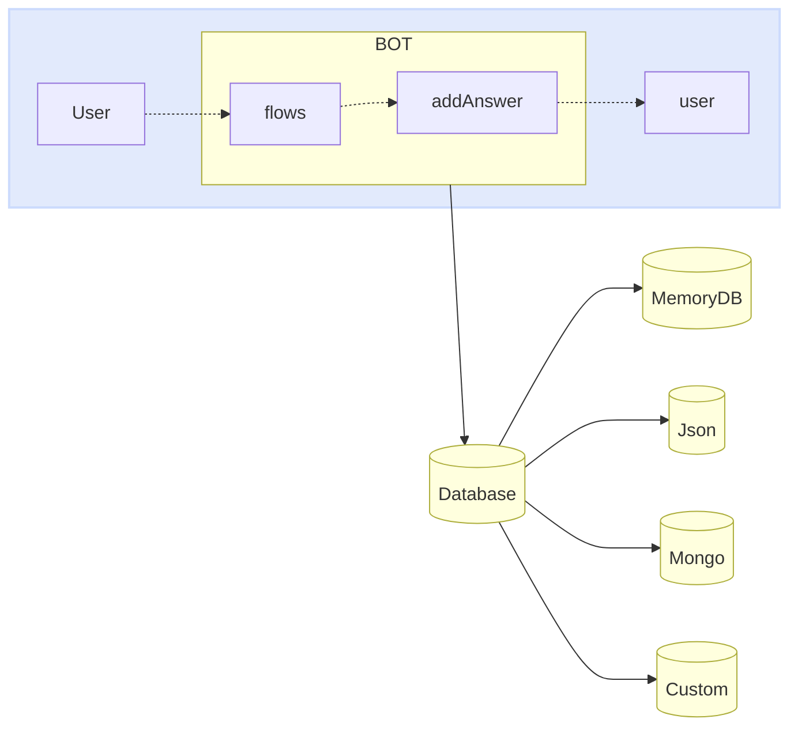

import { Contributors } from '@/components/Contributors'

export const description =
  'In this guide, we will talk about what happens when something goes wrong while you work with the API.'

# Databases

Just as providers can be easily exchanged between adapters, we can do the same with the database. Now the important thing to understand is how it works.
The main purpose of the database inside the bot is to provide the bot with a record of the different events that have occurred between different conversations.

Many people use it as a chat history (in fact, it can also be used for that purpose), but you may find strange data in your logs because it stores not only messages, but also events.


<Warning>
Connectors: [MemoryDB](databases#memory-db), [Json](databases#json), [Mongo](databases#mongo), [MySQL](databases#my-sql), [Postgres](databases#postgres)
</Warning>




Each database may need to adjust the access keys, configuration, among other properties that will be implemented as configuration of the implemented class. 
<CodeGroup>
```ts {{ title: 'memory-database.ts' }}
import { MemoryDB } from "@bot-whatsapp/bot";

export type IDatabase = typeof MemoryDB
export const adapterDB = new MemoryDB();
```

```ts {{ title: 'json-database.ts' }}
import { JsonFileDB } from '@bot-whatsapp/database-json';

export type IDatabase = typeof JsonFileDB
export const adapterDB = new JsonFileDB({ filename: 'db.json' });
```

```ts {{ title: 'mongo-database.ts' }}
import { MongoDB } from '@bot-whatsapp/database-mongo'

export type IDatabase = typeof MongoDB
export const adapterDB = new MongoDB({
    dbUri: MONGO_DB_URI,
    dbName: MONGO_DB_NAME,
})
```

```ts {{ title: 'mysql-database.ts' }}
import { MysqlDB } from '@bot-whatsapp/database-mysql'

export type IDatabase = typeof MysqlDB
export const adapterDB = new MysqlDB({
    host: MYSQL_DB_HOST,
    user: MYSQL_DB_USER,
    database: MYSQL_DB_NAME,
    password: MYSQL_DB_PASSWORD,
})
```

```ts {{ title: 'postgres-database.ts' }}
import { PostgreSQLDB } from '@bot-whatsapp/database-postgres'

export type IDatabase = typeof PostgreSQLDB
export const adapterDB = new PostgreSQLDB({
    host: POSTGRES_DB_HOST,
    user: POSTGRES_DB_USER,
    database: POSTGRES_DB_NAME,
    password: POSTGRES_DB_PASSWORD,
    port: +POSTGRES_DB_PORT,
})
```

</CodeGroup>

Below you will find more information about each of these databases.

---

## Memory

The [WhatsApp Business Platform](https://business.whatsapp.com/products/business-platform) enables medium and large businesses to communicate with their customers on a large scale. You can initiate conversations with customers in just minutes, send them customer service notifications or purchase updates, offer them a personalized level of service, and provide support through the channel of their choice.

<Warning>
Remember that the following requirements must be met in order to implement the meta provider to production. [More information](/databases/memory)
</Warning>

<CodeGroup>
```ts {{ title: 'memory-database.ts' }}
import { MemoryDB } from "@bot-whatsapp/bot";

export type IDatabase = typeof MemoryDB
export const adapterDB = new MemoryDB();
```
```ts {{ title: 'app.ts' }}
import { createBot, createProvider, createFlow, addKeyword } from '@bot-whatsapp/bot'
import { IProvider, adapterProvider } from './meta-provider';
import { IDatabase, adapterDB } from './memory-database';

const welcomeFlow = addKeyword<IProvider, IDatabase>(['hello', 'hi']).addAnswer('Ey! welcome')

const main = async () => {
    await createBot({
        flow: createFlow([welcomeFlow]),
        provider: adapterProvider,
        database: adapterDB
    })
}

main()
```
</CodeGroup>

---

## Json

[Twilio](https://www.twilio.com/en-us/messaging/channels/whatsapp) is a development platform that enables developers to build cloud communication applications and web systems. Twilio's communications APIs enable businesses to provide the right communication experience for their customers within web and mobile applications. By using Twilio APIs, developers can quickly add this functionality to an application, such as voice messaging, video calls, text messaging and more.

<Warning>
Remember that the following requirements must be met in order to implement the meta provider to production. [More information](/providers/twilio)
</Warning>

<CodeGroup>
```ts {{ title: 'json-database.ts' }}
import { JsonFileDB } from '@bot-whatsapp/database-json';

export type IDatabase = typeof JsonFileDB
export const adapterDB = new JsonFileDB({ filename: 'db.json' });
```
```ts {{ title: 'app.ts' }}
import { createBot, createProvider, createFlow, addKeyword } from '@bot-whatsapp/bot'
import { IDatabase, adapterDB } from './json-database';
import { IProvider, adapterProvider } from './twilio-provider';

const welcomeFlow = addKeyword<IProvider, IDatabase>(['hello', 'hi']).addAnswer('Ey! welcome')

const main = async () => {
    await createBot({
        flow: createFlow([welcomeFlow]),
        provider: adapterProvider,
        database: adapterDB
    })
}

main()
```
</CodeGroup>

---

## Mongo

[Baileys](https://whiskeysockets.github.io/) is an open source project which allows sending messages, receiving messages and dozens of other features by implementing WebSocket in a version of whatsapp.
It is a project with great trajectory driven by people with great knowledge of the subject, you can deepen in this library directly in its documentation or [repository](https://github.com/WhiskeySockets/Baileys).

Because this is a free provider that emulates the whatsapp web interface, you must scan the QR to log in.

<Warning>
Remember that the following requirements must be met in order to implement the meta provider to production. [More information](/providers/baileys)
</Warning>

<CodeGroup>
```ts {{ title: 'mongo-database.ts' }}
import { MongoDB } from '@bot-whatsapp/database-mongo'

export type IDatabase = typeof MongoDB
export const adapterDB = new MongoDB({
    dbUri: MONGO_DB_URI,
    dbName: MONGO_DB_NAME,
})
```
```ts {{ title: 'app.ts' }}
import { createBot, createProvider, createFlow, addKeyword, MemoryDB } from '@bot-whatsapp/bot'
import { IProvider, adapterProvider } from './baileys-provider';
import { IDatabase, adapterDB } from './mongo-database';

const welcomeFlow = addKeyword<IProvider, IDatabase>(['hello', 'hi']).addAnswer('Ey! welcome')

const main = async () => {
    await createBot({
        flow: createFlow([welcomeFlow]),
        provider: adapterProvider,
        database: adapterDB
    })
}

main()
```
</CodeGroup>

---

## MySQL

[Venom](https://github.com/orkestral/venom) is an open-source project that utilizes JavaScript to create high-performance bots for WhatsApp. It supports a wide range of interactions including customer care, media sending, AI-based phrase recognition, and various architectural designs tailored for WhatsApp.
You can visit their [official](https://orkestral.io/) website as the repository to understand other features you can use.


Because this is a free provider that emulates the whatsapp web interface, you must scan the QR to log in.

<Warning>
Remember that the following requirements must be met in order to implement the meta provider to production. [More information](/providers/venom)
</Warning>

<CodeGroup>
```ts {{ title: 'mysql-database.ts' }}
import { MysqlDB } from '@bot-whatsapp/database-mysql'

export type IDatabase = typeof MysqlDB
export const adapterDB = new MysqlDB({
    host: MYSQL_DB_HOST,
    user: MYSQL_DB_USER,
    database: MYSQL_DB_NAME,
    password: MYSQL_DB_PASSWORD,
})
```
```ts {{ title: 'app.ts' }}
import { createBot, createProvider, createFlow, addKeyword, MemoryDB } from '@bot-whatsapp/bot'
import { IProvider, adapterProvider } from './venom-provider';
import { IDatabase, adapterDB } from './mysql-database';

const welcomeFlow = addKeyword<IProvider, IDatabase>(['hello', 'hi']).addAnswer('Ey! welcome')

const main = async () => {
    await createBot({
        flow: createFlow([welcomeFlow]),
        provider: adapterProvider,
        database: adapterDB
    })
}

main()
```
</CodeGroup>

---

## Postgres

[WPPConnect](https://wppconnect.io) is an open source project developed by the JavaScript community with the aim of exporting functions from WhatsApp Web to the node, which can be used to support the creation of any interaction, such as customer service, media sending, intelligence recognition based on phrases artificial and many other things, use your imagination
You can visit their official website as the [repository](https://github.com/wppconnect-team/wppconnect) to understand other features you can use.

Because this is a free provider that emulates the whatsapp web interface, you must scan the QR to log in.

<Warning>
Remember that the following requirements must be met in order to implement the meta provider to production. [More information](/providers/wpp-connect)
</Warning>

<CodeGroup>
```ts {{ title: 'postgres-database.ts' }}
import { PostgreSQLDB } from '@bot-whatsapp/database-postgres'

export type IDatabase = typeof PostgreSQLDB
export const adapterDB = new PostgreSQLDB({
    host: POSTGRES_DB_HOST,
    user: POSTGRES_DB_USER,
    database: POSTGRES_DB_NAME,
    password: POSTGRES_DB_PASSWORD,
    port: +POSTGRES_DB_PORT,
})
```
```ts {{ title: 'app.ts' }}
import { createBot, createProvider, createFlow, addKeyword, MemoryDB } from '@bot-whatsapp/bot'
import { IProvider, adapterProvider } from './wppconnect-provider';
import { IDatabase, adapterDB } from './postgres-database';

const welcomeFlow = addKeyword<IProvider, IDatabase>(['hello', 'hi']).addAnswer('Ey! welcome')

const main = async () => {
    await createBot({
        flow: createFlow([welcomeFlow]),
        provider: adapterProvider,
        database: adapterDB
    })
}

main()
```
</CodeGroup>

---

<Contributors users={['leifermendez']} />