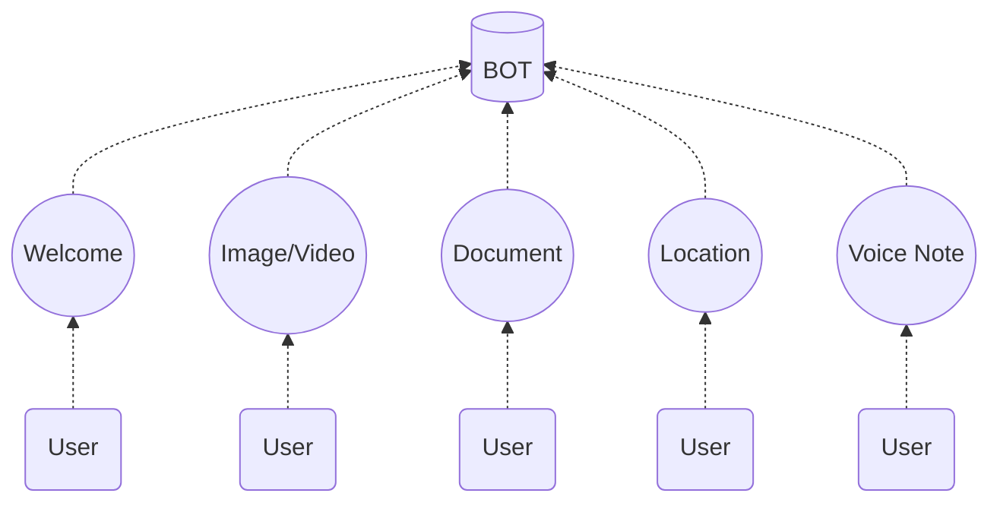
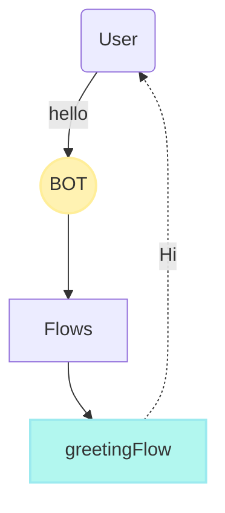

import { Contributors } from '@/components/Contributors'
import { Resources } from '@/components/Resources'
import { Guides } from '@/components/Guides'

export const description =
  'In this guide, we will talk about what happens when something goes wrong while you work with the API.'

# Events

Sometimes users send messages such as an image, a video or special location messages, among others, to receive and start a conversation when a message of this type arrives we can use the events.



---

## Default  {{ tag: 'WELCOME'  }}

When a user sends a "text" message that does not exist in a keyword on another flow, the WELCOME event will be triggered by default, which is the default event.

Let's imagine the case in which a person writes the word `Thank you!`

<CodeGroup>
```ts {{ title: 'app.ts' }}
  import { addKeyword, EVENTS } from '@builderbot/bot'
  
  const welcomeFlow = addKeyword(EVENTS.WELCOME).addAnswer('Ey welcome?')
  const greetingFlow = addKeyword(['hello','hi']).addAnswer('Hi!')
```
```js {{ title: 'app.js' }}
  const { addKeyword, EVENTS } = require('@builderbot/bot')
  
  const welcomeFlow = addKeyword(EVENTS.MEDIA).addAnswer('Message hello')
```
</CodeGroup>

<RowCenter>
  <Col>
  ```mermaid
flowchart TB
    A(User) --"Thank you!"--> B((BOT))
    B --> C[Flows]
    C --> G["welcomeFlow"]
    G -. Ey welcome? .-> A

  style B fill:#fff2b2,stroke:#ffee99,stroke-width:2px
  style G fill:#b2f7ef,stroke:#9ceaef,stroke-width:2px
```
  </Col>
  <Col>

  </Col>
</RowCenter>

We can see in the diagram above that the bot does a search in all the flows to get the best flow that can respond to the keyword "Thank You" but as it does not find then the "WELCOME" is triggered.

---

## Received Image or Video {{ tag: 'MEDIA'  }}

When a user sends an image or a video, the MEDIA event, which is the default event, will be triggered by default. This is ideal for when we need them to send information and we need to store it.

<CodeGroup>
```ts {{ title: 'app.ts' }}
  import { addKeyword, EVENTS } from '@builderbot/bot'
  
  const mediaFlow = addKeyword(EVENTS.MEDIA).addAnswer('I received a media image/video')
```
```js {{ title: 'app.js' }}
  const { addKeyword, EVENTS } = require('@builderbot/bot')
  
  const mediaFlow = addKeyword(EVENTS.MEDIA).addAnswer('I received a media image/video')
```
</CodeGroup>

<Note>
To save the media file you must invoke the saveFile function from the provider you are using.
</Note>

<CodeGroup>
```ts {{ title: 'app.ts' }}
  import { addKeyword, EVENTS } from '@builderbot/bot'
  import { BaileysProvider } from '@builderbot/provider-baileys'

  const mediaFlow = addKeyword<BaileysProvider>(EVENTS.MEDIA)
  .addAnswer('I received a media image/video', async (ctx, { provider }) => {
    const localPath = await provider.saveFile(ctx, {path:'...'})
    //console.log(localPath)
  })
```
```js {{ title: 'app.js' }}
  const { addKeyword, EVENTS } = require('@builderbot/bot')
  const { BaileysProvider } = require('@builderbot/bot')
  
  const mediaFlow = addKeyword(EVENTS.MEDIA)
  .addAnswer('I received a media image/video', async (ctx, { provider }) => {
    const localPath = await provider.saveFile(ctx, {path:'...'})
    //console.log(localPath)
  })
```
</CodeGroup>

---

## Received Document {{ tag: 'DOCUMENT'  }}

When a user sends a document, DOCUMENT event will be triggered by default, which is the default event.
<CodeGroup>
```ts {{ title: 'app.ts' }}
  import { addKeyword, EVENTS } from '@builderbot/bot'
  
  const documentFlow = addKeyword(EVENTS.DOCUMENT)
  .addAnswer("Wow! I'm sorry I can't read this document right now", async (ctx, { provider }) => {
    const localPath = await provider.saveFile(ctx, {path:'...'})
    //console.log(localPath)
  })
```
```js {{ title: 'app.js' }}
  const { addKeyword, EVENTS } = require('@builderbot/bot')
  
  const documentFlow = addKeyword(EVENTS.DOCUMENT)
  .addAnswer("Wow! I'm sorry I can't read this document right now", async (ctx, { provider }) => {
    const localPath = await provider.saveFile(ctx, {path:'...'})
    //console.log(localPath)
  })
```
</CodeGroup>

---

## Received Location {{ tag: 'LOCATION'  }}

<Note>
Location must be sent via WhatsApp, does not yet allow location links from external apps
</Note>

When your chatbot needs to access a user's location, it's important to ensure that the location is sent directly from the WhatsApp app to have results. Once the location is received, you can perform a console log of ctx to view the details of the received location.

The received location context will look something like this in console:

```bash
ctx:  {
  ...
  message: Message {
    locationMessage: LocationMessage {
      degreesLatitude: -2.1462137699127197,
      degreesLongitude: -79.88981628417969,
      name: 'Doctor Miguel Angel Jijón Teran',
      address: 'Doctor Miguel Angel Jijón Teran, Guayaquil, Ecuador',
    },
  },
  body: '_event_location__0d5c9f57-0909-44a1-995f-902f9df3b21f',
  name: 'yeyodev 👨🏾‍💻',
  from: '593000000000'
}
```

This will output the user's latitude and longitude in the console, allowing you to effectively utilize the location data for your chatbot's functionality.

To access the location data, you can use the following approach:

<CodeGroup>
```ts {{ title: 'location.flow.ts' }}
import { EVENTS, addKeyword } from "@builderbot/bot";

export default addKeyword(EVENTS.LOCATION)
.addAnswer("I have received your location!", null, async (ctx) => {
  const userLatitude = ctx.message.locationMessage.degreesLatitude;
  const userLongitude = ctx.message.locationMessage.degreesLongitude;
})
```
```js {{ title: 'location.flow.js' }}
const { EVENTS, addKeyword } = require("@builderbot/bot");

export default addKeyword(EVENTS.LOCATION)
.addAnswer("I have received your location!", null, async (ctx) => {
  const userLatitude = ctx.message.locationMessage.degreesLatitude;
  const userLongitude = ctx.message.locationMessage.degreesLongitude;
})
```
</CodeGroup>

---

## Received Voice Note {{ tag: 'VOICE_NOTE' }}

When a user sends a voice note, the VOICE_NOTE event will be triggered by default, which is the event intended for this behavior, it is important to understand that a voice note is different from an image or video file.

<CodeGroup>
```ts {{ title: 'app.ts' }}
  import { addKeyword, EVENTS } from '@builderbot/bot'
  
  const voiceNoteFlow = addKeyword(EVENTS.VOICE_NOTE)
  .addAnswer('Give me a second to hear you!', async (ctx, { provider }) => {
    const localPath = await provider.saveFile(ctx, {path:'...'})
    //console.log(localPath)
  })
  
```
```js {{ title: 'app.js' }}
  const { addKeyword, EVENTS } = require('@builderbot/bot')
  
  const voiceNoteFlow = addKeyword(EVENTS.VOICE_NOTE)
  .addAnswer('Give me a second to hear you!', async (ctx, { provider }) => {
    const localPath = await provider.saveFile(ctx, {path:'...'})
    //console.log(localPath)
  })
```
</CodeGroup>

---

<Guides />

<Resources />

<Contributors users={['leifermendez']} />