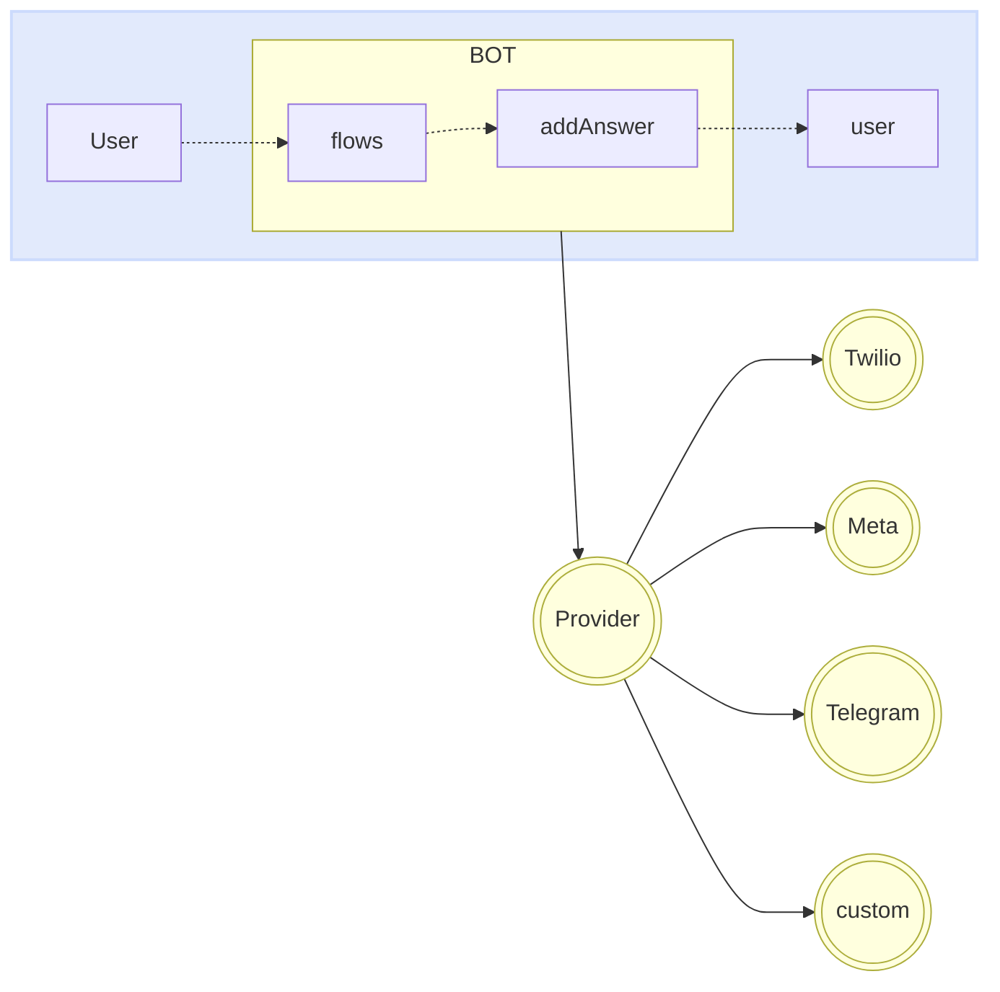

import { Contributors } from '@/components/Contributors'

export const description =
  'In this guide, we will talk about what happens when something goes wrong while you work with the API.'

# Providers

Providers are in charge of providing the communication bridge between your bot and __whatsapp__, __telegram__ or custom provider.

You can change your provider very easily without affecting the logic of your bot. 
It is as simple as implementing the connector of the provider of your choice. At the moment we have integrations with more than four suppliers.

<Warning>
Whatsapp: [Meta](providers#meta), [Twilio](providers#twilio), [Baileys](providers#baileys), [WPPConnect](providers#wpp-connect), [Venom](providers#venom). [Telegram](/plugins/telegram)
</Warning>




Each provider may need to adjust access keys, settings, among other properties that are usually passed as an object in the `createProvider` function.

<CodeGroup>
```ts {{ title: 'meta-provider.ts' }}
import { createProvider } from "@builderbot/bot";
import { MetaProvider } from '@builderbot/provider-meta';

export type IProvider = typeof MetaProvider
export const adapterProvider = createProvider(MetaProvider, {
    jwtToken: 'jwtToken',
    numberId: 'numberId',
    verifyToken: 'verifyToken',
    version: 'v16.0',
})
```

```ts {{ title: 'twilio-provider.ts' }}
import { createProvider } from "@builderbot/bot";
import { TwilioProvider } from '@builderbot/provider-twilio';

export type IProvider = typeof TwilioProvider
export const adapterProvider = createProvider(TwilioProvider, {
    accountSid: 'YOUR_ACCOUNT_SID',
    authToken: 'YOUR_ACCOUNT_TOKEN',
    vendorNumber: '+14155238886',
    publicUrl: "public_url", //optional
});
```

```ts {{ title: 'baileys-provider.ts' }}
import { createProvider } from "@builderbot/bot";
import { BaileysProvider } from '@builderbot/provider-baileys';

export type IProvider = typeof BaileysProvider
export const adapterProvider = createProvider(BaileysProvider)
```

```ts {{ title: 'venom-provider.ts' }}
import { createProvider } from "@builderbot/bot";
import { VenomProvider } from '@builderbot/provider-venom';

export type IProvider = typeof VenomProvider
export const adapterProvider = createProvider(VenomProvider)
```

```ts {{ title: 'wppconnect-provider.ts' }}
import { createProvider } from "@builderbot/bot";
import { WPPConnectProvider } from '@builderbot/provider-wppconnect';

export type IProvider = typeof WPPConnectProvider
export const adapterProvider = createProvider(WPPConnectProvider)
```

</CodeGroup>

Below you will find more information about each of these providers.

---

## Meta

The [WhatsApp Business Platform](https://business.whatsapp.com/products/business-platform) enables medium and large businesses to communicate with their customers on a large scale. You can initiate conversations with customers in just minutes, send them customer service notifications or purchase updates, offer them a personalized level of service, and provide support through the channel of their choice.

<Warning>
Remember that the following requirements must be met in order to implement the meta provider to production. [More information](/providers/meta)
</Warning>

<CodeGroup>
```ts {{ title: 'meta-provider.ts' }}
import { createProvider } from "@builderbot/bot";
import { MetaProvider } from '@builderbot/provider-meta';

export type IProvider = typeof MetaProvider
export const adapterProvider = createProvider(MetaProvider, {
    jwtToken: 'jwtToken',
    numberId: 'numberId',
    verifyToken: 'verifyToken',
    version: 'v16.0',
})
```
```ts {{ title: 'app.ts' }}
import { createBot, createProvider, createFlow, addKeyword, MemoryDB } from '@builderbot/bot'
import { IProvider, adapterProvider } from './meta-provider';

const welcomeFlow = addKeyword<IProvider, MemoryDB>(['hello', 'hi']).addAnswer('Ey! welcome')

const main = async () => {
    await createBot({
        flow: createFlow([welcomeFlow]),
        provider: adapterProvider,
        database: new MemoryDB()
    })
}

main()
```
</CodeGroup>

---

## Twilio

[Twilio](https://www.twilio.com/en-us/messaging/channels/whatsapp) is a development platform that enables developers to build cloud communication applications and web systems. Twilio's communications APIs enable businesses to provide the right communication experience for their customers within web and mobile applications. By using Twilio APIs, developers can quickly add this functionality to an application, such as voice messaging, video calls, text messaging and more.

<CodeGroup>
```ts {{ title: 'twilio-provider.ts' }}
import { createProvider } from "@builderbot/bot";
import { TwilioProvider } from '@builderbot/provider-twilio';

export type IProvider = typeof TwilioProvider
export const adapterProvider = createProvider(TwilioProvider, {
    accountSid: 'YOUR_ACCOUNT_SID',
    authToken: 'YOUR_ACCOUNT_TOKEN',
    vendorNumber: '+14155238886',
    publicUrl: "public_url", //optional
});
```
```ts {{ title: 'app.ts' }}
import { createBot, createProvider, createFlow, addKeyword, MemoryDB } from '@builderbot/bot'
import { IProvider, adapterProvider } from './twilio-provider';

const welcomeFlow = addKeyword<IProvider, MemoryDB>(['hello', 'hi']).addAnswer('Ey! welcome')

const main = async () => {
    await createBot({
        flow: createFlow([welcomeFlow]),
        provider: adapterProvider,
        database: new MemoryDB()
    })
}

main()
```
</CodeGroup>

---

## Baileys

[Baileys](https://whiskeysockets.github.io/) is an open source project which allows sending messages, receiving messages and dozens of other features by implementing WebSocket in a version of whatsapp.
It is a project with great trajectory driven by people with great knowledge of the subject, you can deepen in this library directly in its documentation or [repository](https://github.com/WhiskeySockets/Baileys).

Because this is a free provider that emulates the whatsapp web interface, you must scan the QR to log in.

<CodeGroup>
```ts {{ title: 'baileys-provider.ts' }}
import { createProvider } from "@builderbot/bot";
import { BaileysProvider } from '@builderbot/provider-baileys';

export type IProvider = typeof BaileysProvider
export const adapterProvider = createProvider(BaileysProvider)

```
```ts {{ title: 'baileys-provider-extend.ts' }}
import { createProvider } from "@builderbot/bot";
import { BaileysProvider } from '@builderbot/provider-baileys';

export type IProvider = typeof BaileysProvider
export const adapterProvider = createProvider(BaileysProvider, {
        browser: ['Ubuntu', 'Chrome', '20.0.04'],
        gifPlayback: true,
        name: 'botname',
        phoneNumber: '88888',
        useBaileysStore: true,
        usePairingCode: true
})
```
```ts {{ title: 'app.ts' }}
import { createBot, createProvider, createFlow, addKeyword, MemoryDB } from '@builderbot/bot'
import { IProvider, adapterProvider } from './baileys-provider';

const welcomeFlow = addKeyword<IProvider, MemoryDB>(['hello', 'hi']).addAnswer('Ey! welcome')

const main = async () => {
    await createBot({
        flow: createFlow([welcomeFlow]),
        provider: adapterProvider,
        database: new MemoryDB()
    })
}

main()
```
</CodeGroup>

---

## Venom

[Venom](https://github.com/orkestral/venom) is an open-source project that utilizes JavaScript to create high-performance bots for WhatsApp. It supports a wide range of interactions including customer care, media sending, AI-based phrase recognition, and various architectural designs tailored for WhatsApp.
You can visit their [official](https://orkestral.io/) website as the repository to understand other features you can use.

Because this is a free provider that emulates the whatsapp web interface, you must scan the QR to log in.

<CodeGroup>
```ts {{ title: 'venom-provider.ts' }}
import { createProvider } from "@builderbot/bot";
import { VenomProvider } from '@builderbot/provider-venom';

export type IProvider = typeof VenomProvider
export const adapterProvider = createProvider(VenomProvider)
```
```ts {{ title: 'venom-provider-extend.ts' }}
import { createProvider } from "@builderbot/bot";
import { VenomProvider } from '@builderbot/provider-venom';

export type IProvider = typeof VenomProvider
export const adapterProvider = createProvider(VenomProvider, {
        gifPlayback:true,
        name:'botname'
})
```
```ts {{ title: 'app.ts' }}
import { createBot, createProvider, createFlow, addKeyword, MemoryDB } from '@builderbot/bot'
import { IProvider, adapterProvider } from './venom-provider';

const welcomeFlow = addKeyword<IProvider, MemoryDB>(['hello', 'hi']).addAnswer('Ey! welcome')

const main = async () => {
    await createBot({
        flow: createFlow([welcomeFlow]),
        provider: adapterProvider,
        database: new MemoryDB()
    })
}

main()
```
</CodeGroup>

---

## WPPConnect

[WPPConnect](https://wppconnect.io) is an open source project developed by the JavaScript community with the aim of exporting functions from WhatsApp Web to the node, which can be used to support the creation of any interaction, such as customer service, media sending, intelligence recognition based on phrases artificial and many other things, use your imagination
You can visit their official website as the [repository](https://github.com/wppconnect-team/wppconnect) to understand other features you can use.

Because this is a free provider that emulates the whatsapp web interface, you must scan the QR to log in.

<CodeGroup>
```ts {{ title: 'wppconnect-provider.ts' }}
import { createProvider } from "@builderbot/bot";
import { WPPConnectProvider } from '@builderbot/provider-wppconnect';

export type IProvider = typeof WPPConnectProvider
export const adapterProvider = createProvider(WPPConnectProvider)
```
```ts {{ title: 'wppconnect-provider-extend.ts' }}
import { createProvider } from "@builderbot/bot";
import { WPPConnectProvider } from '@builderbot/provider-wppconnect';

export type IProvider = typeof WPPConnectProvider
export const adapterProvider = createProvider(WPPConnectProviderClass, {
        name:'botname'
})
```
```ts {{ title: 'app.ts' }}
import { createBot, createProvider, createFlow, addKeyword, MemoryDB } from '@builderbot/bot'
import { IProvider, adapterProvider } from './wppconnect-provider';

const welcomeFlow = addKeyword<IProvider, MemoryDB>(['hello', 'hi']).addAnswer('Ey! welcome')

const main = async () => {
    await createBot({
        flow: createFlow([welcomeFlow]),
        provider: adapterProvider,
        database: new MemoryDB()
    })
}

main()
```
</CodeGroup>

---

## Custom Provider

There is the possibility to build your own customized adapter, we know that there are many more providers that can be very useful, an example can be [Wali.chat](https://wali.chat/?ref=7v34k0) which apart from giving us the possibility to interact via API Rest also offers a Dashboard to visualize and share data with your agents.

<CodeGroup>
```ts {{ title: 'app.ts' }}
import { createBot, createProvider, createFlow, addKeyword, utils } from '@builderbot/bot'
import { MemoryDB as Database } from '@builderbot/bot'
import { WaliProvider as Provider } from './provider/wali'

const PORT = process.env.PORT ?? 3008

const fullSamplesFlow = addKeyword<Provider, Database>(['samples', utils.setEvent('SAMPLES')])
    .addAnswer(`💪 I'll send you a lot files...`)
    .addAnswer(`Send video from URL`,
        { media: 'https://media.giphy.com/media/v1.Y2lkPTc5MGI3NjExYTJ0ZGdjd2syeXAwMjQ4aWdkcW04OWlqcXI3Ynh1ODkwZ25zZWZ1dCZlcD12MV9pbnRlcm5hbF9naWZfYnlfaWQmY3Q9Zw/LCohAb657pSdHv0Q5h/giphy.mp4' }
    )
    .addAnswer(`Send audio from URL`,
        { media: 'https://cdn.freesound.org/previews/728/728142_11861866-lq.mp3' }
    )
    .addAnswer(`Send file from URL`,
        { media: 'https://www.w3.org/WAI/ER/tests/xhtml/testfiles/resources/pdf/dummy.pdf' }
    )


const main = async () => {
    const adapterFlow = createFlow([fullSamplesFlow])

    const adapterProvider = createProvider(Provider, {
        token: process.env.TOKEN,
        deviceId: process.env.DEVICE_ID
    })
    const adapterDB = new Database()

    const { httpServer } = await createBot({
        flow: adapterFlow,
        provider: adapterProvider,
        database: adapterDB,
    })

    httpServer(+PORT)
}

main()
```
```ts {{ title: 'provider/wali.ts' }}
import { Middleware } from 'polka';
import { writeFile } from 'fs/promises'
import { createReadStream } from 'fs';
import { join } from 'path';
import { tmpdir } from 'os';
import { ProviderClass, utils } from "@builderbot/bot";
import { BotContext, GlobalVendorArgs, SendOptions } from "@builderbot/bot/dist/types";
import { WaliEvents } from "./wali.events";
import axios, { AxiosResponse } from 'axios'
import FormData from 'form-data'
import mime from 'mime-types'

const URL = 'https://api.wali.chat'

export type WaliArgs = GlobalVendorArgs & { token: string, deviceId: string }

/**
 * Provider class for interacting with the Wali API.
 */
export class WaliProvider extends ProviderClass<WaliEvents> {
    globalVendorArgs: WaliArgs = {
        name: 'bot',
        port: 3000,
        token: undefined,
        deviceId: undefined
    };

    /**
     * Constructor for WaliProvider.
     * @param args - Arguments for WaliProvider.
     */
    constructor(args?: WaliArgs) {
        super();
        this.globalVendorArgs = { ...this.globalVendorArgs, ...args }
        if (!this.globalVendorArgs.token) {
            throw new Error('Must provide Wali Token https://app.wali.chat/developers/apikeys')
        }
        if (!this.globalVendorArgs.deviceId) {
            throw new Error('You must provide the DeviceID https://app.wali.chat/')
        }
    }

    /**
     * Initialize the Wali vendor and set up the server.
     * @returns Promise<any>
     */
    protected async initVendor(): Promise<any> {
        const vendor = new WaliEvents()
        this.vendor = vendor
        this.server = this.server
            .post('/webhook', this.ctrlInMsg)

        await this.checkStatus(this.globalVendorArgs.deviceId);
        return vendor
    }

    /**
     * Some logic before init http server
     * @returns void
     */
    protected beforeHttpServerInit(): void {
    }

    /**
     * Some logic after init http server
     * @returns void
     */
    protected afterHttpServerInit(): void {
    }

    /**
     * @returns void
     */
    protected busEvents = (): { event: string; func: Function; }[] => {
        return [
            {
                event: 'auth_failure',
                func: (payload: any) => this.emit('auth_failure', payload),
            },
            {
                event: 'ready',
                func: () => this.emit('ready', true),
            },
            {
                event: 'message',
                func: (payload: BotContext) => {
                    this.emit('message', payload)
                },
            },
            {
                event: 'host',
                func: (payload: any) => {
                    this.emit('host', payload)
                },
            }
        ]
    }

    private fileTypeFromFile = async (response: AxiosResponse): Promise<{ type: string | null; ext: string | false }> => {
        const type = response.headers['content-type'] ?? ''
        const ext = mime.extension(type)
        return {
            type,
            ext,
        }
    }

    /**
     * Middleware function for handling incoming messages.
     */
    protected ctrlInMsg: Middleware = (req, res) => {
        this.vendor.eventInMsg(req.body)
        return res.end('ok')
    }

    /**
     * Function to donwload the files incoming
     * @param idResource 
     * @returns 
     */
    private downloadFile = async (idResource: string): Promise<{ buffer: Buffer; extension: string }> => {
        try {
            const urlMedia = `${URL}${idResource}`
            const response: AxiosResponse = await axios.get(urlMedia, {
                headers: {
                    Token: this.globalVendorArgs.token,
                },
                responseType: 'arraybuffer',
            })
            const { ext } = await this.fileTypeFromFile(response)
            if (!ext) throw new Error('Unable to determine file extension')
            return {
                buffer: response.data,
                extension: ext,
            }
        } catch (error) {
            console.error(error.message)
        }
    }

    /**
     * Upload a file to the Wali API.
     * @param urlOrPathfile - URL or path of the file to upload.
     * @returns Promise<string> - ID of the uploaded file.
     */
    private uploadToVendor = async (urlOrPathfile: string): Promise<string> => {
        const fileDownloaded = await utils.generalDownload(urlOrPathfile)
        const formData = new FormData()
        const mimeType = mime.lookup(fileDownloaded)
        formData.append('file', createReadStream(fileDownloaded), {
            contentType: mimeType,
        })

        try {
            const response = await axios.post(
                `${URL}/v1/files`,
                formData,
                {
                    headers: {
                        Token: this.globalVendorArgs.token,
                    },
                }
            )
            return response.data[0].id
        } catch (err) {
            if (err.response.data.status === 409) {
                return err.response.data.meta.file
            }
            console.log(`Error:`, err.response.data)
            return
        }
    }

    /**
     * Check the status of the Wali device.
     * @param deviceId - ID of the device to check.
     */
    checkStatus = async (deviceId: string) => {
        try {
            const dataApi = await fetch(`${URL}/v1/devices/${deviceId}/health`, {
                headers: {
                    Token: this.globalVendorArgs.token
                }
            })
            const data = await dataApi.json()

            if (data.status === 'online') {
                this.emit('ready')
                return
            }

            if (data.status !== 200) {
                this.emit('auth_failure', {
                    instructions: [
                        data.message ?? `You must reconnect your device`,
                        ``,
                        `Check: https://app.wali.chat/${deviceId}/info`
                    ]
                })
                return
            }

            this.emit('ready')
            return
        } catch (err) {
            console.log(err)
            this.emit('auth_failure', { instructions: [] })
            return
        }
    }

    /**
     * Send a message to a user.
     * @param userId - ID of the user to send the message to.
     * @param message - Message content.
     * @param options - Additional options for sending the message.
     * @returns Promise<any>
     */
    async sendMessage(userId: string, message: any, options?: SendOptions): Promise<any> {
        options = { ...options, ...options['options'] }
        const payload: any = {
            "phone": `+${utils.removePlus(userId)}`,
            "message": message
        }

        if (options?.media) {
            const idResource = await this.uploadToVendor(options.media)
            payload.media = { file: idResource }
        }

        const body = {
            method: 'POST',
            headers: {
                'Content-Type': 'application/json',
                Token: this.globalVendorArgs.token
            },
            body: JSON.stringify(payload)
        };
        const dataApi = await fetch(`${URL}/v1/messages`, body)
        const data = await dataApi.json()
        return data
    }

    /**
     * Save a file from a message context.
     * @param ctx - Bot context containing the file information.
     * @param options - Additional options for saving the file.
     * @returns Promise<string> - Path of the saved file.
     */
    async saveFile(ctx: BotContext & { data?: { media: { links?: { download: string } } } }, options?: { path: string; }): Promise<string> {
        if (!ctx?.data?.media) return ''
        try {
            const { buffer, extension } = await this.downloadFile(ctx.data.media.links.download)
            const fileName = `file-${Date.now()}.${extension}`
            const pathFile = join(options?.path ?? tmpdir(), fileName)
            await writeFile(pathFile, buffer)
            return pathFile
        } catch (err) {
            console.log(`[Error]:`, err.message)
            return 'ERROR'
        }
    }
}
```
```ts {{ title: 'provider/wali.events.ts' }}
import { EventEmitterClass, utils } from "@builderbot/bot";
import { ProviderEventTypes } from "@builderbot/bot/dist/types";

export type WaliMessage = {
    data: {
        type: 'image' | 'text' | 'video' | 'audio' | 'document' | 'location'
        toNumber: string
        from: string
        fromNumber: string
        body?: string
        location?: {
            latitude: number,
            longitude: number
            name: string
            address: string
        }
        meta: {
            notifyName: string
        }
    }
}

export class WaliEvents extends EventEmitterClass<ProviderEventTypes> {

    /**
     * Función que maneja el evento de mensaje entrante de Wali.
     * @param payload - El mensaje entrante de Wali.
     */
    public eventInMsg = (payload: WaliMessage) => {

        if (payload.data?.from.includes('g.us') || !payload.data) return

        const sendObj = {
            ...payload,
            body: payload.data?.body || '',
            from: payload.data.fromNumber,
            name: payload.data.meta.notifyName,
            host: {
                phone: payload.data.toNumber
            },
        }
        if (['image', 'video'].includes(payload.data.type)) sendObj.body = utils.generateRefProvider('_event_media_')
        if (payload.data.type === 'document') sendObj.body = utils.generateRefProvider('_event_document_')
        if (payload.data.type === 'audio') sendObj.body = utils.generateRefProvider('_event_voice_note_')
        if (payload.data.type === 'location') sendObj.body = utils.generateRefProvider('_event_location_')

        this.emit('message', sendObj)
    }

}
```
</CodeGroup>

---

<Contributors users={['leifermendez']} />