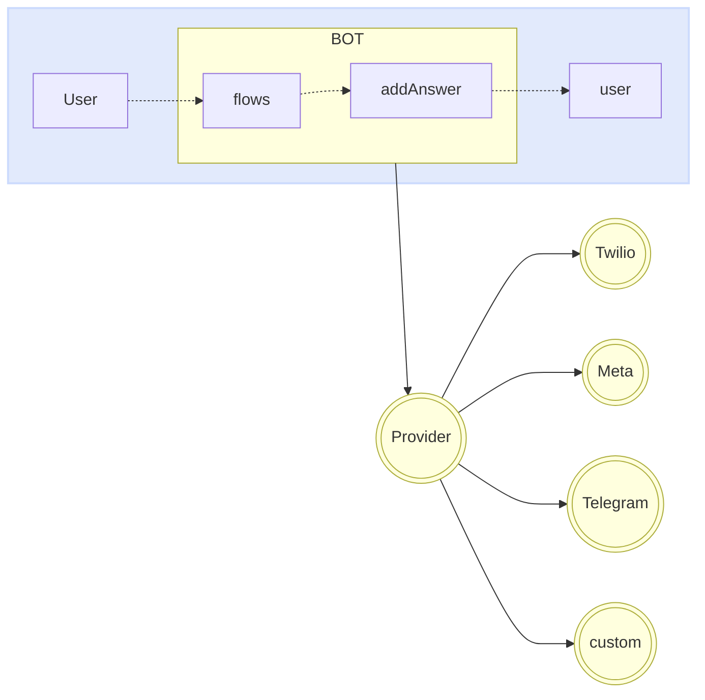

import { Contributors } from '@/components/Contributors'

export const description =
  'In this guide, we will talk about what happens when something goes wrong while you work with the API.'

# Providers

Providers are in charge of providing the communication bridge between your bot and __whatsapp__, __telegram__ or custom provider.

You can change your provider very easily without affecting the logic of your bot. 
It is as simple as implementing the connector of the provider of your choice. At the moment we have integrations with more than four suppliers.

<Warning>
Whatsapp: [Meta](providers#meta), [Twilio](providers#twilio), [Baileys](providers#baileys), [WPPConnect](providers#wpp-connect), [Venom](providers#venom). [Telegram](/plugins/telegram)
</Warning>




Each provider may need to adjust access keys, settings, among other properties that are usually passed as an object in the `createProvider` function.

<CodeGroup>
```ts {{ title: 'meta-provider.ts' }}
import { createProvider } from "@bot-whatsapp/bot";
import { MetaProvider } from '@bot-whatsapp/provider-meta';

export type IProvider = typeof MetaProvider
export const adapterProvider = createProvider(MetaProvider, {
    jwtToken: 'jwtToken',
    numberId: 'numberId',
    verifyToken: 'verifyToken',
    version: 'v16.0',
})
```

```ts {{ title: 'twilio-provider.ts' }}
import { createProvider } from "@bot-whatsapp/bot";
import { TwilioProvider } from '@bot-whatsapp/provider-twilio';

export type IProvider = typeof TwilioProvider
export const adapterProvider = createProvider(TwilioProvider, {
    accountSid: 'YOUR_ACCOUNT_SID',
    authToken: 'YOUR_ACCOUNT_TOKEN',
    vendorNumber: '+14155238886',
    publicUrl: "public_url", //optional
});
```

```ts {{ title: 'baileys-provider.ts' }}
import { createProvider } from "@bot-whatsapp/bot";
import { BaileysProvider } from '@bot-whatsapp/provider-baileys';

export type IProvider = typeof BaileysProvider
export const adapterProvider = createProvider(BaileysProvider)
```

```ts {{ title: 'venom-provider.ts' }}
import { createProvider } from "@bot-whatsapp/bot";
import { VenomProvider } from '@bot-whatsapp/provider-venom';

export type IProvider = typeof VenomProvider
export const adapterProvider = createProvider(VenomProvider)
```

```ts {{ title: 'wppconnect-provider.ts' }}
import { createProvider } from "@bot-whatsapp/bot";
import { WPPConnectProvider } from '@bot-whatsapp/provider-wppconnect';

export type IProvider = typeof WPPConnectProvider
export const adapterProvider = createProvider(WPPConnectProvider)
```

</CodeGroup>

Below you will find more information about each of these providers.

---

## Meta

The [WhatsApp Business Platform](https://business.whatsapp.com/products/business-platform) enables medium and large businesses to communicate with their customers on a large scale. You can initiate conversations with customers in just minutes, send them customer service notifications or purchase updates, offer them a personalized level of service, and provide support through the channel of their choice.

<Warning>
Remember that the following requirements must be met in order to implement the meta provider to production. [More information](/providers/meta)
</Warning>

<CodeGroup>
```ts {{ title: 'meta-provider.ts' }}
import { createProvider } from "@bot-whatsapp/bot";
import { MetaProvider } from '@bot-whatsapp/provider-meta';

export type IProvider = typeof MetaProvider
export const adapterProvider = createProvider(MetaProvider, {
    jwtToken: 'jwtToken',
    numberId: 'numberId',
    verifyToken: 'verifyToken',
    version: 'v16.0',
})
```
```ts {{ title: 'app.ts' }}
import { createBot, createProvider, createFlow, addKeyword, MemoryDB } from '@bot-whatsapp/bot'
import { IProvider, adapterProvider } from './meta-provider';

const welcomeFlow = addKeyword<IProvider, MemoryDB>(['hello', 'hi']).addAnswer('Ey! welcome')

const main = async () => {
    await createBot({
        flow: createFlow([welcomeFlow]),
        provider: adapterProvider,
        database: new MemoryDB()
    })
}

main()
```
</CodeGroup>

---

## Twilio

[Twilio](https://www.twilio.com/en-us/messaging/channels/whatsapp) is a development platform that enables developers to build cloud communication applications and web systems. Twilio's communications APIs enable businesses to provide the right communication experience for their customers within web and mobile applications. By using Twilio APIs, developers can quickly add this functionality to an application, such as voice messaging, video calls, text messaging and more.

<Warning>
Remember that the following requirements must be met in order to implement the meta provider to production. [More information](/providers/twilio)
</Warning>

<CodeGroup>
```ts {{ title: 'twilio-provider.ts' }}
import { createProvider } from "@bot-whatsapp/bot";
import { TwilioProvider } from '@bot-whatsapp/provider-twilio';

export type IProvider = typeof TwilioProvider
export const adapterProvider = createProvider(TwilioProvider, {
    accountSid: 'YOUR_ACCOUNT_SID',
    authToken: 'YOUR_ACCOUNT_TOKEN',
    vendorNumber: '+14155238886',
    publicUrl: "public_url", //optional
});
```
```ts {{ title: 'app.ts' }}
import { createBot, createProvider, createFlow, addKeyword, MemoryDB } from '@bot-whatsapp/bot'
import { IProvider, adapterProvider } from './twilio-provider';

const welcomeFlow = addKeyword<IProvider, MemoryDB>(['hello', 'hi']).addAnswer('Ey! welcome')

const main = async () => {
    await createBot({
        flow: createFlow([welcomeFlow]),
        provider: adapterProvider,
        database: new MemoryDB()
    })
}

main()
```
</CodeGroup>

---

## Baileys

[Baileys](https://whiskeysockets.github.io/) is an open source project which allows sending messages, receiving messages and dozens of other features by implementing WebSocket in a version of whatsapp.
It is a project with great trajectory driven by people with great knowledge of the subject, you can deepen in this library directly in its documentation or [repository](https://github.com/WhiskeySockets/Baileys).

Because this is a free provider that emulates the whatsapp web interface, you must scan the QR to log in.

<Warning>
Remember that the following requirements must be met in order to implement the meta provider to production. [More information](/providers/baileys)
</Warning>

<CodeGroup>
```ts {{ title: 'baileys-provider.ts' }}
import { createProvider } from "@bot-whatsapp/bot";
import { BaileysProvider } from '@bot-whatsapp/provider-baileys';

export type IProvider = typeof BaileysProvider
export const adapterProvider = createProvider(BaileysProvider)

```
```ts {{ title: 'baileys-provider-extend.ts' }}
import { createProvider } from "@bot-whatsapp/bot";
import { BaileysProvider } from '@bot-whatsapp/provider-baileys';

export type IProvider = typeof BaileysProvider
export const adapterProvider = createProvider(BaileysProvider, {
        browser: ['Ubuntu', 'Chrome', '20.0.04'],
        gifPlayback: true,
        name: 'botname',
        phoneNumber: '88888',
        useBaileysStore: true,
        usePairingCode: true
})
```
```ts {{ title: 'app.ts' }}
import { createBot, createProvider, createFlow, addKeyword, MemoryDB } from '@bot-whatsapp/bot'
import { IProvider, adapterProvider } from './baileys-provider';

const welcomeFlow = addKeyword<IProvider, MemoryDB>(['hello', 'hi']).addAnswer('Ey! welcome')

const main = async () => {
    await createBot({
        flow: createFlow([welcomeFlow]),
        provider: adapterProvider,
        database: new MemoryDB()
    })
}

main()
```
</CodeGroup>

---

## Venom

[Venom](https://github.com/orkestral/venom) is an open-source project that utilizes JavaScript to create high-performance bots for WhatsApp. It supports a wide range of interactions including customer care, media sending, AI-based phrase recognition, and various architectural designs tailored for WhatsApp.
You can visit their [official](https://orkestral.io/) website as the repository to understand other features you can use.


Because this is a free provider that emulates the whatsapp web interface, you must scan the QR to log in.

<Warning>
Remember that the following requirements must be met in order to implement the meta provider to production. [More information](/providers/venom)
</Warning>

<CodeGroup>
```ts {{ title: 'venom-provider.ts' }}
import { createProvider } from "@bot-whatsapp/bot";
import { VenomProvider } from '@bot-whatsapp/provider-venom';

export type IProvider = typeof VenomProvider
export const adapterProvider = createProvider(VenomProvider)
```
```ts {{ title: 'venom-provider-extend.ts' }}
import { createProvider } from "@bot-whatsapp/bot";
import { VenomProvider } from '@bot-whatsapp/provider-venom';

export type IProvider = typeof VenomProvider
export const adapterProvider = createProvider(VenomProvider, {
        gifPlayback:true,
        name:'botname'
})
```
```ts {{ title: 'app.ts' }}
import { createBot, createProvider, createFlow, addKeyword, MemoryDB } from '@bot-whatsapp/bot'
import { IProvider, adapterProvider } from './venom-provider';

const welcomeFlow = addKeyword<IProvider, MemoryDB>(['hello', 'hi']).addAnswer('Ey! welcome')

const main = async () => {
    await createBot({
        flow: createFlow([welcomeFlow]),
        provider: adapterProvider,
        database: new MemoryDB()
    })
}

main()
```
</CodeGroup>

---

## WPPConnect

[WPPConnect](https://wppconnect.io) is an open source project developed by the JavaScript community with the aim of exporting functions from WhatsApp Web to the node, which can be used to support the creation of any interaction, such as customer service, media sending, intelligence recognition based on phrases artificial and many other things, use your imagination
You can visit their official website as the [repository](https://github.com/wppconnect-team/wppconnect) to understand other features you can use.

Because this is a free provider that emulates the whatsapp web interface, you must scan the QR to log in.

<Warning>
Remember that the following requirements must be met in order to implement the meta provider to production. [More information](/providers/wpp-connect)
</Warning>

<CodeGroup>
```ts {{ title: 'wppconnect-provider.ts' }}
import { createProvider } from "@bot-whatsapp/bot";
import { WPPConnectProvider } from '@bot-whatsapp/provider-wppconnect';

export type IProvider = typeof WPPConnectProvider
export const adapterProvider = createProvider(WPPConnectProvider)
```
```ts {{ title: 'wppconnect-provider-extend.ts' }}
import { createProvider } from "@bot-whatsapp/bot";
import { WPPConnectProvider } from '@bot-whatsapp/provider-wppconnect';

export type IProvider = typeof WPPConnectProvider
export const adapterProvider = createProvider(WPPConnectProviderClass, {
        name:'botname'
})
```
```ts {{ title: 'app.ts' }}
import { createBot, createProvider, createFlow, addKeyword, MemoryDB } from '@bot-whatsapp/bot'
import { IProvider, adapterProvider } from './wppconnect-provider';

const welcomeFlow = addKeyword<IProvider, MemoryDB>(['hello', 'hi']).addAnswer('Ey! welcome')

const main = async () => {
    await createBot({
        flow: createFlow([welcomeFlow]),
        provider: adapterProvider,
        database: new MemoryDB()
    })
}

main()
```
</CodeGroup>

---

<Contributors users={['leifermendez']} />