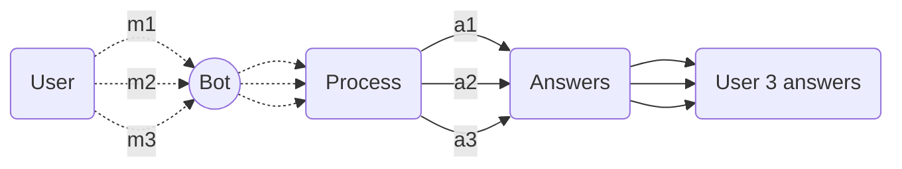
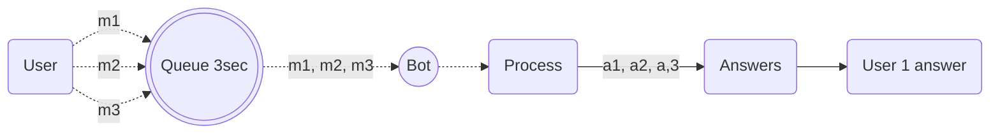

import { Contributors } from '@/components/Contributors'
import { Resources } from '@/components/Resources'
import { Guides } from '@/components/Guides'

export const description = 'Implement message queues for better resource management'

# Fast Entires

## Issue {{not:'true'}}
Sometimes it happens that people are impatient and write independent messages in a very short time gap preventing the bot to answer, which makes that each message is answered but not in the desired order.

<Contributors mode users={['robertouski']} />

---

## Possible Solution {{not:'true'}}

For this other type of environments you can implement a functionality which you can create to have a margin of 3000ms for the user to write a message, and each time he writes a message in a time less than 3000ms it will accumulate all the messages and then after the margin time the bot will interpret everything as a single conversation.



Applying this implementation, what is achieved is that before passing to the processing stage, all independent messages (3) become one (1) and are processed as an independent message.



In this example we say __3000ms__ which is equal to 3 seconds but you can modify this to your liking in `MESSAGE_GAP_SECONDS`

<CodeGroup>

```ts {{ title: 'fast-entires.ts' }}
interface Message {
    text: string;
    timestamp: number;
}

const messageQueue: Message[] = [];

const MESSAGE_GAP_SECONDS = 3000;

let messageTimer: NodeJS.Timeout | null = null;

/**
* Adds a message to the queue for later processing.
* @param messageText The text of the message to add to the queue.
* @returns A promise that resolves when the message queue is processed.
*/
async function enqueueMessage(messageText: string): Promise<string> {
    messageQueue.push({ text: messageText, timestamp: Date.now() });

    return new Promise((resolve) => {
        if (messageTimer) {
            clearTimeout(messageTimer);
        }

        messageTimer = setTimeout(() => {
            resolve(processMessageQueue());
        }, MESSAGE_GAP_SECONDS);
    });
}

/**
* Processes the message queue by combining all messages into a single string and clearing the queue.
* @returns The combined string of all messages in the queue.
*/
function processMessageQueue(): string {
    if (messageQueue.length === 0) {
        return '';
    }

    const combinedMessage = messageQueue.map(message => message.text).join(" ");
    messageQueue.length = 0;
    return combinedMessage;
}

export { enqueueMessage, processMessageQueue };

```
```ts {{ title: 'app.ts' }}
import { enqueueMessage } from './utils/fast-entires'

import { createBot, createProvider, createFlow, addKeyword, MemoryDB } from '@builderbot/bot'
import { BaileysProvider } from '@builderbot/provider-baileys'

const welcomeFlow = addKeyword<BaileysProvider, MemoryDB>(['hello', 'hi'])
.addAction(async(ctx) => {
  const body = await enqueueMessage(ctx.body) // all message merged!
  console.log(body)
})


const main = async () => {

    const adapterDB = new MemoryDB()
    const adapterFlow = createFlow([welcomeFlow])
    const adapterProvider = createProvider(BaileysProvider)

    adapterProvider.initHttpServer(3000)

    await createBot({
        flow: adapterFlow,
        provider: adapterProvider,
        database: adapterDB,
    })
}

main()
```
</CodeGroup>

Remember that this is an alternative solution, and it is possible that its implementation could be improved.

----

<Guides />

<Resources />