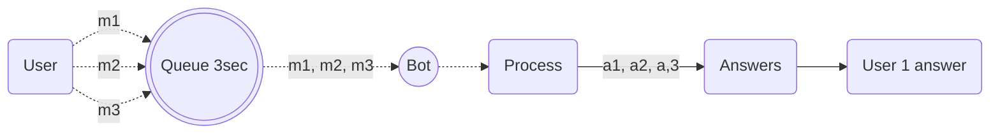

import { Contributors } from '@/components/Contributors'
import { Resources } from '@/components/Resources'
import { Guides } from '@/components/Guides'

export const description = 'Implement message queues for better resource management'

# Fast Entries

## Issue
Sometimes it happens that people are impatient and write independent messages in a very short time gap preventing the bot to answer, which makes that each message is answered but not in the desired order.

<Contributors mode users={['robertouski','leifermendez']} />

---

## Improved Solution

For this type of environment, we've implemented an enhanced functionality that introduces a margin of 3000ms for the user to write messages. Each time a user writes a message within this 3000ms window, it accumulates all the messages. After the margin time expires, the bot interprets everything as a single conversation.



This implementation ensures that before passing to the processing stage, all independent messages (e.g., 3) become one (1) and are processed as a single message.

In this example, we use __3000ms__ (equal to 3 seconds) as the default gap, but you can modify this to your liking by adjusting the `gapSeconds` in the `QueueConfig`.

<VideoVertical label="Video Fast Entries" yt="hGTgQDALEmE"/>

<CodeGroup>

```ts {{ title: 'fast-entires.ts' }}
/**
 * @file multiUserMessageQueue.ts
 * @description An improved functional implementation of a multi-user message queueing system with debounce functionality,
 * ensuring separate conversation handling for each user.
 */

import { BotContext } from "@builderbot/bot/dist/types";

interface Message {
    text: string;
    timestamp: number;
}

interface QueueConfig {
    gapMilliseconds: number;
}

interface UserQueue {
    messages: Message[];
    timer: NodeJS.Timeout | null;
    callback: ((body: string, from: string) => void) | null;
}

interface QueueState {
    queues: Map<string, UserQueue>;
}

function createInitialState(): QueueState {
    return {
        queues: new Map()
    };
}

function resetTimer(userQueue: UserQueue): UserQueue {
    if (userQueue.timer) {
        clearTimeout(userQueue.timer);
    }
    return { ...userQueue, timer: null };
}

function processQueue(messages: Message[]): string {
    const result = messages.map(message => message.text).join(" ");
    console.log('Accumulated messages:', result);
    return result;
}

function createMessageQueue(config: QueueConfig) {
    let state: QueueState = createInitialState();

    return function enqueueMessage(ctx: BotContext, callback: (body: string, from: string) => void): void {
        const from = ctx.from;
        const messageBody = ctx.body;

        if (!from || !messageBody) {
            console.error('Invalid message context:', ctx);
            return;
        }

        console.log('Enqueueing:', messageBody, 'from:', from);

        let userQueue = state.queues.get(from);
        if (!userQueue) {
            userQueue = { messages: [], timer: null, callback: null };
            state.queues.set(from, userQueue);
        }

        userQueue = resetTimer(userQueue);
        userQueue.messages.push({ text: messageBody, timestamp: Date.now() });
        userQueue.callback = callback;

        console.log('Messages for', from, ':', userQueue.messages);

        if (!userQueue.timer) {
            userQueue.timer = setTimeout(() => {
                const currentQueue = state.queues.get(from);
                if (currentQueue) {
                    const result = processQueue(currentQueue.messages);
                    if (currentQueue.callback) {
                        currentQueue.callback(result, from);
                    }
                    state.queues.set(from, { ...currentQueue, messages: [], timer: null });
                }
            }, config.gapMilliseconds);
        }

        state.queues.set(from, userQueue);
    };
}

export { createMessageQueue, QueueConfig };
```

```ts {{ title: 'app.ts' }}
import { createMessageQueue, QueueConfig } from './fast'

import { createBot, createProvider, createFlow, addKeyword, MemoryDB, EVENTS } from '@builderbot/bot'
import { BaileysProvider } from '@builderbot/provider-baileys'

const queueConfig: QueueConfig = { gapMilliseconds: 3000 };
const enqueueMessage = createMessageQueue(queueConfig);

const welcomeFlow = addKeyword<BaileysProvider, MemoryDB>(EVENTS.WELCOME)
    .addAction(async (ctx, { flowDynamic }) => {
        try {
            enqueueMessage(ctx, async (body) => {
                console.log('Processed messages:', body, ctx.from);
                await flowDynamic(`Received messages: ${body}`);
            });
        } catch (error) {
            console.error('Error processing message:', error);
        }
    });

const main = async () => {
    const adapterDB = new MemoryDB()
    const adapterFlow = createFlow([welcomeFlow])
    const adapterProvider = createProvider(BaileysProvider)

    const bot = await createBot({
        flow: adapterFlow,
        provider: adapterProvider,
        database: adapterDB,
    })

    bot.httpServer(3005)
}

main()
```
</CodeGroup>

### Key Improvements in the New Implementation:

1. **Functional Approach**: The new implementation uses a functional programming style, which can lead to more predictable and testable code.

2. **Immutable State**: The state of the queue is managed immutably, which helps prevent unexpected side effects.

3. **Flexible Configuration**: The `QueueConfig` interface allows for easy adjustment of the gap time.

4. **Enhanced Error Handling**: The implementation includes try-catch blocks for better error management.

5. **Callback-based Processing**: Instead of returning a promise, the new implementation uses a callback function, allowing for more flexible message processing.

6. **Detailed Logging**: Console logs have been added at key points to aid in debugging and understanding the message flow.

Remember that while this implementation offers significant improvements, it's always possible to further optimize based on specific use cases and requirements.

----

<Guides />

<Resources />

----

<Guides />

<Resources />