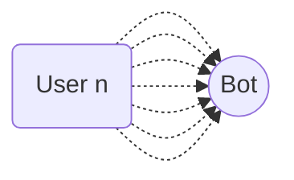

import { Contributors } from '@/components/Contributors'
import { Resources } from '@/components/Resources'
import { Guides } from '@/components/Guides'

export const description = 'Implement message queues for better resource management'

# Queue Limit

## Issue {{not:'true'}}
The problem was that when more than 60 people started a conversation in less than 20 seconds the bot did not respond to all the people.

<Contributors mode users={['robertouski']} />
---

## Possible Solution {{not:'true'}}

The framework by default implements a queue manager based on per-user work promises.
If you already understand the concept and you are in an environment where you receive a considerable number of recurring messages in a short period of time and you notice that it answers a large number of users but not all of them. You can try extending the process queue configuration.

__Imagine the case__ in which you receive more than 60 messages from more than 60 people in a very short period of time of less than 20 seconds for example


It is very likely that it will not respond to all users, since the default configuration of the bot is set to handle a smaller amount of processes, but it is very easy to modify.

```bash {{ title: 'app.ts' }}
const main = async () => {

    await createBot({
        database: new MemoryDB(),
        provider: createProvider(BaileysProvider),
        flow: createFlow([...])
    }, {
        queue: {
            timeout: 20000, //👌
            concurrencyLimit: 50 //👌
        }
    })
}
```
----
<Properties>
  <Property name="timeout" type="number">
 Number of milliseconds used as maximum duration for the execution of an asynchronous function. __default 20000__
  </Property>
  <Property name="concurrencyLimit" type="number">
 Number of parallel processes you can be running at the same time. __default 15__
  </Property>

</Properties>

---

<Guides />

<Resources />