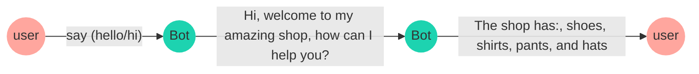
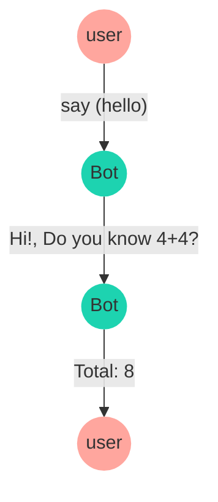

import { Contributors } from '@/components/Contributors'
import { Resources } from '@/components/Resources'
import { Guides } from '@/components/Guides'

export const description =
  'In this guide, we will talk about what happens when something goes wrong while you work with the API.'

# Features

Estas son las funciones más importantes que debes aprender a la hora de crear flujos o interacciones dinámicas con el bot

## Add keyword

__`addKeyword`__ es el punto de partida de un flujo de conversación, solo necesita pasar una __matriz de palabras clave__,
cuando alguien envía un mensaje de texto con esas palabras clave en el chatbot, la función activará el cuadro de diálogo predefinido que ha configurado.

En el siguiente ejemplo se establece un flujo de conversación que recibió las palabras clave 'hola ' y'hola',
luego, el chatbot enviará un mensaje usando `addAnswer` con el texto 'Hola, bienvenido a mi increíble tienda, ¿en qué puedo ayudarte?'
y 'La tienda ofrece: zapatos, camisas, pantalones y sombreros'.

<Note>
La función agregar palabras clave también tiene una serie de propiedades que lo ayudarán a resolver diferentes casos de uso.
Algunas de estas funciones son: [regex](add-functions#regex), [sensitive](add-functions#sensitive)
</Note>


<CodeGroup>
```ts {{ title: 'app.ts' }}
  import { addKeyword } from '@builderbot/bot';

  const mainFlow = addKeyword(['hello', 'hi'])
      .addAnswer(['Hi, welcome to my amazing shop', 'how can I help you?'])
      .addAnswer(['The shop has: ', 'shoes, shirts, pants, and hats'])
```
```js {{ title: 'app.js' }}
  import { addKeyword } from '@builderbot/bot';

  const mainFlow = addKeyword(['hello', 'hi'])
      .addAnswer(['Hi, welcome to my amazing shop', 'how can I help you?'])
      .addAnswer(['The shop has: ', 'shoes, shirts, pants, and hats'])
```
</CodeGroup>





El flujo de conversación puede limitarse a un __keyword__, en el ejemplo, la palabra 'comprar' para activar el siguiente cuadro de diálogo

<CodeGroup>
```ts {{ title: 'app.ts' }}
  import { addKeyword } from '@builderbot/bot';

  const mainFlow = addKeyword('buy')
      .addAnswer(['Great! ', 'What do you want to buy?'])
```
```js {{ title: 'app.js' }}
  import { addKeyword } from '@builderbot/bot';

  const mainFlow = addKeyword('purchase')
      .addAnswer(['Great! ', 'What do you want to buy?'])
```
</CodeGroup>

---

## Regex {{ not:'true', tag:'addKeyword' }}

<Row>
  <Col>
El chatbot admite la validación de expresiones regulares, en el siguiente ejemplo se pasa un objeto como segundo parámetro a la función addKeyword, el objeto tiene una propiedad regex establecida en true y la propiedad keywords es un patrón de expresiones regulares.

  </Col>
  <Col sticky>
<CodeGroup>
```ts {{ title: 'app.ts' }}
  import { addKeyword } from '@builderbot/bot';

  const REGEX_GMAIL_EMAIL = /(\w+)@gmail\.com/g;

  const mainFlow = addKeyword(REGEX_GMAIL_EMAIL, 
      { regex: true })
      .addAnswer(`Thanks for the gmail address`)
```
```js {{ title: 'app.js' }}
  import { addKeyword } from '@builderbot/bot';

  const REGEX_GMAIL_EMAIL = /(\w+)@gmail\.com/g;

  const mainFlow = addKeyword(REGEX_GMAIL_EMAIL, 
      { regex: true })
      .addAnswer(`Thanks for the gmail address`)
```
</CodeGroup>

  </Col>
</Row>

## Sensitive {{ not:'true', tag:'addKeyword' }}

<Row>
  <Col>
El chatbot detecta una palabra clave específica en cualquier parte de un mensaje, pero al pasar la propiedad `sensitive` como `true`, el chatbot activará el cuadro de diálogo si el usuario escribe exactamente la misma __keyword__

  </Col>
  <Col sticky>
<CodeGroup>
```ts {{ title: 'app.ts' }}
  import { addKeyword } from '@builderbot/bot';

  const mainFlow = addKeyword('buy', { sensitive: true })
      .addAnswer(['Great! ', 'What do you want to buy?'])
```
```js {{ title: 'app.js' }}
  import { addKeyword } from '@builderbot/bot';

  const mainFlow = addKeyword('buy', { sensitive: true })
      .addAnswer(['Great! ', 'What do you want to buy?'])
```
</CodeGroup>

  </Col>
</Row>

---

## Add answer

__`addAnswer`__ se utiliza para enviar un mensaje al usuario, puede ser un simple texto o un archivo adjunto.
En el siguiente ejemplo se establece un flujo de conversación que recibió la palabra clave'hola',
luego, el chatbot enviará un mensaje usando 'addAnswer' con el texto  __' Hola, bienvenido a mi increíble tienda, ¿en qué puedo ayudarte?'__

<CodeGroup>
```ts {{ title: 'app.ts' }}
  import { addKeyword, addAnswer } from '@builderbot/bot';

  const mainFlow = addKeyword('hello')
      .addAnswer('Hi, welcome to my amazing shop, how can I help you?')
```
```js {{ title: 'app.js' }}
  import { addKeyword, addAnswer } from '@builderbot/bot';

  const mainFlow = addKeyword('hello')
      .addAnswer('Hi, welcome to my amazing shop, how can I help you?')
``` 
</CodeGroup>

<Note>
Hay diferentes configuraciones para enviar mensajes, algunas funciones como enviar archivos, imágenes, video, retrasos, saltos de línea:
[line breaks](/add-functions#send-consecutive-messages), [consecutive](/add-functions#send-consecutive-messages), [delay](/add-functions#message-with-delay)
, [callback](/add-functions#message-with-callback)
</Note>

---

## Consecutive Messages {{ not:'true', tag:'addAnswer' }}

<Row>
  <Col>
  El chatbot puede enviar varios mensajes simplemente agregando la función addAnswer uno tras otro. En el siguiente ejemplo, el chatbot enviará (3) mensajes:
`Hi`, `Welcome to my amazing shop`, `how can I help you?` in that order.

  </Col>
  <Col sticky>
<CodeGroup>
```ts {{ title: 'app.ts' }}
  import { addKeyword, addAnswer } from '@builderbot/bot';

  const mainFlow = addKeyword('hello')
      .addAnswer('Hi')
      .addAnswer('Welcome to my amazing shop')
      .addAnswer('how can I help you?')
```
```js {{ title: 'app.js' }}
  import { addKeyword, addAnswer } from '@builderbot/bot';

  const mainFlow = addKeyword('hello')
      .addAnswer('Hi')
      .addAnswer('Welcome to my amazing shop')
      .addAnswer('how can I help you?')
```
</CodeGroup>

  </Col>
</Row>

## Message with line breaks {{ not:'true', tag:'addAnswer' }}

<Row>
  <Col>
Siempre que necesite enviar un mensaje con saltos de línea, puede usar una matriz de cadenas como puede ver en el siguiente ejemplo.
  </Col>
  <Col sticky>
<CodeGroup>
```ts {{ title: 'app.ts' }}
  import { addKeyword, addAnswer } from '@builderbot/bot';

  const mainFlow = addKeyword('hello')
      .addAnswer([
        'Hi', 'Welcome to my amazing shop', 
        'how can I help you?'
      ])
```
```js {{ title: 'app.js' }}
  import { addKeyword, addAnswer } from '@builderbot/bot';

  const mainFlow = addKeyword('hello')
      .addAnswer([
        'Hi', 'Welcome to my amazing shop', 
        'how can I help you?'
      ])
``` 
</CodeGroup>

  </Col>
</Row>

## Message with delay {{ not:'true', tag:'addAnswer' }}

<Row>
  <Col>
El chatbot puede enviar un mensaje con un `delay`, simplemente agregue la función addAnswer con la propiedad delay establecida en la cantidad de milisegundos que desea esperar antes de enviar el mensaje.
  </Col>
  <Col sticky>
<CodeGroup>
```ts {{ title: 'app.ts' }}
import { addKeyword, addAnswer } from '@builderbot/bot';

const mainFlow = addKeyword('hello')
  .addAnswer('This message will after 2 seconds',
    { delay: 2000 }
  )
```
```js {{ title: 'app.js' }}
import { addKeyword, addAnswer } from '@builderbot/bot';

const mainFlow = addKeyword('hello')
  .addAnswer('This message will after 2 seconds',
    { delay: 2000 }
  )
``` 
</CodeGroup>

  </Col>
</Row>

---

## Message with callback {{ not:'true'}} 

Cuando se usan funciones de devolución de llamada en addAnswers, la operación prioriza el envío del mensaje y luego la ejecución de la función.

<CodeGroup>
```ts {{ title: 'app.ts' }}
  import { addKeyword, addAnswer } from '@builderbot/bot';

  const mainFlow = addKeyword('hello')
      .addAnswer('Hi!, Do you know 4+4?', null, async (_, {flowDynamic}) => {
          const sum = 4 + 4
          await flowDynamic(`Total: ${sum}`)
      })
      .addAction(async (_, {flowDynamic}) => {
          await flowDynamic(`Other message`)
      })
```
```js {{ title: 'app.js' }}
  import { addKeyword, addAnswer } from '@builderbot/bot';

  const mainFlow = addKeyword('hello')
      .addAnswer('Hi!, Do you know 4+4?', null, async (_, {flowDynamic}) => {
          const sum = 4 + 4
          await flowDynamic(`Total: ${sum}`)
      })
      .addAction(async (_, {flowDynamic}) => {
          await flowDynamic(`Other message`)
      })
``` 
</CodeGroup>



---

## Add Action

__`addAction`__ se usa para definir acciones específicas como respuesta cuando se ha recibido un mensaje de whatsapp,
esta función permite activar flujos de conversación en función de la entrada del usuario y definir cómo debe actuar el chatbot.

En el siguiente ejemplo puedes ver cómo puedes activar una función cuando el usuario envía un mensaje con la palabra clave 'comprar'.

<CodeGroup>
```ts {{ title: 'app.ts' }}
  import { addKeyword, addAction } from '@builderbot/bot';

  const mainFlow = addKeyword('buy')
      .addAnswer('Great! What do you want to buy?')
      .addAction(async (_, { flowDynamic }): void => {
          return console.log('The user wants to buy something');
      })
```
```js {{ title: 'app.js' }}
  import { addKeyword, addAction } from '@builderbot/bot';

  const mainFlow = addKeyword('buy')
      .addAnswer('Great! What do you want to buy?')
      .addAction(async (_, { flowDynamic }) => {
          return console.log('The user wants to buy something');
      })
```
</CodeGroup>


Puede usar la función `addAction` con `capture`  como puede ver en el siguiente ejemplo

<CodeGroup>
```ts {{ title: 'app.ts' }}
  import { addKeyword, addAction } from '@builderbot/bot';

  const mainFlow = addKeyword(['Hello', 'Hi'])
      .addAction(async (_, { flowDynamic }): void => {
          return flowDynamic('Hi! how can I help you?');
      })
      .addAction({ capture: true }, async (ctx, { flowDynamic, state }): void => {
          await state.udpate({ name: ctx.body})
          return console.flowDynamic(`The user said: ${ctx.body}`);
      })
```
```js {{ title: 'app.js' }}
  import { addKeyword, addAction } from '@builderbot/bot';

  const mainFlow = addKeyword(['Hello', 'Hi'])
      .addAction(async (_, { flowDynamic }) => {
          return flowDynamic('The user wants to buy something');
      })
```
</CodeGroup>

---

<Guides />

<Resources />
