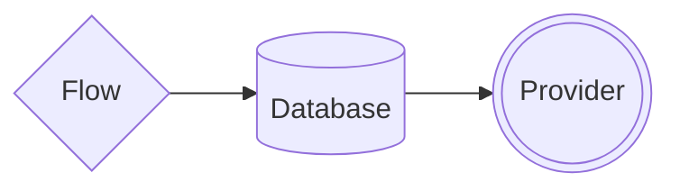

import { Contributors } from '@/components/Contributors'
import { Guides } from '@/components/Guides'
import { Resources } from '@/components/Resources'

export const description =
  'En esta guía, hablaremos sobre lo que sucede cuando algo sale mal mientras trabajas con la API.'

# Concepts

La biblioteca se basa en tres componentes clave para su correcto funcionamiento: el Flujo, encargado de construir el contexto de la conversación y ofrecer una interfaz amigable al desarrollador; el Proveedor, que actúa como conector permitiendo cambiar fácilmente entre proveedores de WhatsApp sin riesgo de afectar a otras partes del bot; y la Base de datos, que en consonancia con esta filosofía de conector, facilita cambiar la capa de persistencia de datos sin necesidad de reescribir el flujo de trabajo.



---

## Flow

Se refiere a crear secuencias estructuradas de interacciones, como en la creación de flujos de conversación. Dos métodos clave son addKeyword y addAnswer, que permiten asociar palabras clave con respuestas específicas, proporcionando opciones para personalizar el flujo de la conversación.

<CodeGroup>
```ts {{ title: 'app.ts' }}
import { addKeyword } from '@bot-whatsapp/bot'

addKeyword(['hello','hi']).addAnswer('Ey! welcome')
```

```js {{ title: 'app.js' }}
const { addKeyword } = require('@bot-whatsapp/bot') 

addKeyword(['hello','hi']).addAnswer('Ey! welcome')
```
</CodeGroup>


Algunos ejemplos de cómo usar la Palabra clave add en la que puede colocar la __keyword__ o una lista de __keywords__ que se usarán para iniciar un flujo conversacional


```ts
// Example with single keyword
addKeyword('hello').addAnswer('Ey! welcome')

// Example with multi keywords
addKeyword(['hello','hi']).addAnswer('Ey! welcome')
```

Para una rápida comprensión de la operación, hemos preparado un ejemplo básico de cómo implementar

<div className="not-prose aling-block">
  <Button
    href="/uses-cases"
    variant="text"
    arrow="right"
    children="View more examples"
  />
</div>

---

## Provider

Es una pieza clave utilizada para entregar el mensaje al proveedor elegido. En el caso de que esté creando un bot para whatsapp, debe usar un adaptador como __Meta__, __Twilio__, __Baileys__, etc. o incluso si desea conectarse a Telegram.


<CodeGroup>
```ts {{ title: 'app.ts' }}
import { addKeyword, MemoryDB, createProvider, createFlow } from '@bot-whatsapp/bot'
import { BaileysProvider } from '@bot-whatsapp/provider-baileys'

// ...stuff code...

const main = async () => {
    
    await createBot({
        database: new MemoryDB(),
        provider: createProvider(BaileysProvider),
        flow: createFlow([flowDemo])
    })
}

main()
```

```ts {{ title: 'provider.wppconnect.ts' }}
import { addKeyword, MemoryDB, createProvider, createFlow } from '@bot-whatsapp/bot'
import { WPPConnectProviderClass } from '@bot-whatsapp/provider-wppconnect'

// ...stuff code...

const main = async () => {
    
    await createBot({
        database: new MemoryDB(),
        provider: createProvider(WPPConnectProviderClass),
        flow: createFlow([flowDemo])
    })
}

main()
```

```ts {{ title: 'provider.meta.ts' }}
import { addKeyword, MemoryDB, createProvider, createFlow } from '@bot-whatsapp/bot'
import { MetaProvider } from '@bot-whatsapp/provider-meta'

// ...stuff code...

const main = async () => {
    
    await createBot({
        database: new MemoryDB(),
        provider: createProvider(MetaProvider, {
              jwtToken: 'jwtToken',
              numberId: 'numberId',
              verifyToken: 'verifyToken',
              version: 'v16.0',
        }),
        flow: createFlow([flowDemo])
    })
}

main()
```
</CodeGroup>

<div className="not-prose aling-block">
  <Button
    href="/providers"
    variant="text"
    arrow="right"
    children="More information about the providers "
  />
</div>

---

## Database

Just as providers can be easily exchanged between adapters, we can do the same with the database. Now the important thing to understand is how it works. The main purpose of the database inside the bot is to provide the bot with a record of the different events that have occurred between different conversations.

Está listo para implementar adaptadores de [Mongo](/databases#mongo), [MySQL](/databases#my-sql), [Postgres](/databases#postgres), entre otros.

<CodeGroup>
```ts {{ title: 'app.ts' }}
import { addKeyword, MemoryDB, createProvider, createFlow } from '@bot-whatsapp/bot'
import { BaileysProvider } from '@bot-whatsapp/provider-baileys'

// ...stuff code...

const main = async () => {
    
    await createBot({
        database: new MemoryDB(),
        provider: createProvider(BaileysProvider),
        flow: createFlow([flowDemo])
    })
}

main()
```

```ts {{ title: 'provider.wppconnect.ts' }}
import { addKeyword, MemoryDB, createProvider, createFlow } from '@bot-whatsapp/bot'
import { WPPConnectProviderClass } from '@bot-whatsapp/provider-wppconnect'

// ...stuff code...

const main = async () => {
    
    await createBot({
        database: new MemoryDB(),
        provider: createProvider(WPPConnectProviderClass),
        flow: createFlow([flowDemo])
    })
}

main()
```

```ts {{ title: 'provider.meta.ts' }}
import { addKeyword, MemoryDB, createProvider, createFlow } from '@bot-whatsapp/bot'
import { MetaProvider } from '@bot-whatsapp/provider-meta'

// ...stuff code...

const main = async () => {
    
    await createBot({
        database: new MemoryDB(),
        provider: createProvider(MetaProvider, {
              jwtToken: 'jwtToken',
              numberId: 'numberId',
              verifyToken: 'verifyToken',
              version: 'v16.0',
        }),
        flow: createFlow([flowDemo])
    })
}

main()
```
</CodeGroup>

<div className="not-prose aling-block">
  <Button
    href="/databases"
    variant="text"
    arrow="right"
    children="More information about the databases "
  />
</div>

----

<Guides />

<Resources />

<Contributors users={['leifermendez', 'elimeleth']} />