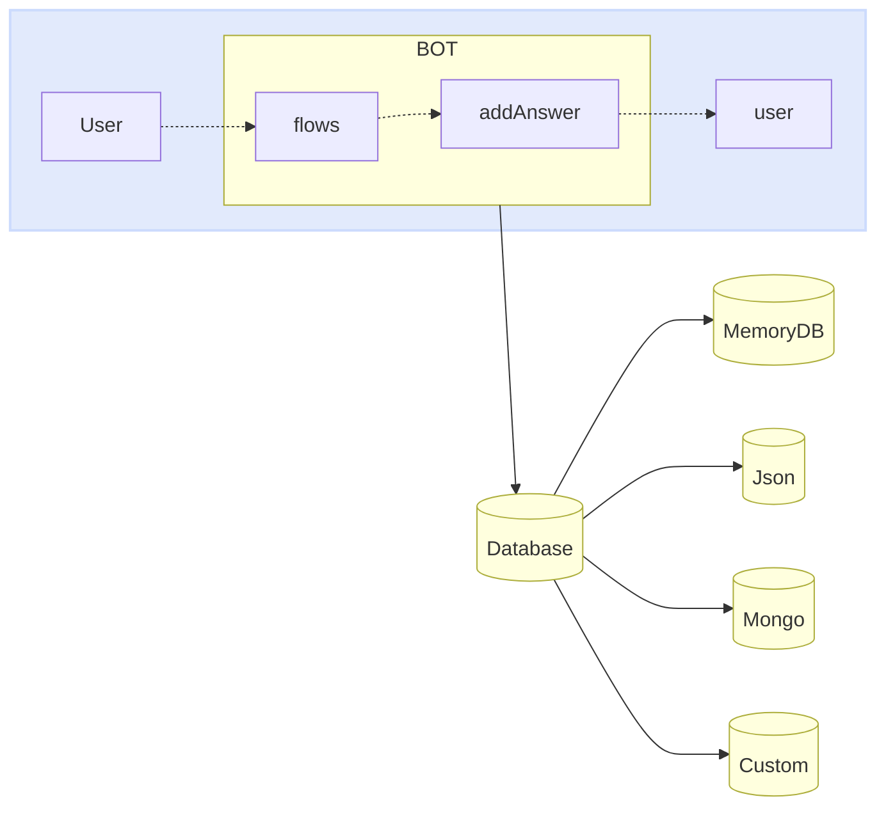

import { Contributors } from '@/components/Contributors'

export const description =
  'En esta guía, hablaremos sobre lo que sucede cuando algo sale mal mientras trabaja con la API.'

# Databases

Así como los proveedores se pueden intercambiar fácilmente entre adaptadores, podemos hacer lo mismo con la base de datos. Ahora lo importante es entender cómo funciona.
El objetivo principal de la base de datos dentro del arranque es proporcionar al bot un registro de los diferentes eventos que han ocurrido entre diferentes conversaciones.

Mucha gente lo usa como historial de chat( de hecho, también se puede usar para ese propósito), pero es posible que encuentre datos extraños en sus registros porque almacena no solo mensajes, sino también eventos.


<Warning>
Conectores: [MemoryDB](databases#memory-db), [Json](databases#json), [Mongo](databases#mongo), [MySQL](databases#my-sql), [Postgres](databases#postgres)
</Warning>




Cada base de datos puede necesitar ajustar las claves de acceso, la configuración, entre otras propiedades que se implementarán como configuración de la clase implementada.
<CodeGroup>
```ts {{ title: 'memory-database.ts' }}
import { MemoryDB } from "@builderbot/bot";

export type IDatabase = typeof MemoryDB
export const adapterDB = new MemoryDB();
```

```ts {{ title: 'json-database.ts' }}
import { JsonFileDB } from '@builderbot/database-json';

export type IDatabase = typeof JsonFileDB
export const adapterDB = new JsonFileDB({ filename: 'db.json' });
```

```ts {{ title: 'mongo-database.ts' }}
import { MongoDB } from '@builderbot/database-mongo'

export type IDatabase = typeof MongoDB
export const adapterDB = new MongoDB({
    dbUri: MONGO_DB_URI,
    dbName: MONGO_DB_NAME,
})
```

```ts {{ title: 'mysql-database.ts' }}
import { MysqlDB } from '@builderbot/database-mysql'

export type IDatabase = typeof MysqlDB
export const adapterDB = new MysqlDB({
    host: MYSQL_DB_HOST,
    user: MYSQL_DB_USER,
    database: MYSQL_DB_NAME,
    password: MYSQL_DB_PASSWORD,
})
```

```ts {{ title: 'postgres-database.ts' }}
import { PostgreSQLDB } from '@builderbot/database-postgres'

export type IDatabase = typeof PostgreSQLDB
export const adapterDB = new PostgreSQLDB({
    host: POSTGRES_DB_HOST,
    user: POSTGRES_DB_USER,
    database: POSTGRES_DB_NAME,
    password: POSTGRES_DB_PASSWORD,
    port: +POSTGRES_DB_PORT,
})
```

</CodeGroup>

A continuación encontrará más información sobre cada una de estas bases de datos.

---

## Memory

El [WhatsApp Business Platform](https://business.whatsapp.com/products/business-platform) permite a medianas y grandes empresas comunicarse con sus clientes a gran escala. Puede iniciar conversaciones con los clientes en solo minutos, enviarles notificaciones de servicio al cliente o actualizaciones de compras, ofrecerles un nivel de servicio personalizado y brindarles asistencia a través del canal que elijan.


<Warning>
Recuerde que se deben cumplir los siguientes requisitos para implementar el meta proveedor en producción. [More information](/databases/memory)
</Warning>

<CodeGroup>
```ts {{ title: 'memory-database.ts' }}
import { MemoryDB } from "@builderbot/bot";

export type IDatabase = typeof MemoryDB
export const adapterDB = new MemoryDB();
```
```ts {{ title: 'app.ts' }}
import { createBot, createProvider, createFlow, addKeyword } from '@builderbot/bot'
import { IProvider, adapterProvider } from './meta-provider';
import { IDatabase, adapterDB } from './memory-database';

const welcomeFlow = addKeyword<IProvider, IDatabase>(['hello', 'hi']).addAnswer('Ey! welcome')

const main = async () => {
    await createBot({
        flow: createFlow([welcomeFlow]),
        provider: adapterProvider,
        database: adapterDB
    })
}

main()
```
</CodeGroup>

---

## Json

[Twilio](https://www.twilio.com/en-us/messaging/channels/whatsapp) es una plataforma de desarrollo que permite a los desarrolladores crear aplicaciones de comunicación en la nube y sistemas web. Las API de comunicaciones de Twilio permiten a las empresas brindar la experiencia de comunicación adecuada a sus clientes dentro de las aplicaciones web y móviles. Al usar las API de Twilio, los desarrolladores pueden agregar rápidamente esta funcionalidad a una aplicación, como mensajes de voz, videollamadas, mensajes de texto y más.


<Warning>
Recuerde que se deben cumplir los siguientes requisitos para implementar el meta proveedor en producción. [More information](/providers/twilio)
</Warning>

<CodeGroup>
```ts {{ title: 'json-database.ts' }}
import { JsonFileDB } from '@builderbot/database-json';

export type IDatabase = typeof JsonFileDB
export const adapterDB = new JsonFileDB({ filename: 'db.json' });
```
```ts {{ title: 'app.ts' }}
import { createBot, createProvider, createFlow, addKeyword } from '@builderbot/bot'
import { IDatabase, adapterDB } from './json-database';
import { IProvider, adapterProvider } from './twilio-provider';

const welcomeFlow = addKeyword<IProvider, IDatabase>(['hello', 'hi']).addAnswer('Ey! welcome')

const main = async () => {
    await createBot({
        flow: createFlow([welcomeFlow]),
        provider: adapterProvider,
        database: adapterDB
    })
}

main()
```
</CodeGroup>

---

## Mongo

[Baileys](https://whiskeysockets.github.io/) es un proyecto de código abierto que permite enviar mensajes, recibir mensajes y docenas de otras funciones implementando WebSocket en una versión de whatsapp.
Es un proyecto con gran trayectoria impulsado por personas con gran conocimiento del tema, puedes profundizar en esta biblioteca directamente en su documentación o[repository](https://github.com/WhiskeySockets/Baileys).

Debido a que este es un proveedor gratuito que emula la interfaz web de whatsapp, debe escanear el QR para iniciar sesión.

<Warning>
Recuerde que se deben cumplir los siguientes requisitos para implementar el meta proveedor en producción. [More information](/providers/baileys)
</Warning>

<CodeGroup>
```ts {{ title: 'mongo-database.ts' }}
import { MongoDB } from '@builderbot/database-mongo'

export type IDatabase = typeof MongoDB
export const adapterDB = new MongoDB({
    dbUri: MONGO_DB_URI,
    dbName: MONGO_DB_NAME,
})
```
```ts {{ title: 'app.ts' }}
import { createBot, createProvider, createFlow, addKeyword, MemoryDB } from '@builderbot/bot'
import { IProvider, adapterProvider } from './baileys-provider';
import { IDatabase, adapterDB } from './mongo-database';

const welcomeFlow = addKeyword<IProvider, IDatabase>(['hello', 'hi']).addAnswer('Ey! welcome')

const main = async () => {
    await createBot({
        flow: createFlow([welcomeFlow]),
        provider: adapterProvider,
        database: adapterDB
    })
}

main()
```
</CodeGroup>

---

## MySQL

[Venom](https://github.com/orkestral/venom) es un proyecto de código abierto que utiliza JavaScript para crear barcos de alto rendimiento para WhatsApp. Admite una amplia gama de interacciones, incluida la atención al cliente, el envío de medios, el reconocimiento de frases basado en IA y varios diseños arquitectónicos adaptados a WhatsApp.
Puedes visitar su [official](https://orkestral.io/) sitio web como repositorio para comprender otras funciones que puede utilizar.


Debido a que este es un proveedor gratuito que emula la interfaz web de whatsapp, debe escanear el QR para iniciar sesión.

<Warning>
Recuerde que se deben cumplir los siguientes requisitos para implementar el meta proveedor en producción. [More information](/providers/venom)
</Warning>

<CodeGroup>
```ts {{ title: 'mysql-database.ts' }}
import { MysqlDB } from '@builderbot/database-mysql'

export type IDatabase = typeof MysqlDB
export const adapterDB = new MysqlDB({
    host: MYSQL_DB_HOST,
    user: MYSQL_DB_USER,
    database: MYSQL_DB_NAME,
    password: MYSQL_DB_PASSWORD,
})
```
```ts {{ title: 'app.ts' }}
import { createBot, createProvider, createFlow, addKeyword, MemoryDB } from '@builderbot/bot'
import { IProvider, adapterProvider } from './venom-provider';
import { IDatabase, adapterDB } from './mysql-database';

const welcomeFlow = addKeyword<IProvider, IDatabase>(['hello', 'hi']).addAnswer('Ey! welcome')

const main = async () => {
    await createBot({
        flow: createFlow([welcomeFlow]),
        provider: adapterProvider,
        database: adapterDB
    })
}

main()
```
</CodeGroup>

---

## Postgres

[WPPConnect](https://wppconnect.io) es un proyecto de código abierto desarrollado por la comunidad JavaScript con el objetivo de exportar funciones de WhatsApp Web al nodo, que se pueden utilizar para apoyar la creación de cualquier interacción, como atención al cliente, envío de medios, reconocimiento de inteligencia basado en frases artificiales y muchas otras cosas, usa tu imaginación
Puedes visitar su web oficial como el [repository](https://github.com/wppconnect-team/wppconnect) para comprender otras funciones que puede utilizar.

Debido a que este es un proveedor gratuito que emula la interfaz web de whatsapp, debe escanear el QR para iniciar sesión.

<Warning>
Recuerde que se deben cumplir los siguientes requisitos para implementar el meta proveedor en producción. [More information](/providers/wpp-connect)
</Warning>

<CodeGroup>
```ts {{ title: 'postgres-database.ts' }}
import { PostgreSQLDB } from '@builderbot/database-postgres'

export type IDatabase = typeof PostgreSQLDB
export const adapterDB = new PostgreSQLDB({
    host: POSTGRES_DB_HOST,
    user: POSTGRES_DB_USER,
    database: POSTGRES_DB_NAME,
    password: POSTGRES_DB_PASSWORD,
    port: +POSTGRES_DB_PORT,
})
```
```ts {{ title: 'app.ts' }}
import { createBot, createProvider, createFlow, addKeyword, MemoryDB } from '@builderbot/bot'
import { IProvider, adapterProvider } from './wppconnect-provider';
import { IDatabase, adapterDB } from './postgres-database';

const welcomeFlow = addKeyword<IProvider, IDatabase>(['hello', 'hi']).addAnswer('Ey! welcome')

const main = async () => {
    await createBot({
        flow: createFlow([welcomeFlow]),
        provider: adapterProvider,
        database: adapterDB
    })
}

main()
```
</CodeGroup>

---

<Contributors users={['leifermendez', 'elimeleth']} />