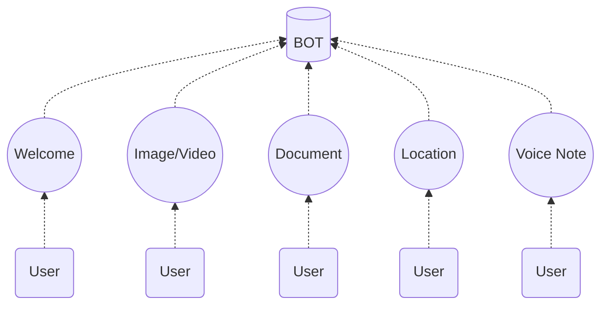
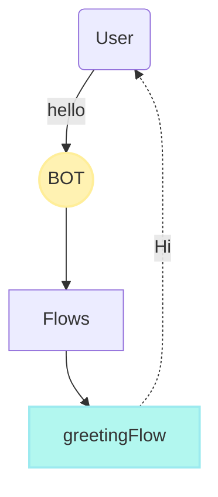

import { Contributors } from '@/components/Contributors'
import { Resources } from '@/components/Resources'
import { Guides } from '@/components/Guides'

export const description =
  'En esta guía, hablaremos sobre lo que sucede cuando algo sale mal mientras trabaja con la API.'

# Events

En ocasiones los usuarios envían mensajes como una imagen, un video o mensajes de ubicación especial, entre otros, para recibir e iniciar una conversación cuando llega un mensaje de este tipo podemos utilizar los eventos.



---

## Default  {{ tag: 'WELCOME'  }}

Cuando un usuario envía un mensaje de "texto" que no existe en una palabra clave en otro flujo, el WELCOME el evento se activará de forma predeterminada, que es el evento predeterminado.

Imaginemos el caso en el que una persona escribe la palabra `¡Gracias!`

<CodeGroup>
```ts {{ title: 'app.ts' }}
  import { addKeyword, EVENTS } from '@bot-whatsapp/bot'
  
  const welcomeFlow = addKeyword(EVENTS.WELCOME).addAnswer('Ey welcome?')
  const greetingFlow = addKeyword(['hello','hi']).addAnswer('Hi!')
```
```js {{ title: 'app.js' }}
  const { addKeyword, EVENTS } = require('@bot-whatsapp/bot')
  
  const welcomeFlow = addKeyword(EVENTS.MEDIA).addAnswer('Message hello')
```
</CodeGroup>

<RowCenter>
  <Col>
  ```mermaid
flowchart TB
    A(User) --"Thank you!"--> B((BOT))
    B --> C[Flows]
    C --> G["welcomeFlow"]
    G -. Ey welcome? .-> A

  style B fill:#fff2b2,stroke:#ffee99,stroke-width:2px
  style G fill:#b2f7ef,stroke:#9ceaef,stroke-width:2px
```
  </Col>
  <Col>

  </Col>
</RowCenter>

Podemos ver en el diagrama anterior que el bot realiza una búsqueda en todos los flujos para obtener el mejor flujo que pueda responder a la palabra clave "Thank You" pero como no encuentra, se activa la "WELCOME".

---

## Received Image or Video {{ tag: 'MEDIA'  }}

Cuando un usuario envía una imagen o un video, el evento MEDIA, que es el evento predeterminado, se activará de forma predeterminada. Esto es ideal para cuando necesitamos que envíen información y necesitamos almacenarla.
<CodeGroup>
```ts {{ title: 'app.ts' }}
  import { addKeyword, EVENTS } from '@bot-whatsapp/bot'
  
  const mediaFlow = addKeyword(EVENTS.MEDIA).addAnswer('I received a media image/video')
```
```js {{ title: 'app.js' }}
  const { addKeyword, EVENTS } = require('@bot-whatsapp/bot')
  
  const mediaFlow = addKeyword(EVENTS.MEDIA).addAnswer('I received a media image/video')
```
</CodeGroup>

<Note>
Para guardar el archivo multimedia, debe invocar la función saveFile del proveedor que está utilizando.
</Note>

<CodeGroup>
```ts {{ title: 'app.ts' }}
  import { addKeyword, EVENTS } from '@bot-whatsapp/bot'
  import { BaileysProvider } from '@bot-whatsapp/provider-baileys'

  const mediaFlow = addKeyword<BaileysProvider>(EVENTS.MEDIA)
  .addAnswer('I received a media image/video', async (ctx, { provider }) => {
    const localPath = await provider.saveFile(ctx, {path:'...'})
    //console.log(localPath)
  })
```
```js {{ title: 'app.js' }}
  const { addKeyword, EVENTS } = require('@bot-whatsapp/bot')
  const { BaileysProvider } = require('@bot-whatsapp/bot')
  
  const mediaFlow = addKeyword(EVENTS.MEDIA)
  .addAnswer('I received a media image/video', async (ctx, { provider }) => {
    const localPath = await provider.saveFile(ctx, {path:'...'})
    //console.log(localPath)
  })
```
</CodeGroup>

---

## Received Document {{ tag: 'DOCUMENT'  }}

Cuando un usuario envía un documento, el evento del DOCUMENT se activará de forma predeterminada, que es el evento predeterminado.
<CodeGroup>
```ts {{ title: 'app.ts' }}
  import { addKeyword, EVENTS } from '@bot-whatsapp/bot'
  
  const documentFlow = addKeyword(EVENTS.DOCUMENT)
  .addAnswer("Wow! I'm sorry I can't read this document right now", async (ctx, { provider }) => {
    const localPath = await provider.saveFile(ctx, {path:'...'})
    //console.log(localPath)
  })
```
```js {{ title: 'app.js' }}
  const { addKeyword, EVENTS } = require('@bot-whatsapp/bot')
  
  const documentFlow = addKeyword(EVENTS.DOCUMENT)
  .addAnswer("Wow! I'm sorry I can't read this document right now", async (ctx, { provider }) => {
    const localPath = await provider.saveFile(ctx, {path:'...'})
    //console.log(localPath)
  })
```
</CodeGroup>

---

## Received Location {{ tag: 'LOCATION'  }}

<Note>
LOCATION debe enviarse a través de WhatsApp, aún no permite enlaces de ubicación desde aplicaciones externas
</Note>

Cuando su chatbot necesita acceder a la ubicación de un usuario, es importante asegurarse de que la ubicación se envíe directamente desde la aplicación WhatsApp para obtener resultados. Una vez recibida la ubicación, puede realizar un registro de consola de ctx para ver los detalles de la ubicación recibida.

El contexto de ubicación recibido se verá así en la consola:

```bash
ctx:  {
  ...
  message: Message {
    locationMessage: LocationMessage {
      degreesLatitude: -2.1462137699127197,
      degreesLongitude: -79.88981628417969,
      name: 'Doctor Miguel Angel Jijón Teran',
      address: 'Doctor Miguel Angel Jijón Teran, Guayaquil, Ecuador',
    },
  },
  body: '_event_location__0d5c9f57-0909-44a1-995f-902f9df3b21f',
  name: 'yeyodev 👨🏾‍💻',
  from: '593000000000'
}
```

Esto generará la latitud y longitud del usuario en la consola, lo que le permitirá utilizar de manera efectiva los datos de ubicación para la funcionalidad de su chatbot.

Para acceder a los datos de ubicación, puede utilizar el siguiente enfoque:

<CodeGroup>
```ts {{ title: 'location.flow.ts' }}
import { EVENTS, addKeyword } from "@bot-whatsapp/bot";

export default addKeyword(EVENTS.LOCATION)
.addAnswer("I have received your location!", null, async (ctx) => {
  const userLatitude = ctx.message.locationMessage.degreesLatitude;
  const userLongitude = ctx.message.locationMessage.degreesLongitude;
})
```
```js {{ title: 'location.flow.js' }}
const { EVENTS, addKeyword } = require("@bot-whatsapp/bot");

export default addKeyword(EVENTS.LOCATION)
.addAnswer("I have received your location!", null, async (ctx) => {
  const userLatitude = ctx.message.locationMessage.degreesLatitude;
  const userLongitude = ctx.message.locationMessage.degreesLongitude;
})
```
</CodeGroup>

---

## Received Voice Note {{ tag: 'VOICE_NOTE' }}

Cuando un usuario envía una nota de voz, el evento VOICE_NOTE se activará de forma predeterminada, que es el evento previsto para este comportamiento, es importante comprender que una nota de voz es diferente de un archivo de imagen o video.

<CodeGroup>
```ts {{ title: 'app.ts' }}
  import { addKeyword, EVENTS } from '@bot-whatsapp/bot'
  
  const voiceNoteFlow = addKeyword(EVENTS.VOICE_NOTE)
  .addAnswer('Give me a second to hear you!', async (ctx, { provider }) => {
    const localPath = await provider.saveFile(ctx, {path:'...'})
    //console.log(localPath)
  })
  
```
```js {{ title: 'app.js' }}
  const { addKeyword, EVENTS } = require('@bot-whatsapp/bot')
  
  const voiceNoteFlow = addKeyword(EVENTS.VOICE_NOTE)
  .addAnswer('Give me a second to hear you!', async (ctx, { provider }) => {
    const localPath = await provider.saveFile(ctx, {path:'...'})
    //console.log(localPath)
  })
```
</CodeGroup>

---

<Guides />

<Resources />

<Contributors users={['leifermendez', 'elimeleth']} />