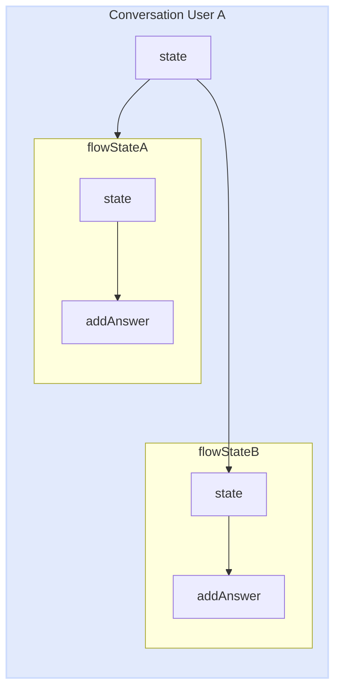
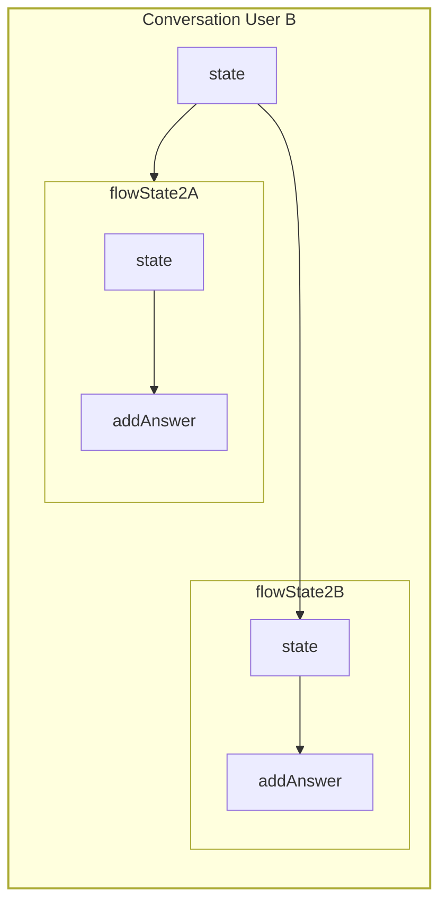
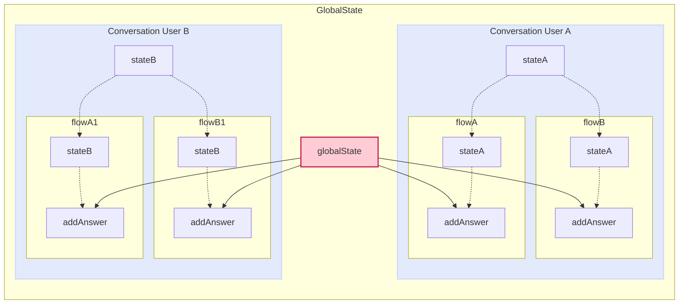
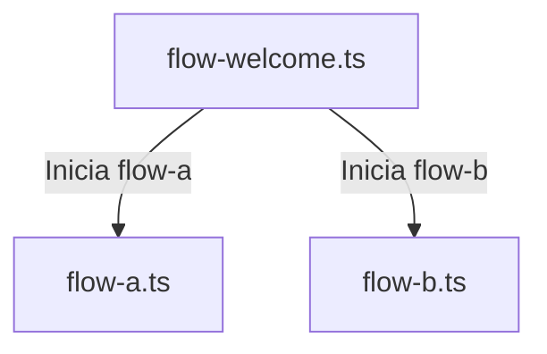

import { Contributors } from '@/components/Contributors'
import { Resources } from '@/components/Resources'
import { Guides } from '@/components/Guides'

export const description =
  'En esta guía, hablaremos sobre lo que sucede cuando algo sale mal mientras trabaja con la API.'

# Methods

## State

En muchas ocasiones necesitarás compartir datos entre flujos y sin importar si has modularizado tu proyecto en diferentes archivos puedes usar state en la función callback para poder acceder al estado individual de cada usuario.

Imaginemos el caso en el que tienes dos flujos.
Flujo A: Encargado de recopilar los datos de los usuarios.
Flujo B: Encargado de generar un registro en la base de datos.
pero ambos flujos son archivos independientes

__Remember__ that the state is independent per conversation between user and bot. 

<CodeGroup>
```ts {{ title: 'app.ts' }}
  import { createFlow, MemoryDB, createProvider } from '@builderbot/bot';
  // ...
  import flowA from './flows/flow-a'
  import flowB from './flows/flow-b'

  const main = async () => {

      const adapterDB = new MemoryDB()
      const adapterFlow = createFlow([flowA, flowB])
      const adapterProvider = createProvider(BaileysProvider)

      adapterProvider.initHttpServer(3000)

      await createBot({
          flow: adapterFlow,
          provider: adapterProvider,
          database: adapterDB,
      })
  }
```
```ts {{ title: 'flow-a.ts' }}
  import { addKeyword, addAction } from '@builderbot/bot';

  const flowA = addKeyword('register')
    .addAnswer('What is your name?', { capture: true }, async (ctx, { state }) => {
      const responseName = ctx.body
      await state.update({ name: responseName })
    })
    .addAnswer('What is your email?', { capture: true }, async (ctx, { state }) => {
      const responseEmail = ctx.body
      await state.update({ email: responseEmail })
    })

  export default flowA
```
```ts {{ title: 'flow-b.ts' }}
  import { addKeyword } from '@builderbot/bot';

  const flowB = addKeyword('resume')
    .addAnswer('ok your name is...', null, async (_, { state, flowDynamic }) => {
      const name = state.get('name')
      await flowDynamic(name)
    })
    .addAnswer('ok your email is...', null, async (_, { state, flowDynamic }) => {
      const email = state.get('email')
      await flowDynamic(email)
    })
    .addAnswer('ok your summary is..', null, async (_, { state, flowDynamic }) => {
      const allState = state.getMyState()
      await flowDynamic(`Name:${allState.name}, Email: ${allState.email}`)
    })


  export default flowB
```
</CodeGroup>

Cada historial de conversaciones con el usuario es totalmente independiente, de esta forma evitamos mezclar conversaciones.
  





<Warning>
Es importante entender que el estado es volátil, no impregna en ninguna parte. Si le preocupa el nivel de rendimiento, puede verlo [here](https://github.com/codigoencasa/bot-whatsapp/blob/d8eb94cae36fb233f5283c8d44c6c0307d26a978/packages/bot/src/context/stateClass.ts#L7), pero te ahorraré tiempo diciéndote que es un [Map](https://developer.mozilla.org/en-US/docs/Web/JavaScript/Reference/Global_Objects/Map)
</Warning>

---

## GlobalState

Muy similar a [state](/methods#state) existe otro método llamado `global_state` para compartir un estado global del bot entre diferentes flujos. El uso principal de este método es compartir datos que pueden cambiar y a los que puede acceder cada conversación entre bot y usuario.

A continuación, puede ver un ejemplo práctico en el que usamos globalState para usarlo como un interruptor para permitir o no permitir que el bot responda sin importar quién le escriba.

<CodeGroup>
```ts {{ title: 'app.ts' }}
  import { createFlow, MemoryDB, createProvider } from '@builderbot/bot';
  // ...
  import flowWelcome from './flows/flow-welcome'
  import flowOnOff from './flows/flow-on-off'

  const main = async () => {

      const adapterDB = new MemoryDB()
      const adapterFlow = createFlow([flowWelcome, flowOnOff])
      const adapterProvider = createProvider(BaileysProvider)

      adapterProvider.initHttpServer(3000)

      await createBot({
          flow: adapterFlow,
          provider: adapterProvider,
          database: adapterDB,
      })
  }
```
```ts {{ title: 'flow-on-off.ts' }}
  import { addKeyword, addAction } from '@builderbot/bot';

  const flowOnOff = addKeyword('turnOffBot')
    .addAction(async (ctx, { globalState, flowDynamic, endFlow }) => {
      const offOrOn = !globalState.get<boolean>('enable')
      await globalState.update({ enable: offOrOn })

      if(!offOrOn){
        return endFlow(`Bot is: OFF`)
      }
      await flowDynamic(`Bot is: ON`)
    })
    .addAnswer('message...')

  export default flowOnOff

```
```ts {{ title: 'flow-welcome.ts' }}
  import { addKeyword } from '@builderbot/bot';

  const flowWelcome = addKeyword('hi')
    .addAction(async (_, { globalState, endFlow }) => {
      const offOrOn = !globalState.get<boolean>('enable')
      if(!offOrOn) return endFlow()
    })
    .addAnswer('Welcome to...')

  export default flowWelcome

```
</CodeGroup>




---

## State/GlobalState Options {{ not:'true' }}

Ambos métodos, como state y global estate, contienen opciones y funcionalidades similares, que según el caso de uso pueden resultar muy útiles.

## Clear {{ not:'true' }}

<Row>
  <Col>
Este método permite limpiar el estado de forma global o independiente. Técnicamente despeja el Mapa.

Disponible en: __state__, __globalState__
  </Col>
  <Col sticky>
    <CodeGroup>
    ```ts
    .addAnswer('..', null, async (_, { state }) => {
      state.clear()
    })
    .addAction(async (_, { globalState }) => {
      globalState.clear()
    })
    ```
    </CodeGroup>

  </Col>
</Row>

## Update {{ not:'true' }}

<Row>
  <Col>
Para agregar o actualizar un valor en el estado tenemos disponible el método update. Este método recibe un objeto que si el valor no existe lo crea y devuelve un nuevo objeto con todos los valores.
Es importante comprender que es una promesa evitar comportamientos raros agregando el `await`

Disponible en: __state__, __globalState__
  </Col>
  <Col sticky>
    <CodeGroup>
    ```ts
    .addAnswer('..', null, async (_, { state }) => {
      await state.update({name:'Joe', age:'33'})
      await state.update({email:'test@test.com'})
    })
    .addAction(async (_, { globalState }) => {
      await globalState.update({name:'Joe', age:'33'})
      await globalState.update({email:'test@test.com'})
    })
    ```
    </CodeGroup>

  </Col>
</Row>


## Get {{ not:'true' }}

<Row>
  <Col>
Cuando necesitamos recuperar los valores de estado, podemos hacerlo individualmente llamando por el nombre de la propiedad de la siguiente manera.

Disponible en: __state__, __globalState__
  </Col>
  <Col sticky>
    <CodeGroup>
    ```ts
    .addAnswer('..', null, async (_, { state }) => {
      state.get('propertyName')
    })
    .addAction(async (_, { globalState }) => {
      globalState.get('propertyName')
    })
    ```
    </CodeGroup>

  </Col>
</Row>

## GetMyState {{ not:'true' }}

<Row>
  <Col>
Otra forma de recuperar todo el objeto de estado perteneciente a una conversación independiente del usuario es mediante getMyState

Disponible en: __state__
  </Col>
  <Col sticky>
    <CodeGroup>
    ```ts
    .addAnswer('..', null, async (_, { state }) => {
      state.getMyState()
    })
    ```
    </CodeGroup>
  </Col>
</Row>

## GetAllState {{ not:'true' }}

<Row>
  <Col>
Cuando estamos trabajando con el Estado global y queremos recuperar todos los objetos de propiedades con sus respectivos valores, puede usar getAllState

Disponible en: __globalState__
  </Col>
  <Col sticky>
    <CodeGroup>
    ```ts
    .addAnswer('..', null, async (_, { globalState }) => {
      globalState.getAllState()
    })
    ```
    </CodeGroup>
  </Col>
</Row>

---

## FlowDynamic

Muchas veces necesitará enviar mensajes provenientes de una llamada API o datos dinámicos de la base de datos o de procesos. En este caso, debe usar`flowDynamic`.

<CodeGroup>
```ts {{ title: 'flow-standalone.ts' }}
  import { addKeyword } from '@builderbot/bot';

  const flowStandAlone = addKeyword('register')
    .addAnswer('What is your name?', { capture: true }, async (ctx, { flowDynamic }) => {
      const responseName = ctx.body
      //.... db.insert({name:responseName})
      await flowDynamic(`Thanks for register ${responseName}`)
    })

  export default flowStandAlone
```
```ts {{ title: 'flow-multiline.ts' }}
  import { addKeyword } from '@builderbot/bot';

  const flowStandAlone = addKeyword('register')
    .addAnswer('Hello!', null, async (ctx, { flowDynamic }) => {
      await flowDynamic(
        [
          `How are you?`,
          `I'm fine`
        ]
      )
    })

  export default flowStandAlone
```
```ts {{ title: 'flow-list.ts' }}
  import { addKeyword } from '@builderbot/bot';

  const flowProducts = addKeyword('products')
    .addAction( async (_, { flowDynamic }) => {
      const dataAPI = await fetch('http://your-api.example.com/products')
      const data = await dataAPI.json() as {name:string, photo:string}[]
      const parseDataToFlow = data.map(item => ({body:`Item: ${item.name}`, media:item.photo}))
      await flowDynamic(parseDataToFlow)
    })

  export default flowProducts
```

</CodeGroup>

<Error>
NO se recomienda enviar muchos mensajes seguidos porque el [provider](/concepts#provider)  puede determinar que es spam.
</Error>

Si desea enviar una lista de productos, se recomienda enviar algunos productos entre 4 y 8 y puede preguntar al usuario qué categoría de productos y otros detalles filtrar y poder responder con la lista de productos ideal.
---

## FlowDynamic Options {{ not: 'true' }}

<Row>
  <Col>

    <Properties>
      <Property name="body" type="string">
Puede enviar un mensaje dentro de un objeto utilizando la propiedad body. Es ideal cuando necesita enviar un mensaje aparte del mensaje para enviar un medio o para retrasar.     
 </Property>
      <Property name="delay" type="number">
Este es el número de milisegundos que transcurrirán antes de que se envíe el mensaje.
      </Property>
      <Property name="media" type="string">
La url o ruta local del archivo a enviar, debe ser una cadena de texto y si es una URL debe ser pública.
      </Property>
    </Properties>


  </Col>
  <Col sticky>

    <CodeGroup>
    ```ts
const flow = addKeyword('register')
    .addAction(async (_, { flowDynamic }) => {

      await flowDynamic([{ body: `Thanks  ${responseName}` }])

      await flowDynamic([{ 
        body: `message with 2 seconds delay`,
        delay: 2000 
       }])

      await flowDynamic([{ 
        body: `Look at this`,
        media: `https://i.imgur.com/0HpzsEm.png` 
      }])

      await flowDynamic([{ 
        body: `Look at this`,
        media: join('assets','file.pdf') 
      }])

    })
    ```

    </CodeGroup>

  </Col>
</Row>

---

## FallBack

La función fallBack() es un recurso fundamental dentro del flujo de interacción de un bot, que se utiliza para manejar respuestas inválidas o inesperadas del usuario. Cuando un usuario proporciona un mensaje que no coincide con ninguna palabra clave o respuesta esperada, el bot puede invocar la función fallBack() para repetir el último mensaje y esperar una respuesta válida.

Para integrar la función fallBack () en el flujo de interacción del bot, se usa dentro del [addAnswer()](/add-functions#add-answer) o [addAction()](/add-functions#add-action) método. Dentro de este método, se establece una condición que verifica si la respuesta del usuario es válida o no. En caso de que la respuesta no cumpla con los criterios esperados, se llama a fallBack() para repetir el último mensaje y solicitar una respuesta válida. Por ejemplo:

<CodeGroup>

```ts {{ title: 'flow-validate-email-custom-error.ts' }}
import { addKeyword } from '@builderbot/bot';

const flowEmailRegister = addKeyword('hello')
  .addAnswer('What is your email?', {capture:true}, (ctx, { fallBack }) => {
    if (!ctx.body.includes('@')) {
      return fallBack(`Ups! is not a valid email`);
    } else {
      // db.insert({email:ctx.body})
    }
  });
```
```ts {{ title: 'flow-validate-email-default-error.ts' }}
import { addKeyword } from '@builderbot/bot';

const flowEmailRegister = addKeyword('hello')
  .addAnswer('What is your email?', {capture:true}, (ctx, { fallBack }) => {
    if (!ctx.body.includes('@')) {
      return fallBack(); //repeat the last question What is your email?
    } else {
      // db.insert({email:ctx.body})
    }
  });
```

</CodeGroup>

---

## EndFlow

La función endFlow se utiliza en aplicaciones de chat o interfaces de usuario conversacionales para finalizar un flujo de interacción con el usuario. Imagine un escenario en el que está recopilando información de un usuario en varios pasos, como su nombre, dirección de correo electrónico y número de teléfono, y en cada paso el usuario tiene la opción de cancelar la operación actual.

Al utilizar endFlow, puede proporcionar al usuario una manera fácil de cancelar la transacción en cualquier momento. Por ejemplo, podría presentar un botón o comando que el usuario pueda activar para indicar que desea detener el proceso actual. Una vez que se activa endFlow, el flujo de interacción finaliza y se puede mostrar un mensaje final al usuario, informándole que la solicitud ha sido cancelada.

En resumen, endFlow mejora la experiencia del usuario al proporcionar una salida clara y fácil de usar en caso de que decida abandonar el proceso en cualquier etapa del flujo de interacción. Esto ayuda a garantizar una experiencia de usuario más fluida y satisfactoria en las aplicaciones de conversación.

```ts {{ title: 'flow-validate-email-custom-error.ts' }}
const flowRegister = addKeyword(['Hi'])
  .addAnswer(
    ['Hello!', 'To submit the form I need some data...', 'Write your *Name*'],
    { capture: true },

    async (ctx, { flowDynamic, endFlow, state }) => {
      if (ctx.body === 'cancel') {
        return endFlow(`Your request has been canceled`);
      }
      await state.update({name:ctx.body})
      return flowDynamic(`Nice to meet you *${ctx.body}*, let's continue...`);
    }
  )
  .addAnswer(
    ['I also need your last names'],
    { capture: true },

    async (ctx, { flowDynamic, endFlow, state }) => {
      if (ctx.body === 'cancel') {
        return endFlow();
      }
      await state.update({lastName:ctx.body})
      return flowDynamic(`Perfect *${ctx.body}*, finally...`);
    }
  )
```


---

## GotoFlow
La función `gotoFlow` permite la transición fluida entre diferentes flujos de interacción en una aplicación conversacional. Este método es útil cuando necesita separar la lógica de interacción en diferentes flujos y dirigir al usuario de un flujo a otro de acuerdo con ciertas condiciones o eventos.

Por ejemplo, supongamos que en una aplicación de asistente virtual tiene un flujo para usuarios registrados y otro para usuarios no registrados. Con `gotoFlow`, es posible dirigir a un usuario recién registrado del flujo de usuarios no registrados al flujo de usuarios registrados, o viceversa, proporcionando una experiencia personalizada y consistente para cada tipo de usuario.

En el código proporcionado, se muestra cómo usar `gotoFlow` para dirigir al usuario al flujo correspondiente de acuerdo con su estado de registro. Esto ayuda a modularizar la lógica de la aplicación y facilita la gestión de múltiples flujos de conversación.

<CodeGroup>

```ts {{ title: 'flow-welcome.ts' }}
  import { addKeyword, EVENTS } from '@builderbot/bot';

  const flowWelcome = addKeyword('hi')
    .addAnswer('Welcome!', null, async (ctx, { gotoFlow }) => {
        // db.get(...)
        const userRegistered = true;

        if (userRegistered) return gotoFlow(flowRegistered);

        return gotoFlow(flowUserNotRegistered);
    });
  export default flowWelcome
```
```ts {{ title: 'flow-a.ts' }}
  import { addKeyword, EVENTS } from '@builderbot/bot';

  const flowA = addKeyword(EVENTS.ACTION)
      .addAction(async (_, { flowDynamic }) => {
          const mockUser = "Leifer";
          await flowDynamic(`Hello ${mockUser}! Welcome back.`);
      });
  export default flowA
```
```ts {{ title: 'flow-b.ts' }}
  import { addKeyword, EVENTS } from '@builderbot/bot';

  const flowB = addKeyword(EVENTS.ACTION)
    .addAnswer(`It's your first time here! What's your email address?`, 
      { capture: true }, async (_, { flowDynamic, gotoFlow }) => {
        await flowDynamic('¡We have registered you! Welcome to');
        return gotoFlow(flowRegistered);
    });
  export default flowB
```
```ts {{ title: 'app.ts' }}
  import { createFlow, MemoryDB, createProvider } from '@builderbot/bot';
  // ...
  import flowWelcome from './flows/flow-welcome'
  import flowA from './flows/flow-a'
  import flowB from './flows/flow-b'

  const main = async () => {

      const adapterDB = new MemoryDB()
      const adapterFlow = createFlow([flowWelcome, flowA, flowB])
      const adapterProvider = createProvider(BaileysProvider)

      adapterProvider.initHttpServer(3000)

      await createBot({
          flow: adapterFlow,
          provider: adapterProvider,
          database: adapterDB,
      })
  }
```
</CodeGroup>

<Error>
Es importante tener en cuenta que la implementación de go to Flow debe tener un retorno antes
</Error>



---

## Blacklist
Muchas veces necesitaremos agregar o administrar una lista de números con los que no queremos interactuar con nuestro bot. Para ellos existe una lista negra que contiene una serie de métodos para agregar, eliminar y revisar números.
Imagine un caso en el que desea hablar con un contacto sin la intervención del bot. Podrías usar este mecanismo

<CodeGroup>

```ts {{ title: 'http-mute.ts' }}
    const flowMain = addKeyword<BaileysProvider>(EVENTS.WELCOME)
        .addAction(async (_, { flowDynamic}) => {
            await flowDynamic('Hola buenas!!')
        })

    await createBot({
        database: new MemoryDB(),
        flow: createFlow([flowMain]),
        provider: createProvider(BaileysProvider),
    })

    adapterProvider.initHttpServer(3001)
    adapterProvider.server.post('/mute-number', handleCtx(async (bot, req, res) => {
        await bot.blacklist.add(`340000000`) // added to blacklist
        res.end('ok number muted')
    }))
```
```ts {{ title: 'flow-mute.ts' }}
  import { addKeyword } from '@builderbot/bot';

  const flowMute = addKeyword('hi')
      .addAction(async (ctx, { flowDynamic, blacklist }) => {
          // const dataFromDb = db.findOne({from:ctx.from}) simualte db query
          const dataFromDb = {muted:true}
          if(dataFromDb.muted) {
            blacklist.add(ctx.from)
            await flowDynamic(`${ctx.from}! added to blacklist`);
          } else {
            blacklist.remove(ctx.from)
            await flowDynamic(`${ctx.from}! removed from blacklist`);
          }
  
      });
  export default flowMute
```
```ts {{ title: 'flow-check-if.ts' }}
  import { addKeyword } from '@builderbot/bot';

  const flowCheckIf = addKeyword('hi')
      .addAction(async (ctx, { flowDynamic, blacklist }) => {
          const dataCheck = blacklist.checkIf(ctx.from)
          await flowDynamic(`Muted: ${dataCheck}`);
  
      });
  export default flowCheckIf
```
</CodeGroup>

---

<Guides />

<Resources />

<Contributors users={['leifermendez','lualreye', 'elimeleth']} />