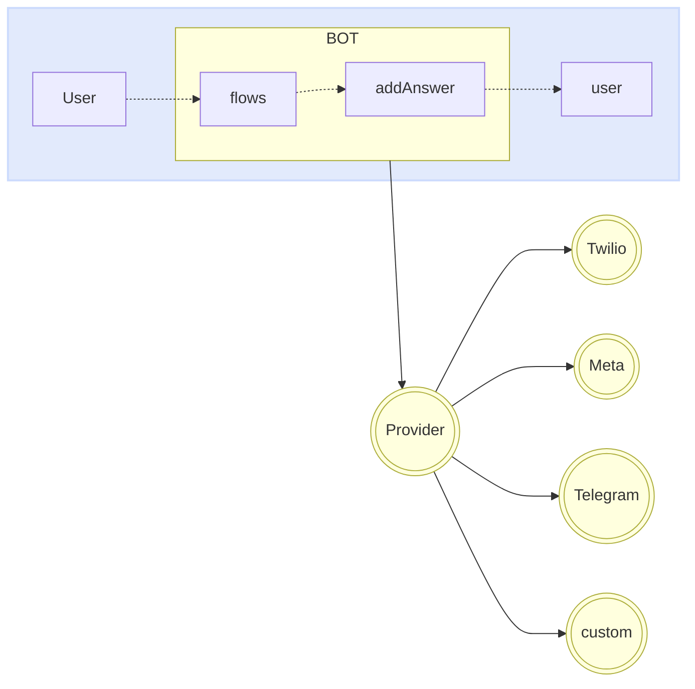

import { Contributors } from '@/components/Contributors'

export const description =
  'En esta guía, hablaremos sobre lo que sucede cuando algo sale mal mientras trabaja con la API.'

# Providers

Los proveedores se encargan de proporcionar el puente de comunicación entre su bot y __whatsapp__, __telegram__ o proveedor personalizado.

Puede cambiar de proveedor muy fácilmente sin afectar la lógica de su bot.
Es tan sencillo como implementar el conector del proveedor que elijas. Por el momento tenemos integraciones con más de cuatro proveedores.

<Warning>
Whatsapp: [Meta](providers#meta), [Twilio](providers#twilio), [Baileys](providers#baileys), [WPPConnect](providers#wpp-connect), [Venom](providers#venom). [Telegram](/plugins/telegram)
</Warning>




Es posible que cada proveedor deba ajustar las claves de acceso, la configuración, entre otras propiedades que generalmente se pasan como un objeto en la función `createProvider`.

<CodeGroup>
```ts {{ title: 'meta-provider.ts' }}
import { createProvider } from "@bot-whatsapp/bot";
import { MetaProvider } from '@bot-whatsapp/provider-meta';

export type IProvider = typeof MetaProvider
export const adapterProvider = createProvider(MetaProvider, {
    jwtToken: 'jwtToken',
    numberId: 'numberId',
    verifyToken: 'verifyToken',
    version: 'v16.0',
})
```

```ts {{ title: 'twilio-provider.ts' }}
import { createProvider } from "@bot-whatsapp/bot";
import { TwilioProvider } from '@bot-whatsapp/provider-twilio';

export type IProvider = typeof TwilioProvider
export const adapterProvider = createProvider(TwilioProvider, {
    accountSid: 'YOUR_ACCOUNT_SID',
    authToken: 'YOUR_ACCOUNT_TOKEN',
    vendorNumber: '+14155238886',
    publicUrl: "public_url", //optional
});
```

```ts {{ title: 'baileys-provider.ts' }}
import { createProvider } from "@bot-whatsapp/bot";
import { BaileysProvider } from '@bot-whatsapp/provider-baileys';

export type IProvider = typeof BaileysProvider
export const adapterProvider = createProvider(BaileysProvider)
```

```ts {{ title: 'venom-provider.ts' }}
import { createProvider } from "@bot-whatsapp/bot";
import { VenomProvider } from '@bot-whatsapp/provider-venom';

export type IProvider = typeof VenomProvider
export const adapterProvider = createProvider(VenomProvider)
```

```ts {{ title: 'wppconnect-provider.ts' }}
import { createProvider } from "@bot-whatsapp/bot";
import { WPPConnectProvider } from '@bot-whatsapp/provider-wppconnect';

export type IProvider = typeof WPPConnectProvider
export const adapterProvider = createProvider(WPPConnectProvider)
```

</CodeGroup>

A continuación encontrará más información sobre cada uno de estos proveedores.

---

## Meta

[WhatsApp Business Platform](https://business.whatsapp.com/products/business-platform) permite a medianas y grandes empresas comunicarse con sus clientes a gran escala. Puede iniciar conversaciones con los clientes en solo minutos, enviarles notificaciones de servicio al cliente o actualizaciones de compras, ofrecerles un nivel de servicio personalizado y brindarles asistencia a través del canal que elijan.

<Warning>
Recuerde que se deben cumplir los siguientes requisitos para implementar el meta proveedor en producción. [More information](/providers/meta)
</Warning>

<CodeGroup>
```ts {{ title: 'meta-provider.ts' }}
import { createProvider } from "@bot-whatsapp/bot";
import { MetaProvider } from '@bot-whatsapp/provider-meta';

export type IProvider = typeof MetaProvider
export const adapterProvider = createProvider(MetaProvider, {
    jwtToken: 'jwtToken',
    numberId: 'numberId',
    verifyToken: 'verifyToken',
    version: 'v16.0',
})
```
```ts {{ title: 'app.ts' }}
import { createBot, createProvider, createFlow, addKeyword, MemoryDB } from '@bot-whatsapp/bot'
import { IProvider, adapterProvider } from './meta-provider';

const welcomeFlow = addKeyword<IProvider, MemoryDB>(['hello', 'hi']).addAnswer('Ey! welcome')

const main = async () => {
    await createBot({
        flow: createFlow([welcomeFlow]),
        provider: adapterProvider,
        database: new MemoryDB()
    })
}

main()
```
</CodeGroup>

---

## Twilio

[Twilio](https://www.twilio.com/en-us/messaging/channels/whatsapp) es una plataforma de desarrollo que permite a los desarrolladores crear aplicaciones de comunicación en la nube y sistemas web. Las API de comunicaciones de Twilio permiten a las empresas brindar la experiencia de comunicación adecuada a sus clientes dentro de las aplicaciones web y móviles. Al usar las API de Twilio, los desarrolladores pueden agregar rápidamente esta funcionalidad a una aplicación, como mensajes de voz, videollamadas, mensajes de texto y más.

<Warning>
Recuerde que se deben cumplir los siguientes requisitos para implementar el meta proveedor en producción. [More information](/providers/twilio)
</Warning>

<CodeGroup>
```ts {{ title: 'twilio-provider.ts' }}
import { createProvider } from "@bot-whatsapp/bot";
import { TwilioProvider } from '@bot-whatsapp/provider-twilio';

export type IProvider = typeof TwilioProvider
export const adapterProvider = createProvider(TwilioProvider, {
    accountSid: 'YOUR_ACCOUNT_SID',
    authToken: 'YOUR_ACCOUNT_TOKEN',
    vendorNumber: '+14155238886',
    publicUrl: "public_url", //optional
});
```
```ts {{ title: 'app.ts' }}
import { createBot, createProvider, createFlow, addKeyword, MemoryDB } from '@bot-whatsapp/bot'
import { IProvider, adapterProvider } from './twilio-provider';

const welcomeFlow = addKeyword<IProvider, MemoryDB>(['hello', 'hi']).addAnswer('Ey! welcome')

const main = async () => {
    await createBot({
        flow: createFlow([welcomeFlow]),
        provider: adapterProvider,
        database: new MemoryDB()
    })
}

main()
```
</CodeGroup>

---

## Baileys

[Baileys](https://whiskeysockets.github.io/) es un proyecto de código abierto que permite enviar mensajes, recibir mensajes y docenas de otras funciones implementando WebSocket en una versión de whatsapp.
Es un proyecto con gran trayectoria impulsado por personas con gran conocimiento del tema, puedes profundizar en esta biblioteca directamente en su documentación o [repository](https://github.com/WhiskeySockets/Baileys).

Debido a que este es un proveedor gratuito que emula la interfaz web de whatsapp, debe escanear el QR para iniciar sesión.


<Warning>
Recuerde que se deben cumplir los siguientes requisitos para implementar el meta proveedor en producción. [More information](/providers/baileys)
</Warning>

<CodeGroup>
```ts {{ title: 'baileys-provider.ts' }}
import { createProvider } from "@bot-whatsapp/bot";
import { BaileysProvider } from '@bot-whatsapp/provider-baileys';

export type IProvider = typeof BaileysProvider
export const adapterProvider = createProvider(BaileysProvider)

```
```ts {{ title: 'baileys-provider-extend.ts' }}
import { createProvider } from "@bot-whatsapp/bot";
import { BaileysProvider } from '@bot-whatsapp/provider-baileys';

export type IProvider = typeof BaileysProvider
export const adapterProvider = createProvider(BaileysProvider, {
        browser: ['Ubuntu', 'Chrome', '20.0.04'],
        gifPlayback: true,
        name: 'botname',
        phoneNumber: '88888',
        useBaileysStore: true,
        usePairingCode: true
})
```
```ts {{ title: 'app.ts' }}
import { createBot, createProvider, createFlow, addKeyword, MemoryDB } from '@bot-whatsapp/bot'
import { IProvider, adapterProvider } from './baileys-provider';

const welcomeFlow = addKeyword<IProvider, MemoryDB>(['hello', 'hi']).addAnswer('Ey! welcome')

const main = async () => {
    await createBot({
        flow: createFlow([welcomeFlow]),
        provider: adapterProvider,
        database: new MemoryDB()
    })
}

main()
```
</CodeGroup>

---

## Venom

[Venom](https://github.com/orkestral/venom)es un proyecto de código abierto que utiliza JavaScript para crear barcos de alto rendimiento para WhatsApp. Admite una amplia gama de interacciones, incluida la atención al cliente, el envío de medios, el reconocimiento de frases basado en IA y varios diseños arquitectónicos adaptados a WhatsApp.
Puedes visitar su [official](https://orkestral.io/) sitio web como repositorio para comprender otras funciones que puede utilizar.


Debido a que este es un proveedor gratuito que emula la interfaz web de whatsapp, debe escanear el QR para iniciar sesión.

<Warning>
Recuerde que se deben cumplir los siguientes requisitos para implementar el meta proveedor en producción. [More information](/providers/venom)
</Warning>

<CodeGroup>
```ts {{ title: 'venom-provider.ts' }}
import { createProvider } from "@bot-whatsapp/bot";
import { VenomProvider } from '@bot-whatsapp/provider-venom';

export type IProvider = typeof VenomProvider
export const adapterProvider = createProvider(VenomProvider)
```
```ts {{ title: 'venom-provider-extend.ts' }}
import { createProvider } from "@bot-whatsapp/bot";
import { VenomProvider } from '@bot-whatsapp/provider-venom';

export type IProvider = typeof VenomProvider
export const adapterProvider = createProvider(VenomProvider, {
        gifPlayback:true,
        name:'botname'
})
```
```ts {{ title: 'app.ts' }}
import { createBot, createProvider, createFlow, addKeyword, MemoryDB } from '@bot-whatsapp/bot'
import { IProvider, adapterProvider } from './venom-provider';

const welcomeFlow = addKeyword<IProvider, MemoryDB>(['hello', 'hi']).addAnswer('Ey! welcome')

const main = async () => {
    await createBot({
        flow: createFlow([welcomeFlow]),
        provider: adapterProvider,
        database: new MemoryDB()
    })
}

main()
```
</CodeGroup>

---

## WPPConnect

[WPPConnect](https://wppconnect.io) es un proyecto de código abierto desarrollado por la comunidad JavaScript con el objetivo de exportar funciones de WhatsApp Web al nodo, que se pueden utilizar para apoyar la creación de cualquier interacción, como atención al cliente, envío de medios, reconocimiento de inteligencia basado en frases artificiales y muchas otras cosas, usa tu imaginación
Puedes visitar su web oficial como el [repository](https://github.com/wppconnect-team/wppconnect) para comprender otras funciones que puede utilizar.

Debido a que este es un proveedor gratuito que emula la interfaz web de whatsapp, debe escanear el QR para iniciar sesión.

<Warning>
Recuerde que se deben cumplir los siguientes requisitos para implementar el meta proveedor en producción. [More information](/providers/wpp-connect)
</Warning>

<CodeGroup>
```ts {{ title: 'wppconnect-provider.ts' }}
import { createProvider } from "@bot-whatsapp/bot";
import { WPPConnectProvider } from '@bot-whatsapp/provider-wppconnect';

export type IProvider = typeof WPPConnectProvider
export const adapterProvider = createProvider(WPPConnectProvider)
```
```ts {{ title: 'wppconnect-provider-extend.ts' }}
import { createProvider } from "@bot-whatsapp/bot";
import { WPPConnectProvider } from '@bot-whatsapp/provider-wppconnect';

export type IProvider = typeof WPPConnectProvider
export const adapterProvider = createProvider(WPPConnectProviderClass, {
        name:'botname'
})
```
```ts {{ title: 'app.ts' }}
import { createBot, createProvider, createFlow, addKeyword, MemoryDB } from '@bot-whatsapp/bot'
import { IProvider, adapterProvider } from './wppconnect-provider';

const welcomeFlow = addKeyword<IProvider, MemoryDB>(['hello', 'hi']).addAnswer('Ey! welcome')

const main = async () => {
    await createBot({
        flow: createFlow([welcomeFlow]),
        provider: adapterProvider,
        database: new MemoryDB()
    })
}

main()
```
</CodeGroup>

---

<Contributors users={['leifermendez', 'elimeleth']} />