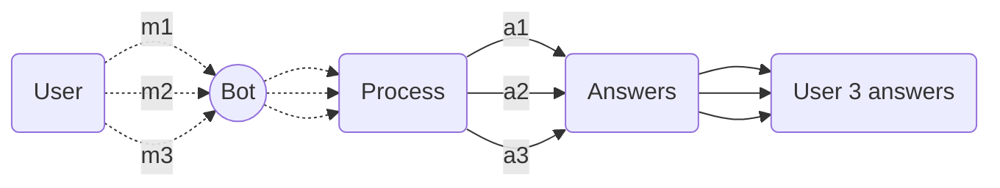
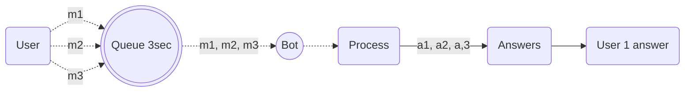

import { Contributors } from '@/components/Contributors'
import { Resources } from '@/components/Resources'
import { Guides } from '@/components/Guides'

export const description = 'Implemente colas de mensajes para una mejor administración de recursos'

# Fast Entires

En muchos casos, los usuarios suelen escribir mensajes individuales en un corto período de tiempo. El comportamiento habitual del bot es responder a cada mensaje de forma independiente, lo que puede resultar un comportamiento molesto en algunos casos de uso.

Para este otro tipo de entornos puedes implementar una funcionalidad la cual puedes crear para tener un margen de 3000ms para que el usuario escriba un mensaje, y cada vez que escriba un mensaje en un tiempo inferior a 3000ms acumulará todos los mensajes y luego pasado el margen de tiempo el bot interpretará todo como una sola conversación.



Aplicando esta implementación, lo que se consigue es que antes de pasar a la etapa de procesamiento, todos los mensajes independientes (3) se conviertan en uno (1) y se procesen como un mensaje independiente.

Gracias __[robmoncayonabux](https://github.com/robmoncayonabux)__ por compartir esta útil solución a un caso de uso muy particular.



En este ejemplo decimos __3000ms__ que equivale a 3 segundos pero puedes modificarlo a tu gusto en `MESSAGE_GAP_SECONDS`

<CodeGroup>

```ts {{ title: 'fast-entires.ts' }}
interface Message {
  text: string;
  timestamp: number;
}

const messageQueue: Message[] = [];

const MESSAGE_GAP_SECONDS = 3000;

let messageTimer: NodeJS.Timeout | null = null;

/**
* Adds a message to the queue for later processing.
* @param messageText The text of the message to add to the queue.
* @returns A promise that resolves when the message queue is processed.
*/
async function enqueueMessage(messageText: string): Promise<void> {
  messageQueue.push({ text: messageText, timestamp: Date.now() });

  return new Promise((resolve) => {
      if (messageTimer) {
          clearTimeout(messageTimer);
      }

      messageTimer = setTimeout(() => {
          resolve(processMessageQueue());
      }, MESSAGE_GAP_SECONDS);
  });
}

/**
* Processes the message queue by combining all messages into a single string and clearing the queue.
* @returns The combined string of all messages in the queue.
*/
function processMessageQueue(): string {
  if (messageQueue.length === 0) {
      return '';
  }

  const combinedMessage = messageQueue.map(message => message.text).join(" ");
  messageQueue.length = 0;
  return combinedMessage;
}

export { enqueueMessage, processMessageQueue };
```
```ts {{ title: 'app.ts' }}
import { enqueueMessage } from './utils/fast-entires'

import { createBot, createProvider, createFlow, addKeyword, MemoryDB } from '@bot-whatsapp/bot'
import { BaileysProvider } from '@bot-whatsapp/provider-baileys'

const welcomeFlow = addKeyword<BaileysProvider, MemoryDB>(['hello', 'hi'])
.addAction(async(ctx) => {
  const body = await enqueueMessage(ctx.body) // all message merged!
  console.log(body)
})


const main = async () => {

    const adapterDB = new MemoryDB()
    const adapterFlow = createFlow([welcomeFlow])
    const adapterProvider = createProvider(BaileysProvider)

    adapterProvider.initHttpServer(3000)

    await createBot({
        flow: adapterFlow,
        provider: adapterProvider,
        database: adapterDB,
    })
}

main()
```
</CodeGroup>

Recuerde que esta es una solución alternativa, y es posible que su implementación pueda mejorarse.
----

<Guides />

<Resources />

<Contributors users={['leifermendez','robmoncayonabux', 'elimeleth']} />