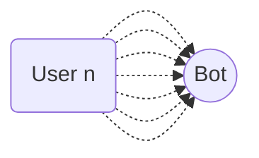

import { Contributors } from '@/components/Contributors'
import { Resources } from '@/components/Resources'
import { Guides } from '@/components/Guides'

export const description = 'Implemente colas de mensajes para una mejor administración de recursos'

# Queue

## How to implement and manage Queue Limit {{not:'true'}}

El marco implementa de forma predeterminada un administrador de colas basado en promesas de trabajo por usuario.
Si ya entiendes el concepto y te encuentras en un entorno donde recibes una cantidad considerable de mensajes recurrentes en un corto período de tiempo y notas que responde a una gran cantidad de usuarios pero no a todos. Puede intentar extender la configuración de la cola de procesos.

__Imagine el caso__ en el que recibe más de 60 mensajes de más de 60 personas en un período de tiempo muy corto de menos de 20 segundos, por ejemplo


Es muy probable que no responda a todos los usuarios, ya que la configuración predeterminada del bot está configurada para manejar una cantidad menor de procesos, pero es muy fácil de modificar.

```bash {{ title: 'app.ts' }}
const main = async () => {

    await createBot({
        database: new MemoryDB(),
        provider: createProvider(BaileysProvider),
        flow: createFlow([...])
    }, {
        queue: {
            timeout: 20000, //👌
            concurrencyLimit: 50 //👌
        }
    })
}
```
----
<Properties>
  <Property name="timeout" type="number">
 Número de milisegundos utilizados como duración máxima para la ejecución de una función asíncrona. __default 20000__
  </Property>
  <Property name="concurrencyLimit" type="number">
Número de procesos paralelos que puede ejecutar al mismo tiempo. __default 15__
  </Property>

</Properties>

---

<Guides />

<Resources />

<Contributors users={['leifermendez','robmoncayonabux', 'elimeleth']} />