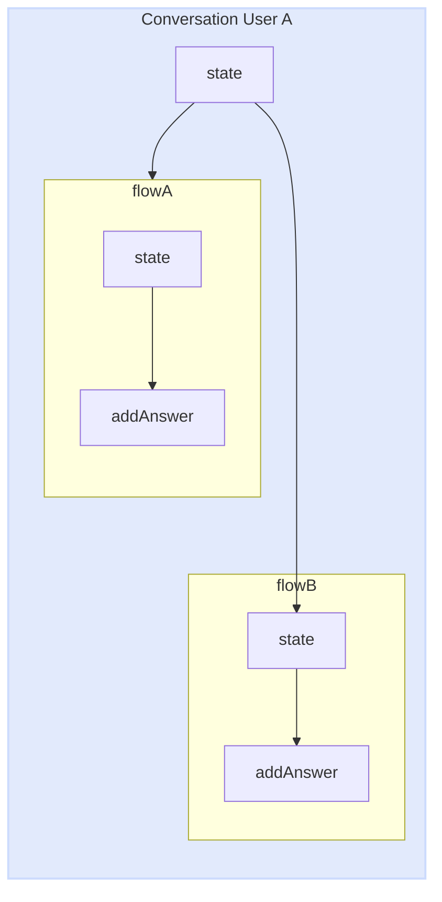
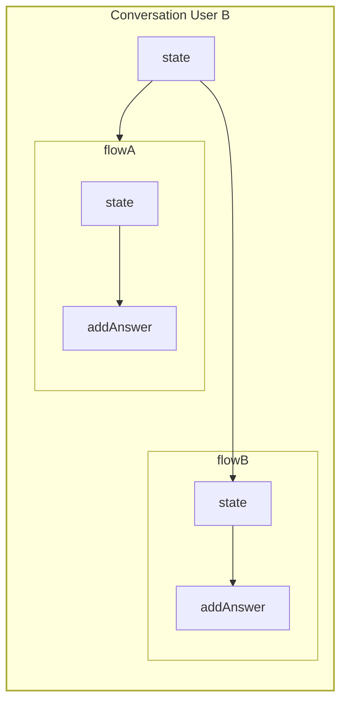

export const description =
  'In this guide, we will talk about what happens when something goes wrong while you work with the API.'

## State

In many occasions you will need to share data between flows and no matter if you have modularized your project in different files you can use state in the callback function to be able to access the individual state of each user.

Let's imagine the case where you have two flows.
Flow A: In charge of collecting user data.
Flow B: Responsible for generating a record in the database.
but both flows are independent files

__Remember__ that the state is independent per conversation between user and bot. 

<CodeGroup>
```ts {{ title: 'app.ts' }}
  import { createFlow, MemoryDB, createProvider } from '@bot-whatsapp/bot';
  // ...
  import flowA from './flows/flow-a'
  import flowB from './flows/flow-b'

  const main = async () => {

      const adapterDB = new MemoryDB()
      const adapterFlow = createFlow([flowA, flowB])
      const adapterProvider = createProvider(BaileysProvider)

      adapterProvider.initHttpServer(3000)

      await createBot({
          flow: adapterFlow,
          provider: adapterProvider,
          database: adapterDB,
      })
  }
```
```ts {{ title: 'flow-a.ts' }}
  import { addKeyword, addAction } from '@bot-whatsapp/bot';

  const flowA = addKeyword('register')
    .addAnswer('What is your name?', { capture: true }, async (ctx, { state }) => {
      const responseName = ctx.body
      await state.update({ name: responseName })
    })
    .addAnswer('What is your email?', { capture: true }, async (ctx, { state }) => {
      const responseEmail = ctx.body
      await state.update({ email: responseEmail })
    })

  export default flowA
```
```ts {{ title: 'flow-b.ts' }}
  import { addKeyword } from '@bot-whatsapp/bot';

  const flowB = addKeyword('resume')
    .addAnswer('ok your name is...', null, async (_, { state, flowDynamic }) => {
      const name = state.get('name')
      await flowDynamic(name)
    })
    .addAnswer('ok your email is...', null, async (_, { state, flowDynamic }) => {
      const email = state.get('email')
      await flowDynamic(email)
    })
    .addAnswer('ok your summary is..', null, async (_, { state, flowDynamic }) => {
      const allState = state.getMyState()
      await flowDynamic(`Name:${allState.name}, Email: ${allState.email}`)
    })


  export default flowB
```
</CodeGroup>

Each conversation history with the user is totally independent, in this way we avoid mixing conversations.


 <RowCenter>

  <Col>
  

  </Col>

  <Col>

  </Col>


</RowCenter>


<Warning>
It is important to understand that the state is volatile, it does not permeate anywhere. If you are worried about the performance level, you can see it [here](https://github.com/codigoencasa/bot-whatsapp/blob/d8eb94cae36fb233f5283c8d44c6c0307d26a978/packages/bot/src/context/stateClass.ts#L7), but I'll save you time by telling you that it is a [Map](https://developer.mozilla.org/en-US/docs/Web/JavaScript/Reference/Global_Objects/Map)
</Warning>

---

## GlobalState

Very similar to [state](/methods#state) there is another method called GlobalState to share a global state of the bot between different flows. The main use for this method is to share data that can change and that every conversation between bot and user can access.

Below you can see a practical example where we use the globalState to use it as a switch to allow or disallow the bot to respond no matter who writes to it.
<CodeGroup>
```ts {{ title: 'app.ts' }}
  import { createFlow, MemoryDB, createProvider } from '@bot-whatsapp/bot';
  // ...
  import flowWelcome from './flows/flow-welcome'
  import flowOnOff from './flows/flow-on-off'

  const main = async () => {

      const adapterDB = new MemoryDB()
      const adapterFlow = createFlow([flowWelcome, flowOnOff])
      const adapterProvider = createProvider(BaileysProvider)

      adapterProvider.initHttpServer(3000)

      await createBot({
          flow: adapterFlow,
          provider: adapterProvider,
          database: adapterDB,
      })
  }
```
```ts {{ title: 'flow-on-off.ts' }}
  import { addKeyword, addAction } from '@bot-whatsapp/bot';

  const flowOnOff = addKeyword('turnOffBot')
    .addAction(async (ctx, { globalState, flowDynamic, endFlow }) => {
      const offOrOn = !globalState.get<boolean>('enable')
      await globalState.update({ enable: offOrOn })

      if(!offOrOn){
        return endFlow(`Bot is: OFF`)
      }
      await flowDynamic(`Bot is: ON`)
    })
    .addAnswer('message...')

  export default flowOnOff

```
```ts {{ title: 'flow-welcome.ts' }}
  import { addKeyword } from '@bot-whatsapp/bot';

  const flowWelcome = addKeyword('hi')
    .addAction(async (_, { globalState, endFlow }) => {
      const offOrOn = !globalState.get<boolean>('enable')
      if(!offOrOn) return endFlow()
    })
    .addAnswer('Welcome to...')

  export default flowWelcome

```
</CodeGroup>

---

## State/GlobalState Options {{ not:'true' }}

Both methods such as state and global estate contain similar options and funcinalides, which depending on the use case can be very useful. 

## Clear {{ not:'true' }}

<Row>
  <Col>
This method allows the state to be cleaned either globally or independently. It technically clears the Map.

Available in: __state__, __globalState__
  </Col>
  <Col sticky>
    <CodeGroup>
    ```ts
    .addAnswer('..', null, async (_, { state }) => {
      state.clear()
    })
    .addAction(async (_, { globalState }) => {
      globalState.clear()
    })
    ```
    </CodeGroup>

  </Col>
</Row>

## Update {{ not:'true' }}

<Row>
  <Col>
To add or update a value in the state we have available the update method. This method receives an object which if the value does not exist creates it and returns a new object with all the values.
It is important to understand that it is a promise to avoid rare behavior by adding the `await`

Available in: __state__, __globalState__
  </Col>
  <Col sticky>
    <CodeGroup>
    ```ts
    .addAnswer('..', null, async (_, { state }) => {
      await state.update({name:'Joe', age:'33'})
      await state.update({email:'test@test.com'})
    })
    .addAction(async (_, { globalState }) => {
      await globalState.update({name:'Joe', age:'33'})
      await globalState.update({email:'test@test.com'})
    })
    ```
    </CodeGroup>

  </Col>
</Row>


## Get {{ not:'true' }}

<Row>
  <Col>
When we need to retrieve the state values we can do it individually by calling by the property name as follows.

Available in: __state__, __globalState__
  </Col>
  <Col sticky>
    <CodeGroup>
    ```ts
    .addAnswer('..', null, async (_, { state }) => {
      state.get('propertyName')
    })
    .addAction(async (_, { globalState }) => {
      globalState.get('propertyName')
    })
    ```
    </CodeGroup>

  </Col>
</Row>

## GetMyState {{ not:'true' }}

<Row>
  <Col>
Another way to retrieve the entire state object belonging to a user-independent conversation is by using getMyState

Available in: __state__
  </Col>
  <Col sticky>
    <CodeGroup>
    ```ts
    .addAnswer('..', null, async (_, { state }) => {
      state.getMyState()
    })
    ```
    </CodeGroup>
  </Col>
</Row>

## GetAllState {{ not:'true' }}

<Row>
  <Col>
When we are working with the globalState and we want to retrieve all the properties object with their respective values you can use getAllState

Available in: __globalState__
  </Col>
  <Col sticky>
    <CodeGroup>
    ```ts
    .addAnswer('..', null, async (_, { globalState }) => {
      globalState.getAllState()
    })
    ```
    </CodeGroup>
  </Col>
</Row>

---

## flowDynamic

The library is based on three key components for its correct functioning: the Flow, in charge of building the context of the conversation and offering a friendly interface to the developer; the Provider, which acts as a connector allowing to easily switch between WhatsApp providers without the risk of affecting other parts of the bot; and the Database, which in line with this connector philosophy, facilitates changing the data persistence layer without the need to rewrite the workflow.

---

## fallBack

The library is based on three key components for its correct functioning: the Flow, in charge of building the context of the conversation and offering a friendly interface to the developer; the Provider, which acts as a connector allowing to easily switch between WhatsApp providers without the risk of affecting other parts of the bot; and the Database, which in line with this connector philosophy, facilitates changing the data persistence layer without the need to rewrite the workflow.

---

## endFlow

The library is based on three key components for its correct functioning: the Flow, in charge of building the context of the conversation and offering a friendly interface to the developer; the Provider, which acts as a connector allowing to easily switch between WhatsApp providers without the risk of affecting other parts of the bot; and the Database, which in line with this connector philosophy, facilitates changing the data persistence layer without the need to rewrite the workflow.

---

## gotoFlow

The library is based on three key components for its correct functioning: the Flow, in charge of building the context of the conversation and offering a friendly interface to the developer; the Provider, which acts as a connector allowing to easily switch between WhatsApp providers without the risk of affecting other parts of the bot; and the Database, which in line with this connector philosophy, facilitates changing the data persistence layer without the need to rewrite the workflow.

---

## Blacklist

The library is based on three key components for its correct functioning: the Flow, in charge of building the context of the conversation and offering a friendly interface to the developer; the Provider, which acts as a connector allowing to easily switch between WhatsApp providers without the risk of affecting other parts of the bot; and the Database, which in line with this connector philosophy, facilitates changing the data persistence layer without the need to rewrite the workflow.

---

## idle

The library is based on three key components for its correct functioning: the Flow, in charge of building the context of the conversation and offering a friendly interface to the developer; the Provider, which acts as a connector allowing to easily switch between WhatsApp providers without the risk of affecting other parts of the bot; and the Database, which in line with this connector philosophy, facilitates changing the data persistence layer without the need to rewrite the workflow.

---