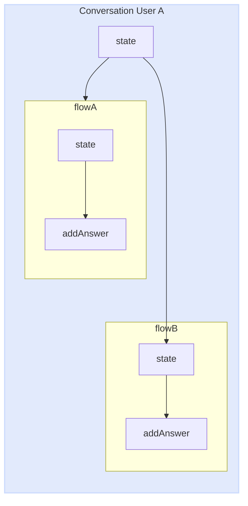
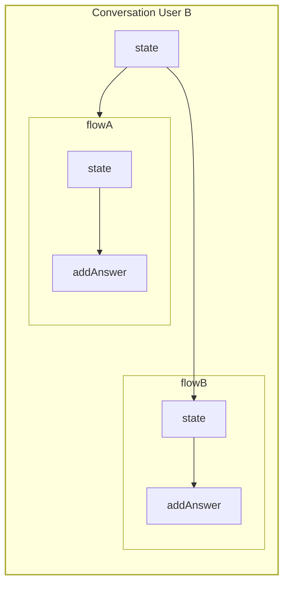
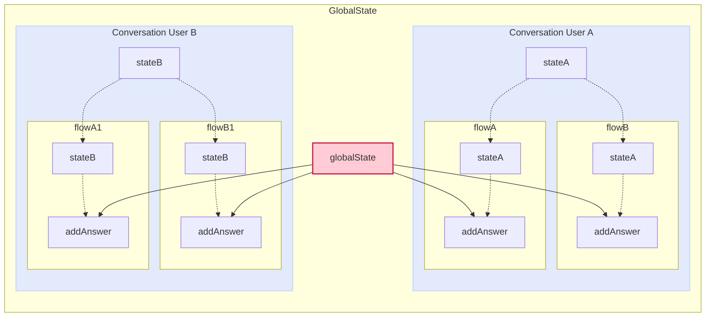
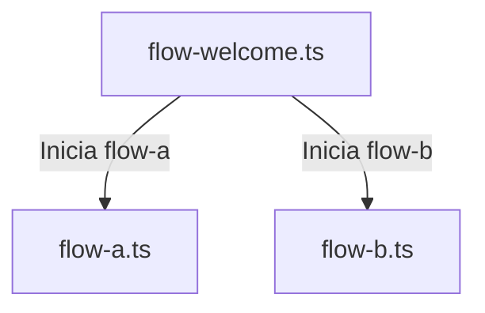

import { Contributors } from '@/components/Contributors'

export const description =
  'In this guide, we will talk about what happens when something goes wrong while you work with the API.'

# Methods

## State

In many occasions you will need to share data between flows and no matter if you have modularized your project in different files you can use state in the callback function to be able to access the individual state of each user.

Let's imagine the case where you have two flows.
Flow A: In charge of collecting user data.
Flow B: Responsible for generating a record in the database.
but both flows are independent files

__Remember__ that the state is independent per conversation between user and bot. 

<CodeGroup>
```ts {{ title: 'app.ts' }}
  import { createFlow, MemoryDB, createProvider } from '@bot-whatsapp/bot';
  // ...
  import flowA from './flows/flow-a'
  import flowB from './flows/flow-b'

  const main = async () => {

      const adapterDB = new MemoryDB()
      const adapterFlow = createFlow([flowA, flowB])
      const adapterProvider = createProvider(BaileysProvider)

      adapterProvider.initHttpServer(3000)

      await createBot({
          flow: adapterFlow,
          provider: adapterProvider,
          database: adapterDB,
      })
  }
```
```ts {{ title: 'flow-a.ts' }}
  import { addKeyword, addAction } from '@bot-whatsapp/bot';

  const flowA = addKeyword('register')
    .addAnswer('What is your name?', { capture: true }, async (ctx, { state }) => {
      const responseName = ctx.body
      await state.update({ name: responseName })
    })
    .addAnswer('What is your email?', { capture: true }, async (ctx, { state }) => {
      const responseEmail = ctx.body
      await state.update({ email: responseEmail })
    })

  export default flowA
```
```ts {{ title: 'flow-b.ts' }}
  import { addKeyword } from '@bot-whatsapp/bot';

  const flowB = addKeyword('resume')
    .addAnswer('ok your name is...', null, async (_, { state, flowDynamic }) => {
      const name = state.get('name')
      await flowDynamic(name)
    })
    .addAnswer('ok your email is...', null, async (_, { state, flowDynamic }) => {
      const email = state.get('email')
      await flowDynamic(email)
    })
    .addAnswer('ok your summary is..', null, async (_, { state, flowDynamic }) => {
      const allState = state.getMyState()
      await flowDynamic(`Name:${allState.name}, Email: ${allState.email}`)
    })


  export default flowB
```
</CodeGroup>

Each conversation history with the user is totally independent, in this way we avoid mixing conversations.


 <RowCenter>
  <Col>
  

  </Col>

  <Col>

  </Col>

</RowCenter>


<Warning>
It is important to understand that the state is volatile, it does not permeate anywhere. If you are worried about the performance level, you can see it [here](https://github.com/codigoencasa/bot-whatsapp/blob/d8eb94cae36fb233f5283c8d44c6c0307d26a978/packages/bot/src/context/stateClass.ts#L7), but I'll save you time by telling you that it is a [Map](https://developer.mozilla.org/en-US/docs/Web/JavaScript/Reference/Global_Objects/Map)
</Warning>

---

## GlobalState

Very similar to [state](/methods#state) there is another method called GlobalState to share a global state of the bot between different flows. The main use for this method is to share data that can change and that every conversation between bot and user can access.

Below you can see a practical example where we use the globalState to use it as a switch to allow or disallow the bot to respond no matter who writes to it.

<CodeGroup>
```ts {{ title: 'app.ts' }}
  import { createFlow, MemoryDB, createProvider } from '@bot-whatsapp/bot';
  // ...
  import flowWelcome from './flows/flow-welcome'
  import flowOnOff from './flows/flow-on-off'

  const main = async () => {

      const adapterDB = new MemoryDB()
      const adapterFlow = createFlow([flowWelcome, flowOnOff])
      const adapterProvider = createProvider(BaileysProvider)

      adapterProvider.initHttpServer(3000)

      await createBot({
          flow: adapterFlow,
          provider: adapterProvider,
          database: adapterDB,
      })
  }
```
```ts {{ title: 'flow-on-off.ts' }}
  import { addKeyword, addAction } from '@bot-whatsapp/bot';

  const flowOnOff = addKeyword('turnOffBot')
    .addAction(async (ctx, { globalState, flowDynamic, endFlow }) => {
      const offOrOn = !globalState.get<boolean>('enable')
      await globalState.update({ enable: offOrOn })

      if(!offOrOn){
        return endFlow(`Bot is: OFF`)
      }
      await flowDynamic(`Bot is: ON`)
    })
    .addAnswer('message...')

  export default flowOnOff

```
```ts {{ title: 'flow-welcome.ts' }}
  import { addKeyword } from '@bot-whatsapp/bot';

  const flowWelcome = addKeyword('hi')
    .addAction(async (_, { globalState, endFlow }) => {
      const offOrOn = !globalState.get<boolean>('enable')
      if(!offOrOn) return endFlow()
    })
    .addAnswer('Welcome to...')

  export default flowWelcome

```
</CodeGroup>




---

## State/GlobalState Options {{ not:'true' }}

Both methods such as state and global estate contain similar options and funcinalides, which depending on the use case can be very useful. 

## Clear {{ not:'true' }}

<Row>
  <Col>
This method allows the state to be cleaned either globally or independently. It technically clears the Map.

Available in: __state__, __globalState__
  </Col>
  <Col sticky>
    <CodeGroup>
    ```ts
    .addAnswer('..', null, async (_, { state }) => {
      state.clear()
    })
    .addAction(async (_, { globalState }) => {
      globalState.clear()
    })
    ```
    </CodeGroup>

  </Col>
</Row>

## Update {{ not:'true' }}

<Row>
  <Col>
To add or update a value in the state we have available the update method. This method receives an object which if the value does not exist creates it and returns a new object with all the values.
It is important to understand that it is a promise to avoid rare behavior by adding the `await`

Available in: __state__, __globalState__
  </Col>
  <Col sticky>
    <CodeGroup>
    ```ts
    .addAnswer('..', null, async (_, { state }) => {
      await state.update({name:'Joe', age:'33'})
      await state.update({email:'test@test.com'})
    })
    .addAction(async (_, { globalState }) => {
      await globalState.update({name:'Joe', age:'33'})
      await globalState.update({email:'test@test.com'})
    })
    ```
    </CodeGroup>

  </Col>
</Row>


## Get {{ not:'true' }}

<Row>
  <Col>
When we need to retrieve the state values we can do it individually by calling by the property name as follows.

Available in: __state__, __globalState__
  </Col>
  <Col sticky>
    <CodeGroup>
    ```ts
    .addAnswer('..', null, async (_, { state }) => {
      state.get('propertyName')
    })
    .addAction(async (_, { globalState }) => {
      globalState.get('propertyName')
    })
    ```
    </CodeGroup>

  </Col>
</Row>

## GetMyState {{ not:'true' }}

<Row>
  <Col>
Another way to retrieve the entire state object belonging to a user-independent conversation is by using getMyState

Available in: __state__
  </Col>
  <Col sticky>
    <CodeGroup>
    ```ts
    .addAnswer('..', null, async (_, { state }) => {
      state.getMyState()
    })
    ```
    </CodeGroup>
  </Col>
</Row>

## GetAllState {{ not:'true' }}

<Row>
  <Col>
When we are working with the globalState and we want to retrieve all the properties object with their respective values you can use getAllState

Available in: __globalState__
  </Col>
  <Col sticky>
    <CodeGroup>
    ```ts
    .addAnswer('..', null, async (_, { globalState }) => {
      globalState.getAllState()
    })
    ```
    </CodeGroup>
  </Col>
</Row>

---

## FlowDynamic

Many times you will need to send messages coming from an API call or dynamic data from data base or from processes. In this case you should use `flowDynamic`.

<CodeGroup>
```ts {{ title: 'flow-standalone.ts' }}
  import { addKeyword } from '@bot-whatsapp/bot';

  const flowStandAlone = addKeyword('register')
    .addAnswer('What is your name?', { capture: true }, async (ctx, { flowDynamic }) => {
      const responseName = ctx.body
      //.... db.insert({name:responseName})
      await flowDynamic(`Thanks for register ${responseName}`)
    })

  export default flowStandAlone
```
```ts {{ title: 'flow-multiline.ts' }}
  import { addKeyword } from '@bot-whatsapp/bot';

  const flowStandAlone = addKeyword('register')
    .addAnswer('Hello!', null, async (ctx, { flowDynamic }) => {
      await flowDynamic(
        [
          `How are you?`,
          `I'm fine`
        ]
      )
    })

  export default flowStandAlone
```
```ts {{ title: 'flow-list.ts' }}
  import { addKeyword } from '@bot-whatsapp/bot';

  const flowProducts = addKeyword('products')
    .addAction( async (_, { flowDynamic }) => {
      const dataAPI = await fetch('http://your-api.example.com/products')
      const data = await dataAPI.json() as {name:string, photo:string}[]
      const parseDataToFlow = data.map(item => ({body:`Item: ${item.name}`, media:item.photo}))
      await flowDynamic(parseDataToFlow)
    })

  export default flowProducts
```

</CodeGroup>

<Error>
It is NOT recommended to send many messages in a row because the [provider](/concepts#provider) may determine that it is spam. 
</Error>

If you want to send a list of products it is recommended to send a few products between 4 to 8 and you can ask the user what category of products and other details to filter and be able to respond with the ideal product list.

---

## FlowDynamic Options {{ not: 'true' }}

<Row>
  <Col>

    <Properties>
      <Property name="body" type="string">
You can send a message inside an object using the body property. It is ideal when you need to send a message apart from the message to send a media or to place a delay.
      </Property>
      <Property name="delay" type="number">
This is the number of milliseconds that will elapse before the message is sent.
      </Property>
      <Property name="media" type="string">
The url or local path of the file to send, must be a text string and if it is a URL it must be public.
      </Property>
    </Properties>


  </Col>
  <Col sticky>

    <CodeGroup>
    ```ts
const flow = addKeyword('register')
    .addAction(async (_, { flowDynamic }) => {

      await flowDynamic([{ body: `Thanks  ${responseName}` }])

      await flowDynamic([{ 
        body: `message with 2 seconds delay`,
        delay: 2000 
       }])

      await flowDynamic([{ 
        body: `Look at this`,
        media: `https://i.imgur.com/0HpzsEm.png` 
      }])

      await flowDynamic([{ 
        body: `Look at this`,
        media: join('assets','file.pdf') 
      }])

    })
    ```

    </CodeGroup>

  </Col>
</Row>

---

## FallBack

The fallBack() function is a fundamental resource within a bot's interaction flow, used to handle invalid or unexpected responses from the user. When a user provides a message that does not match any keyword or expected response, the bot can invoke the fallBack() function to repeat the last message and wait for a valid response.

To integrate the fallBack() function into the bot interaction flow, it is used within the [addAnswer()](/add-functions#add-answer) or [addAction()](/add-functions#add-action) method. Within this method, a condition is set that verifies whether the user's response is valid or not. In case the response does not meet the expected criteria, fallBack() is called to repeat the last message and request a valid response. For example:

<CodeGroup>

```ts {{ title: 'flow-validate-email-custom-error.ts' }}
import { addKeyword } from '@bot-whatsapp/bot';

const flowEmailRegister = addKeyword('hello')
  .addAnswer('What is your email?', {capture:true}, (ctx, { fallBack }) => {
    if (!ctx.body.includes('@')) {
      return fallBack(`Ups! is not a valid email`);
    } else {
      // db.insert({email:ctx.body})
    }
  });
```
```ts {{ title: 'flow-validate-email-default-error.ts' }}
import { addKeyword } from '@bot-whatsapp/bot';

const flowEmailRegister = addKeyword('hello')
  .addAnswer('What is your email?', {capture:true}, (ctx, { fallBack }) => {
    if (!ctx.body.includes('@')) {
      return fallBack(); //repeat the last question What is your email?
    } else {
      // db.insert({email:ctx.body})
    }
  });
```

</CodeGroup>

---

## EndFlow

The endFlow function is used in chat applications or conversational user interfaces to end a flow of interaction with the user. Imagine a scenario where you are collecting information from a user in several steps, such as their name, email address and phone number, and at each step the user has the option to cancel the current operation.

By using endFlow, you can provide the user with an easy way to cancel the transaction at any time. For example, you could present a button or command that the user can activate to indicate that they wish to stop the current process. Once endFlow is triggered, the interaction flow is terminated and a final message can be displayed to the user, informing them that the request has been canceled.

In summary, endFlow improves the user experience by providing a clear and easy-to-use exit in case they decide to abandon the process at any stage of the interaction flow. This helps ensure a smoother and more satisfying user experience in conversational applications.


```ts {{ title: 'flow-validate-email-custom-error.ts' }}
const flowRegister = addKeyword(['Hi'])
  .addAnswer(
    ['Hello!', 'To submit the form I need some data...', 'Write your *Name*'],
    { capture: true },

    async (ctx, { flowDynamic, endFlow, state }) => {
      if (ctx.body === 'cancel') {
        return endFlow(`Your request has been canceled`);
      }
      await state.update({name:ctx.body})
      return flowDynamic(`Nice to meet you *${ctx.body}*, let's continue...`);
    }
  )
  .addAnswer(
    ['I also need your last names'],
    { capture: true },

    async (ctx, { flowDynamic, endFlow, state }) => {
      if (ctx.body === 'cancel') {
        return endFlow();
      }
      await state.update({lastName:ctx.body})
      return flowDynamic(`Perfect *${ctx.body}*, finally...`);
    }
  )
```


---

## GotoFlow

The `gotoFlow` function allows the smooth transition between different interaction flows in a conversational application. This method is useful when you need to separate the interaction logic into different flows and direct the user from one flow to another according to certain conditions or events.

For example, suppose that in a virtual assistant application you have one flow for registered users and another for unregistered users. With `gotoFlow`, it is possible to direct a newly registered user from the unregistered user flow to the registered user flow, or vice versa, providing a personalized and consistent experience for each type of user.

In the code provided, it is shown how to use `gotoFlow` to direct the user to the corresponding flow according to their registration status. This helps to modularize the application logic and facilitates the management of multiple conversation flows.

<CodeGroup>

```ts {{ title: 'flow-welcome.ts' }}
  import { addKeyword, EVENTS } from '@bot-whatsapp/bot';

  const flowWelcome = addKeyword('hi')
    .addAnswer('Welcome!', null, async (ctx, { gotoFlow }) => {
        // db.get(...)
        const userRegistered = true;

        if (userRegistered) return gotoFlow(flowRegistered);

        return gotoFlow(flowUserNotRegistered);
    });
  export default flowWelcome
```
```ts {{ title: 'flow-a.ts' }}
  import { addKeyword, EVENTS } from '@bot-whatsapp/bot';

  const flowA = addKeyword(EVENTS.ACTION)
      .addAction(async (_, { flowDynamic }) => {
          const mockUser = "Leifer";
          await flowDynamic(`Hello ${mockUser}! Welcome back.`);
      });
  export default flowA
```
```ts {{ title: 'flow-b.ts' }}
  import { addKeyword, EVENTS } from '@bot-whatsapp/bot';

  const flowB = addKeyword(EVENTS.ACTION)
    .addAnswer(`It's your first time here! What's your email address?`, 
      { capture: true }, async (_, { flowDynamic, gotoFlow }) => {
        await flowDynamic('¡We have registered you! Welcome to');
        return gotoFlow(flowRegistered);
    });
  export default flowB
```
```ts {{ title: 'app.ts' }}
  import { createFlow, MemoryDB, createProvider } from '@bot-whatsapp/bot';
  // ...
  import flowWelcome from './flows/flow-welcome'
  import flowA from './flows/flow-a'
  import flowB from './flows/flow-b'

  const main = async () => {

      const adapterDB = new MemoryDB()
      const adapterFlow = createFlow([flowWelcome, flowA, flowB])
      const adapterProvider = createProvider(BaileysProvider)

      adapterProvider.initHttpServer(3000)

      await createBot({
          flow: adapterFlow,
          provider: adapterProvider,
          database: adapterDB,
      })
  }
```
</CodeGroup>

<Error>
It is important to note that the implementation of gotoFlow must have a return before
</Error>



---

## Blacklist

Many times we will need to add or manage a list of nuemers that we do not want to interact with our bot. For them there is a blacklist that contains a series of methods to add, remove and review numbers.
Imagine a case where you want to talk to a contact without the intervention of the bot. You could use this mechanism

<CodeGroup>

```ts {{ title: 'http-mute.ts' }}
    const flowMain = addKeyword<BaileysProvider>(EVENTS.WELCOME)
        .addAction(async (_, { flowDynamic}) => {
            await flowDynamic('Hola buenas!!')
        })

    await createBot({
        database: new MemoryDB(),
        flow: createFlow([flowMain]),
        provider: createProvider(BaileysProvider),
    })

    adapterProvider.initHttpServer(3001)
    adapterProvider.http.server.post('/mute-number', handleCtx(async (bot, req, res) => {
        await bot.blacklist.add(`340000000`) // added to blacklist
        res.end('ok number muted')
    }))
```
```ts {{ title: 'flow-mute.ts' }}
  import { addKeyword } from '@bot-whatsapp/bot';

  const flowMute = addKeyword('hi')
      .addAction(async (ctx, { flowDynamic, blacklist }) => {
          // const dataFromDb = db.findOne({from:ctx.from}) simualte db query
          const dataFromDb = {muted:true}
          if(dataFromDb.muted) {
            blacklist.add(ctx.from)
            await flowDynamic(`${ctx.from}! added to blacklist`);
          } else {
            blacklist.remove(ctx.from)
            await flowDynamic(`${ctx.from}! removed from blacklist`);
          }
  
      });
  export default flowMute
```
```ts {{ title: 'flow-check-if.ts' }}
  import { addKeyword } from '@bot-whatsapp/bot';

  const flowCheckIf = addKeyword('hi')
      .addAction(async (ctx, { flowDynamic, blacklist }) => {
          const dataCheck = blacklist.checkIf(ctx.from)
          await flowDynamic(`Muted: ${dataCheck}`);
  
      });
  export default flowCheckIf
```
</CodeGroup>

---

<Contributors users={['leifermendez']} />