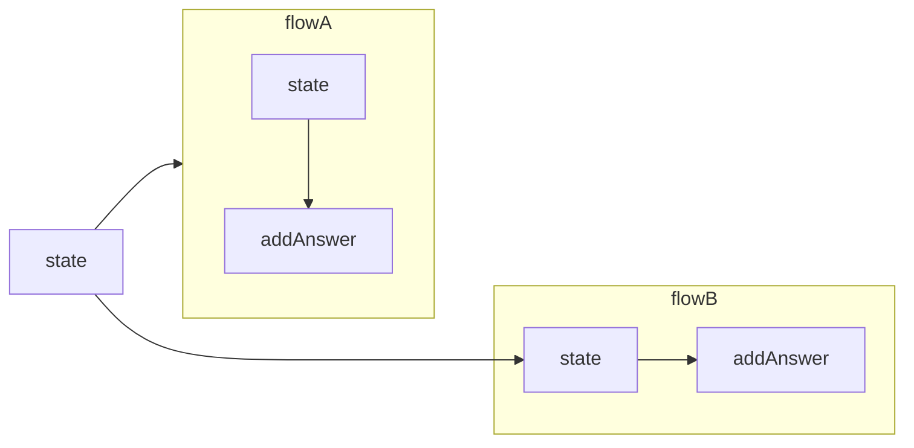

export const description =
  'In this guide, we will talk about what happens when something goes wrong while you work with the API.'

## State

In many occasions you will need to share data between flows and no matter if you have modularized your project in different files you can use state in the callback function to be able to access the individual state of each user.

Let's imagine the case where you have two flows.
Flow A: In charge of collecting user data.
Flow B: Responsible for generating a record in the database.
but both flows are independent files

<CodeGroup>
```ts {{ title: 'app.ts' }}
  import { createFlow, MemoryDB, createProvider } from '@bot-whatsapp/bot';
  // ...
  import flowA from './flows/flow-a'
  import flowB from './flows/flow-b'

  const main = async () => {

      const adapterDB = new MemoryDB()
      const adapterFlow = createFlow([flowA, flowB])
      const adapterProvider = createProvider(BaileysProvider)

      adapterProvider.initHttpServer(3000)

      await createBot({
          flow: adapterFlow,
          provider: adapterProvider,
          database: adapterDB,
      })
  }
```
```ts {{ title: 'flow-a.ts' }}
  import { addKeyword, addAction } from '@bot-whatsapp/bot';

  const flowA = addKeyword('register')
    .addAnswer('What is your name?', { capture: true }, async (ctx, { state }) => {
      const responseName = ctx.body
      await state.update({ name: responseName })
    })
    .addAnswer('What is your email?', { capture: true }, async (ctx, { state }) => {
      const responseEmail = ctx.body
      await state.update({ email: responseEmail })
    })

  export default flowA
```
```ts {{ title: 'flow-b.ts' }}
  import { addKeyword } from '@bot-whatsapp/bot';

  const flowB = addKeyword('resume')
    .addAnswer('ok your name is...', null, async (_, { state, flowDynamic }) => {
      const name = state.get('name')
      await flowDynamic(name)
    })
    .addAnswer('ok your email is...', null, async (_, { state, flowDynamic }) => {
      const email = state.get('email')
      await flowDynamic(email)
    })
    .addAnswer('ok your summary is..', null, async (_, { state, flowDynamic }) => {
      const allState = state.getMyState()
      await flowDynamic(`Name:${allState.name}, Email: ${allState.email}`)
    })


  export default flowB
```
</CodeGroup>



<Warning>
It is important to understand that the state is volatile, it does not permeate anywhere. If you are worried about the performance level, you can see it [here](https://github.com/codigoencasa/bot-whatsapp/blob/d8eb94cae36fb233f5283c8d44c6c0307d26a978/packages/bot/src/context/stateClass.ts#L7), but I'll save you time by telling you that it is a [Map](https://developer.mozilla.org/en-US/docs/Web/JavaScript/Reference/Global_Objects/Map)
</Warning>

The state has several functionalities, add, update, clean you can see an example of how to use them below.

## Clear {{ not:'true' }}

<Row>
  <Col>
    This endpoint allows you to delete attachments. Note: This will permanently delete the file.
  </Col>
  <Col sticky>
    <CodeGroup>
    ```ts
    .addAnswer('..', null, async (_, { state }) => {
      state.clear()
    })
    .addAction(async (_, { state }) => {
      state.clear()
    })
    ```
    </CodeGroup>

  </Col>
</Row>

## Update {{ not:'true' }}

<Row>
  <Col>
    This endpoint allows you to delete attachments. Note: This will permanently delete the file.
  </Col>
  <Col sticky>
    <CodeGroup>
    ```ts
    .addAnswer('..', null, async (_, { state }) => {
      state.clear()
    })
    .addAction(async (_, { state }) => {
      state.clear()
    })
    ```
    </CodeGroup>

  </Col>
</Row>

## Get {{ not:'true' }}

<Row>
  <Col>
    This endpoint allows you to delete attachments. Note: This will permanently delete the file.
  </Col>
  <Col sticky>
    <CodeGroup>
    ```ts
    .addAnswer('..', null, async (_, { state }) => {
      state.get('propertyName')
    })
    .addAction(async (_, { state }) => {
     state.get('propertyName')
    })
    ```
    </CodeGroup>

  </Col>
</Row>

## GetMyState {{ not:'true' }}

<Row>
  <Col>
    This endpoint allows you to delete attachments. Note: This will permanently delete the file.
  </Col>
  <Col sticky>
    <CodeGroup>
    ```ts
    .addAnswer('..', null, async (_, { state }) => {
      state.getMyState()
    })
    .addAction(async (_, { state }) => {
     state.getMyState()
    })
    ```
    </CodeGroup>

  </Col>
</Row>

---

## flowDynamic

The library is based on three key components for its correct functioning: the Flow, in charge of building the context of the conversation and offering a friendly interface to the developer; the Provider, which acts as a connector allowing to easily switch between WhatsApp providers without the risk of affecting other parts of the bot; and the Database, which in line with this connector philosophy, facilitates changing the data persistence layer without the need to rewrite the workflow.

---

## fallBack

The library is based on three key components for its correct functioning: the Flow, in charge of building the context of the conversation and offering a friendly interface to the developer; the Provider, which acts as a connector allowing to easily switch between WhatsApp providers without the risk of affecting other parts of the bot; and the Database, which in line with this connector philosophy, facilitates changing the data persistence layer without the need to rewrite the workflow.

---

## endFlow

The library is based on three key components for its correct functioning: the Flow, in charge of building the context of the conversation and offering a friendly interface to the developer; the Provider, which acts as a connector allowing to easily switch between WhatsApp providers without the risk of affecting other parts of the bot; and the Database, which in line with this connector philosophy, facilitates changing the data persistence layer without the need to rewrite the workflow.

---

## gotoFlow

The library is based on three key components for its correct functioning: the Flow, in charge of building the context of the conversation and offering a friendly interface to the developer; the Provider, which acts as a connector allowing to easily switch between WhatsApp providers without the risk of affecting other parts of the bot; and the Database, which in line with this connector philosophy, facilitates changing the data persistence layer without the need to rewrite the workflow.

---

## Blacklist

The library is based on three key components for its correct functioning: the Flow, in charge of building the context of the conversation and offering a friendly interface to the developer; the Provider, which acts as a connector allowing to easily switch between WhatsApp providers without the risk of affecting other parts of the bot; and the Database, which in line with this connector philosophy, facilitates changing the data persistence layer without the need to rewrite the workflow.

---

## idle

The library is based on three key components for its correct functioning: the Flow, in charge of building the context of the conversation and offering a friendly interface to the developer; the Provider, which acts as a connector allowing to easily switch between WhatsApp providers without the risk of affecting other parts of the bot; and the Database, which in line with this connector philosophy, facilitates changing the data persistence layer without the need to rewrite the workflow.

---