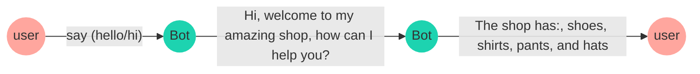
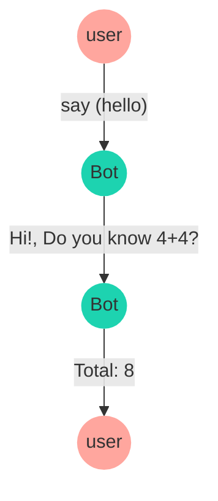

import { Contributors } from '@/components/Contributors'

export const description =
  'Neste guia, falaremos sobre o que acontece quando algo dá errado enquanto você trabalha com a API.'

# Recursos

## addKeyword

Esta função é importada de *@bot-whastapp/bot*, permite iniciar uma conversa com base nas configurações dadas.

A função 'addKeyword' é o ponto de partida de um fluxo de conversa, basta passar um __ array de palavras-chave__,
quando alguém enviar uma mensagem de texto para essas palavras-chave no chatbot, a função acionará a caixa de diálogo predefinida que você configurou.

No exemplo a seguir é estabelecido um fluxo de conversa que recebeu as palavras-chave 'hello' e 'hi',
em seguida, o chatbot enviará uma mensagem usando  addAnswer com o texto oi, bem-vindo à minha loja incrível, como posso ajudá-lo?
e 'a Loja oferece: sapatos, camisas, calças e chapéus'.


<CodeGroup>
```ts {{ title:' app.ts'}}
  import { addKeyword } from '@bot-whatsapp/bot';

  const mainFlow = addKeyword(['Olá', 'oi'])
      .addAnswer(['oi, bem-vindo à minha loja incrível', ' como posso te ajudar?'])
      .addAnswer(['a Loja TEM:', 'sapatos, camisas, calças e chapéus'])
```
```js {{ title: 'app.js'}}
  import { addKeyword } from '@bot-whatsapp/bot';

  const mainFlow = addKeyword(['Olá', 'oi'])
      .addAnswer(['oi, bem-vindo à minha loja incrível', ' como posso te ajudar?'])
      .addAnswer(['a Loja TEM:', 'sapatos, camisas, calças e chapéus'])
```
</CodeGroup>



---

<Note>
A função addKeywords também possui uma série de properiedaes que o ajudarão a resolver diferentes casos de uso.
Algumas dessas funções são: [regex] (/add-functions#regex), [sensitive] (/add-functions#sensitive)
</Note>

O fluxo da conversa pode ser limitado a uma __keyword__ específica, por exemplo, a palavra 'purchase' para acionar a próxima caixa de diálogo

<CodeGroup>
```ts {{ title:' app.ts'}}
  import { addKeyword } from '@bot-whatsapp/bot';

  const mainFlow = addKeyword('comprar')
      .addAnswer(['ótimo! ', 'O que você quer comprar?'])
```
```js {{ title: 'app.js'}}
  import { addKeyword } from '@bot-whatsapp/bot';

  const mainFlow = addKeyword('compra')
      .addAnswer(['ótimo! ', 'O que você quer comprar?'])
```
</CodeGroup>


## Regex {{ not: 'true'}} 

O chatbot suporta validação regex, no exemplo a seguir um objeto é passado como o segundo parâmetro para a função `addKeyword`, o objeto tem uma propriedade `regex` definida como `true` e a propriedade __keywords__ é um padrão regex.

<CodeGroup>
```ts {{ title: 'app.ts'}}
  import { addKeyword } from '@bot-whatsapp/bot';

  const REGEX_CREDIT_CARD = `/(^4[0-9]{12}(?:[0-9]{3})?$)|(^(?:5[1-5][0-9]{2}|222[1-9]|22[3-9][0-9]|2[3-6][0-9]{2}|27[01][0-9]|2720)[0-9]{12}$)|(3[47][0-9]{13})|(^3(?:0[0-5]|[68][0-9])[0-9]{11}$)|(^6(?:011|5[0-9]{2})[0-9]{12}$)|(^(?:2131/1800/35\d{3})\d{11}$)/gm`;

  const mainFlow = addKeyword(REGEX_CREDIT_CARD, { regex: true })
      .addAnswer('este parece ser um número de cartão de crédito válido')
      .addAnswer('pronto, seu cartão de crédito foi validado')
```
```js {{ title: 'app.js'}}
  import { addKeyword } from '@bot-whatsapp/bot';

  const REGEX_CREDIT_CARD = `/(^4[0-9]{12}(?:[0-9]{3})?$)|(^(?:5[1-5][0-9]{2}|222[1-9]|22[3-9][0-9]|2[3-6][0-9]{2}|27[01][0-9]|2720)[0-9]{12}$)|(3[47][0-9]{13})|(^3(?:0[0-5]|[68][0-9])[0-9]{11}$)|(^6(?:011|5[0-9]{2})[0-9]{12}$)|(^(?:2131/1800/35\d{3})\d{11}$)/gm`;

  const mainFlow = addKeyword(REGEX_CREDIT_CARD, { regex: true })
      .addAnswer('este parece ser um número de cartão de crédito válido')
      .addAnswer('pronto, seu cartão de crédito foi validado')
```
</CodeGroup>

## Sensitive {{ not: 'true'}} 

O chatbot detecta uma palavra-chave específica em qualquer parte de uma mensagem, mas passando a propriedade `sensitive` como `true` o chatbot acionará a caixa de diálogo se o usuário anotar exatamente a mesma __keyword__.
Por favor, siga o próximo exemplo:

<CodeGroup>
```ts {{ title:' app.ts'}}
  import { addKeyword } from '@bot-whatsapp/bot';

  const mainFlow = addKeyword('comprar', { sensitive: true })
      .addAnswer(['ótimo! ', 'O que você quer comprar?'])
```
```js {{ title: 'app.js'}}
  import { addKeyword } from '@bot-whatsapp/bot';

  const mainFlow = addKeyword('comprar', { sensitive: true })
      .addAnswer(['ótimo! ', 'O que você quer comprar?'])
```
</CodeGroup>

---

## addAnswer

Esta função é importada de *@bot-whastapp/bot*.

A função 'addAnswer' é usada para enviar uma mensagem para o usuário, pode ser um texto simples ou um arquivo anexado.

No exemplo a seguir é estabelecido um fluxo de conversa que recebeu a palavra-chave'hello',
então o chatbot enviará uma mensagem usando 'addAnswer'com o texto' oi, seja bem vindo a minha loja incrível, como posso te ajudar?'

<CodeGroup>
```ts {{ title:' app.ts'}}
  import { addKeyword, addAnswer } from '@bot-whatsapp/bot';

  const mainFlow = addKeyword('hello')
      .addAnswer('oi, seja bem vindo a minha loja incrível, como posso te ajudar?')
```
```js {{ title: 'app.js'}}
  import { addKeyword, addAnswer } from '@bot-whatsapp/bot';

  const mainFlow = addKeyword('hello')
      .addAnswer('oi, seja bem vindo a minha loja incrível, como posso te ajudar?')
``` 
</CodeGroup>

<Note>
Existem diferentes configurações para envio de mensagens, algumas funções como envio de arquivos, imagens, vídeo, atrasos, quebras de linha:
[quebras de linha] (/add-functions#send-consecutive-messages), [consecutive](/add-functions#send-consecutive-messages), [delay](/add-functions#message-with-delay)
, [callback](/add-functions#message-with-callback)
</Note>

## Enviar mensagens consecutivas {{ not: 'true'}} 

O chatbot pode enviar várias mensagens apenas adicionando a função `addAnswer` uma após a outra.
No exemplo a seguir o chatbot enviará (3) mensagens __'oi'__, __'Bem-vindo à minha loja incrível'__ e __'como posso te ajudar?'__nessa ordem.

<CodeGroup>
```ts {{ title:' app.ts'}}
  import { addKeyword, addAnswer } from '@bot-whatsapp/bot';

  const mainFlow = addKeyword('hello')
      .addAnswer('oi')
      .addAnwer('Bem-vindo à minha loja incrível')
      .addAnswer('Como posso te ajudar?')
```
```js {{ title: 'app.js'}}
  import { addKeyword, addAnswer } from '@bot-whatsapp/bot';

  const mainFlow = addKeyword('hello')
      .addAnswer('oi')
      .addAnwer('Bem-vindo à minha loja incrível')
      .addAnswer('Como posso te ajudar?')
```
</CodeGroup>

## Enviar mensagem com quebras de linha {{ not: 'true'}} 

Sempre que você precisar enviar uma mensagem com quebras de linha, você pode usar um array de string como você pode ver no exemplo a seguir.

<CodeGroup>
```ts {{ title:' app.ts'}}
  import { addKeyword, addAnswer } from '@bot-whatsapp/bot';

  const mainFlow = addKeyword('hello')
      .addAnswer(['oi', 'Bem-vindo à minha loja incrível', ' como posso te ajudar?'])
```
```js {{ title: 'app.js'}}
  import { addKeyword, addAnswer } from '@bot-whatsapp/bot';

  const mainFlow = addKeyword('hello')
      .addAnswer(['oi', 'Bem-vindo à minha loja incrível', ' como posso te ajudar?'])
``` 
</CodeGroup>

## Mensagem com atraso {{ not: 'true'}} 

O chatbot pode enviar uma mensagem com atraso, basta adicionar a função `addAnswer` com a propriedafrom 'delay' definida para a quantidade de milissegundos que você deseja aguardar antes de enviar a mensagem.

<CodeGroup>
```ts {{ title:' app.ts'}}
  import { addKeyword, addAnswer } from '@bot-whatsapp/bot';

  const mainFlow = addKeyword('hello')
      .addAnswer('esta mensagem será após 2 segundos', { delay: 2000 })
```
```js {{ title: 'app.js'}}
  import { addKeyword, addAnswer } from '@bot-whatsapp/bot';

  const mainFlow = addKeyword('hello')
      .addAnswer('esta mensagem será após 2 segundos', { delay: 2000 })
``` 
</CodeGroup>

## Mensagem com callback {{ not: 'true'}} 

Ao utilizar funções de callback em um addAnswers a operação prioriza o envio da mensagem e depois a execução da função.


<CodeGroup>
```ts {{ title:' app.ts'}}
  import { addKeyword, addAnswer } from '@bot-whatsapp/bot';

  const mainFlow = addKeyword('hello')
      .addAnswer('oi!, Você conhece 4+4?', null, async ( _ , {flowDynamic}) => {
          const sum = 4 + 4
          await flowDynamic('Total: ${sum}')
      })
```
```js {{ title: 'app.js'}}
  import { addKeyword, addAnswer } from '@bot-whatsapp/bot';

  const mainFlow = addKeyword('hello')
      .addAnswer('esta mensagem será após 2 segundos', { delay: 2000 })
``` 
</CodeGroup>



---

## addAction

Esta função é importada de *@bot-whastapp/bot*.

A função `addAction` é usada para definir ações específicas como resposta quando uma mensagem do whatsapp é recebida, 
essa função permite acionar fluxos de conversa com base na entrada do Usuário e definir como o chatbot deve agir.

No exemplo a seguir você pode ver como você pode acionar uma função quando o usuário envia uma mensagem com a palavra-chave'buy'.

<CodeGroup>
```ts {{ title:' app.ts'}}
  import { addKeyword, addAction } from '@bot-whatsapp/bot';

  const mainFlow = addKeyword('comprar')
      .addAnswer('ótimo! O que você quer comprar?')
      .addAction(async ( _ , { fowDynamic }): void => {
          console.log('o usuário quer comprar algo');
      })
```
```js {{ title: 'app.js'}}
  import { addKeyword, addAction } from '@bot-whatsapp/bot';

  const mainFlow = addKeyword('comprar')
      .addAnswer('ótimo! O que você quer comprar?')
      .addAction(async ( _ , { fowDynamic }) => {
          console.log('o usuário quer comprar algo');
      })
```
</CodeGroup>


Você pode usar a função 'addAction' com 'capture' como você pode ver no exemplo abaixo

<CodeGroup>
```ts {{ title:' app.ts'}}
  import { addKeyword, addAction } from '@bot-whatsapp/bot';

  const mainFlow = addKeyword(['Olá', 'oi'])
      .addAction(async ( _ , { fowDynamic }): void => {
          return flowDynamic('oi! Como posso te ajudar?');
      })
      .addAction({ capture: true }, async (ctx, { fowDynamic, state }): void => {
          await state.udpate({ nome: ctx.body})
          console.flowDynamic('o usuário disse: ${ctx.body}');
      })
```
```js {{ title: 'app.js'}}
  import { addKeyword, addAction } from '@bot-whatsapp/bot';

  const mainFlow = addKeyword(['Olá', 'oi'])
      .addAction(async ( _ , { fowDynamic }) => {
          return flowDynamic('o usuário quer comprar algo');
      })
```
</CodeGroup>

### Exemplo 1

Neste exemplo, criamos um fluxo de conversa usando a palavra-chave' Hello 'e'Hi'.

Quando o usuário enviar uma mensagem de texto para uma dessas palavras-chave, o chatbot enviará uma mensagem de saudação e 
o chatbot irá capturar a resposta do Usuário e enviar de volta a mesma mensagem repetida para o usuário.

Esperamos que isso ajude você a ter a ideia principal de como usar a função `addAction` no seu chatbot do whatsapp.
Se você tiver alguma dúvida, entre em contato conosco.

<CodeGroup>
```ts {{ title:' app.ts'}}
  import { addKeyword, addAction } from '@bot-whatsapp/bot';

  const mainFlow = addKeyword(['Hola', 'Hi'])
      .addAction(async ( _ , { fowDynamic }): void => {
          return flowDynamic('oi! Esse é o Luis, em que posso te ajudar?');
      })  
      .addAction(async ( _ , { fowDynamic }): void => {
          mensagem const = ctx.corpo;
          console.flowDynamic('o usuário disse: ${message}');
      })
```
```js {{ title: 'app.js'}}
  import { addKeyword, addAction } from '@bot-whatsapp/bot';

  const mainFlow = addKeyword(['Hola', 'Hi'])
      .addAction(async ( _ , { fowDynamic }) => {
          return flowDynamic('oi! Esse é o Luis, em que posso te ajudar?');
      })  
      .addAction(async ( _ , { fowDynamic }) => {
          mensagem const = ctx.corpo;
          console.flowDynamic('o usuário disse: ${message}');
      })
```
</CodeGroup>

<Note>
A função `addAction` é uma ferramenta poderosa para acionar ações específicas quando o usuário envia uma mensagem com uma palavra-chave específica,
portanto, é altamente recomendável usá-lo para uma lógica mais complexa do que apenas enviar uma mensagem para o usuário.
</Note>

### Exemplo 2

No exemplo a seguir, criamos alguns fluxos de conversa usando
```ts {{ title:' app.ts'}}
import { addKeyword, addAction } from '@bot-whatsapp / bot';

// Criar fluxo principal
const mainFlow = addKeyword(['Olá', 'oi'])
.addAction(async ( _ , { fowDynamic }) => {
return flowDynamic('Oi, aqui é o Luis, em que posso te ajudar?');
});

// Criar um fluxo de solicitação de produto
const productRequestFlow = addKeyword(['produto'])
.addAction(async ( _ , { fowDynamic }) => {
return flowDynamic('ótimo! O que você quer comprar?');
})

// Criar fluxo de suporte
const suportFlow = addKeyword(['Olá', 'oi'])
.addAction(async ( _ , { fowDynamic }) => {
return flowDynamic('Oi, você pode descrever seu problema?');
});

// Criar outro fluxo de solicitação
const anotherRequestFlow = addKeyword(['request'])
.addAction(async ( _ , { fowDynamic }) => {
return flowDynamic('especifique a solicitação que deseja fazer');
});

// Criar fluxo de Ajuda
const helpFlow = addKeyword(['help'])
.addAction ({capture: true }, async (ctx, {fowDynamic }) => {
const option = parseInt (ctx.corpo);
  switch (option) {
    caso 1:
      return flowDynamic('você pode comprar um produto digitando a palavra "produto"');
    caso 2:
      return flowDynamic('você pode solicitar um serviço digitando a palavra "request"');
    caso 3:
      return flowDynamic('você pode pedir suporte digitando a palavra "suporte"');
  default:
    return flowDynamic('não entendi seu pedido');
}
});

// Criar bot e adicionar fluxos
const bot = createBot([mainFlow, productRequestFlow, suportFlow, anotherRequestFlow, helpFlow]);
```

---

<Contributors users={['lualreye', 'leifermendez']} />