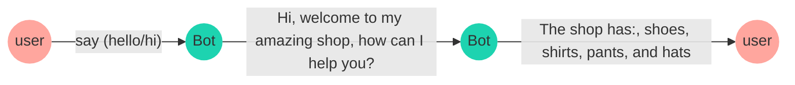
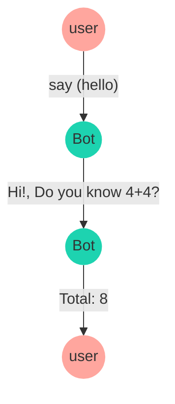

import { Contributors } from '@/components/Contributors'
import { Resources } from '@/components/Resources'
import { Guides } from '@/components/Guides'

export const description =
  'Neste guia, falaremos sobre o que acontece quando algo dá errado enquanto você trabalha com a API.'

# Features

Estas são as funções mais importantes que você deve aprender ao criar fluxos ou interações dinâmicas com o bot

## Add keyword

__`addKeyword`__  é o ponto de partida de um fluxo de conversa, só precisa passar um __array of keywords__,
quando alguém escreve essas palavras-chave no chatbot, a função aciona a caixa de diálogo predefinida que você configurou.

No exemplo a seguir é estabelecido um fluxo de conversação que recebeu as palavras-chave 'hello ' e'hi',
em seguida, o chatbot enviará uma mensagem usando `addAnswer` com o texto 'oi, bem-vindo à minha loja incrível, como posso ajudá-lo?'
e 'a Loja oferece: sapatos, camisas, calças e chapéus'.

<Note>
A função adicionar palavras-chave também possui várias propriedades que o ajudarão a resolver diferentes casos de uso.
Algumas destas funções são: [regex](add-functions#regex), [sensitive](add-functions#sensitive)
</Note>


<CodeGroup>
```ts {{ title: 'app.ts' }}
  import { addKeyword } from '@bot-whatsapp/bot';

  const mainFlow = addKeyword(['hello', 'hi'])
      .addAnswer(['Hi, welcome to my amazing shop', 'how can I help you?'])
      .addAnswer(['The shop has: ', 'shoes, shirts, pants, and hats'])
```
```js {{ title: 'app.js' }}
  import { addKeyword } from '@bot-whatsapp/bot';

  const mainFlow = addKeyword(['hello', 'hi'])
      .addAnswer(['Hi, welcome to my amazing shop', 'how can I help you?'])
      .addAnswer(['The shop has: ', 'shoes, shirts, pants, and hats'])
```
</CodeGroup>





O fluxo de conversação pode ser limitado a uma __keyword__ específica, por exemplo, a palavra 'compra' para acionar a próxima caixa de diálogo

<CodeGroup>
```ts {{ title: 'app.ts' }}
  import { addKeyword } from '@bot-whatsapp/bot';

  const mainFlow = addKeyword('buy')
      .addAnswer(['Great! ', 'What do you want to buy?'])
```
```js {{ title: 'app.js' }}
  import { addKeyword } from '@bot-whatsapp/bot';

  const mainFlow = addKeyword('purchase')
      .addAnswer(['Great! ', 'What do you want to buy?'])
```
</CodeGroup>

---

## Regex {{ not:'true', tag:'addKeyword' }}

<Row>
  <Col>
O chatbot suporta validação de regex, no exemplo a seguir um objeto é passado como o segundo parâmetro para a função addKeyword, o objeto tem uma propriedade regex definida como true e a propriedade keywords é um padrão regex.

  </Col>
  <Col sticky>
<CodeGroup>
```ts {{ title: 'app.ts' }}
  import { addKeyword } from '@bot-whatsapp/bot';

  const REGEX_GMAIL_EMAIL = /(\w+)@gmail\.com/g;

  const mainFlow = addKeyword(REGEX_GMAIL_EMAIL, 
      { regex: true })
      .addAnswer(`Thanks for the gmail address`)
```
```js {{ title: 'app.js' }}
  import { addKeyword } from '@bot-whatsapp/bot';

  const REGEX_GMAIL_EMAIL = /(\w+)@gmail\.com/g;

  const mainFlow = addKeyword(REGEX_GMAIL_EMAIL, 
      { regex: true })
      .addAnswer(`Thanks for the gmail address`)
```
</CodeGroup>

  </Col>
</Row>

## Sensitive {{ not:'true', tag:'addKeyword' }}

<Row>
  <Col>
O chatbot detecta uma palavra-chave específica em qualquer parte de uma mensagem, mas `sensitive` propriedade como `true` o chatbot acionará a caixa de diálogo se o usuário anotar exatamente o mesmo __keyword__.

  </Col>
  <Col sticky>
<CodeGroup>
```ts {{ title: 'app.ts' }}
  import { addKeyword } from '@bot-whatsapp/bot';

  const mainFlow = addKeyword('buy', { sensitive: true })
      .addAnswer(['Great! ', 'What do you want to buy?'])
```
```js {{ title: 'app.js' }}
  import { addKeyword } from '@bot-whatsapp/bot';

  const mainFlow = addKeyword('buy', { sensitive: true })
      .addAnswer(['Great! ', 'What do you want to buy?'])
```
</CodeGroup>

  </Col>
</Row>

---

## Add answer

__`addAnswer`__ é usado para enviar uma mensagem ao usuário, pode ser um texto simples ou um arquivo anexado.
No exemplo a seguir é estabelecido um fluxo de conversa que recebeu a palavra-chave 'hello',
em seguida, o chatbot enviará uma mensagem usando `addAnswer` com o texto __' oi, bem-vindo à minha loja incrível, como posso ajudá-lo?'__

<CodeGroup>
```ts {{ title: 'app.ts' }}
  import { addKeyword, addAnswer } from '@bot-whatsapp/bot';

  const mainFlow = addKeyword('hello')
      .addAnswer('Hi, welcome to my amazing shop, how can I help you?')
```
```js {{ title: 'app.js' }}
  import { addKeyword, addAnswer } from '@bot-whatsapp/bot';

  const mainFlow = addKeyword('hello')
      .addAnswer('Hi, welcome to my amazing shop, how can I help you?')
``` 
</CodeGroup>

<Note>
Existem diferentes configurações para o envio de mensagens, algumas funções como envio de arquivos, imagens, vídeo, atrasos, quebras de linha:
[line breaks](/add-functions#send-consecutive-messages), [consecutive](/add-functions#send-consecutive-messages), [delay](/add-functions#message-with-delay)
, [callback](/add-functions#message-with-callback)
</Note>

---

## Consecutive Messages {{ not:'true', tag:'addAnswer' }}

<Row>
  <Col>
O chatbot pode enviar várias mensagens apenas adicionando a função addAnswer uma após a outra. No exemplo a seguir, o chatbot enviará (3) mensagens:
`Hi`, `Welcome to my amazing shop`, `how can I help you?` nessa ordem.

  </Col>
  <Col sticky>
<CodeGroup>
```ts {{ title: 'app.ts' }}
  import { addKeyword, addAnswer } from '@bot-whatsapp/bot';

  const mainFlow = addKeyword('hello')
      .addAnswer('Hi')
      .addAnswer('Welcome to my amazing shop')
      .addAnswer('how can I help you?')
```
```js {{ title: 'app.js' }}
  import { addKeyword, addAnswer } from '@bot-whatsapp/bot';

  const mainFlow = addKeyword('hello')
      .addAnswer('Hi')
      .addAnswer('Welcome to my amazing shop')
      .addAnswer('how can I help you?')
```
</CodeGroup>

  </Col>
</Row>

## Message with line breaks {{ not:'true', tag:'addAnswer' }}

<Row>
  <Col>
Sempre que precisar enviar uma mensagem com quebras de linha, você pode usar uma matriz de string, como pode ver no exemplo a seguir.
  </Col>
  <Col sticky>
<CodeGroup>
```ts {{ title: 'app.ts' }}
  import { addKeyword, addAnswer } from '@bot-whatsapp/bot';

  const mainFlow = addKeyword('hello')
      .addAnswer([
        'Hi', 'Welcome to my amazing shop', 
        'how can I help you?'
      ])
```
```js {{ title: 'app.js' }}
  import { addKeyword, addAnswer } from '@bot-whatsapp/bot';

  const mainFlow = addKeyword('hello')
      .addAnswer([
        'Hi', 'Welcome to my amazing shop', 
        'how can I help you?'
      ])
``` 
</CodeGroup>

  </Col>
</Row>

## Message with delay {{ not:'true', tag:'addAnswer' }}

<Row>
  <Col>
O chatbot pode enviar uma mensagem com um `delay`, basta adicionar a função addAnswer com a propriedade delay definida para a quantidade de milissegundos que deseja aguardar antes de enviar a mensagem.
  </Col>
  <Col sticky>
<CodeGroup>
```ts {{ title: 'app.ts' }}
import { addKeyword, addAnswer } from '@bot-whatsapp/bot';

const mainFlow = addKeyword('hello')
  .addAnswer('This message will after 2 seconds',
    { delay: 2000 }
  )
```
```js {{ title: 'app.js' }}
import { addKeyword, addAnswer } from '@bot-whatsapp/bot';

const mainFlow = addKeyword('hello')
  .addAnswer('This message will after 2 seconds',
    { delay: 2000 }
  )
``` 
</CodeGroup>

  </Col>
</Row>

---

## Message with callback {{ not:'true'}} 

Ao usar funções de retorno de chamada em um addAnswers, a operação prioriza o envio da mensagem e, em seguida, a execução da função.

<CodeGroup>
```ts {{ title: 'app.ts' }}
  import { addKeyword, addAnswer } from '@bot-whatsapp/bot';

  const mainFlow = addKeyword('hello')
      .addAnswer('Hi!, Do you know 4+4?', null, async (_, {flowDynamic}) => {
          const sum = 4 + 4
          await flowDynamic(`Total: ${sum}`)
      })
      .addAction(async (_, {flowDynamic}) => {
          await flowDynamic(`Other message`)
      })
```
```js {{ title: 'app.js' }}
  import { addKeyword, addAnswer } from '@bot-whatsapp/bot';

  const mainFlow = addKeyword('hello')
      .addAnswer('Hi!, Do you know 4+4?', null, async (_, {flowDynamic}) => {
          const sum = 4 + 4
          await flowDynamic(`Total: ${sum}`)
      })
      .addAction(async (_, {flowDynamic}) => {
          await flowDynamic(`Other message`)
      })
``` 
</CodeGroup>



---

## Add Action

__`addAction`__ é usado para definir ações específicas como uma resposta quando uma mensagem do whatsapp foi recebida,
esta função permite acionar fluxos de conversação com base na entrada do Usuário e definir como o chatbot deve agir.

No exemplo a seguir, você pode ver como pode acionar uma função quando o usuário envia uma mensagem com a palavra-chave 'buy'.

<CodeGroup>
```ts {{ title: 'app.ts' }}
  import { addKeyword, addAction } from '@bot-whatsapp/bot';

  const mainFlow = addKeyword('buy')
      .addAnswer('Great! What do you want to buy?')
      .addAction(async (_, { fowDynamic }): void => {
          return console.log('The user wants to buy something');
      })
```
```js {{ title: 'app.js' }}
  import { addKeyword, addAction } from '@bot-whatsapp/bot';

  const mainFlow = addKeyword('buy')
      .addAnswer('Great! What do you want to buy?')
      .addAction(async (_, { fowDynamic }) => {
          return console.log('The user wants to buy something');
      })
```
</CodeGroup>


Você pode usar a função `addAction` com `capture` como você pode ver no exemplo abaixo

<CodeGroup>
```ts {{ title: 'app.ts' }}
  import { addKeyword, addAction } from '@bot-whatsapp/bot';

  const mainFlow = addKeyword(['Hello', 'Hi'])
      .addAction(async (_, { fowDynamic }): void => {
          return flowDynamic('Hi! how can I help you?');
      })
      .addAction({ capture: true }, async (ctx, { fowDynamic, state }): void => {
          await state.udpate({ name: ctx.body})
          return console.flowDynamic(`The user said: ${ctx.body}`);
      })
```
```js {{ title: 'app.js' }}
  import { addKeyword, addAction } from '@bot-whatsapp/bot';

  const mainFlow = addKeyword(['Hello', 'Hi'])
      .addAction(async (_, { fowDynamic }) => {
          return flowDynamic('The user wants to buy something');
      })
```
</CodeGroup>

---

<Guides />

<Resources />

<Contributors users={['leifermendez','lualreye', 'elimeleth']} />