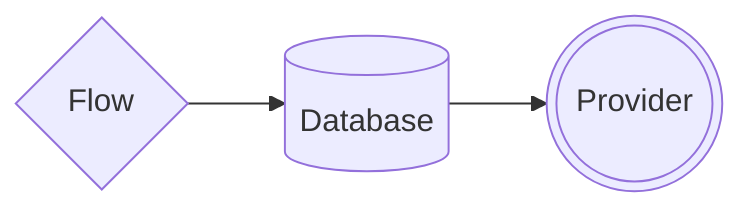

import { Contributors } from '@/components/Contributors'
import { Guides } from '@/components/Guides'
import { Resources } from '@/components/Resources'

export const description =
  'Neste guia, falaremos sobre o que acontece quando algo dá errado enquanto você trabalha com a API.'

# Concepts

A biblioteca baseia-se em três componentes fundamentais para o seu correcto funcionamento: o fluxo, encarregado de construir o contexto da conversa e de oferecer uma interface amigável ao programador; o fornecedor, que actua como um conector que permite alternar facilmente entre os fornecedores do WhatsApp sem o risco de afectar outras partes do bot; e a base de dados, que em consonância com esta filosofia do conector, facilita a alteração da camada de persistência de dados sem a necessidade de reescrever o fluxo de trabalho.



---

## Flow

Refere-se à criação de sequências estruturadas de interações, como na construção de fluxos de conversação. Dois métodos principais são addKeyword e addAnswer, que permitem que palavras-chave sejam associadas a respostas específicas, fornecendo opções para personalizar o fluxo da conversa.

<CodeGroup>
```ts {{ title: 'app.ts' }}
import { addKeyword } from '@bot-whatsapp/bot'

addKeyword(['hello','hi']).addAnswer('Ey! welcome')
```

```js {{ title: 'app.js' }}
const { addKeyword } = require('@bot-whatsapp/bot') 

addKeyword(['hello','hi']).addAnswer('Ey! welcome')
```
</CodeGroup>


Alguns exemplos de como usar a palavra-chave add na qual você pode colocar a __keyword__ou uma lista de __keywords__ que será usada para iniciar um fluxo de conversação

```ts
// Example with single keyword
addKeyword('hello').addAnswer('Ey! welcome')

// Example with multi keywords
addKeyword(['hello','hi']).addAnswer('Ey! welcome')
```

Para uma rápida compreensão da operação, preparamos um exemplo básico de como implementar

<div className="not-prose aling-block">
  <Button
    href="/uses-cases"
    variant="text"
    arrow="right"
    children="View more examples"
  />
</div>

---

## Provider

É uma peça-chave usada para entregar a mensagem ao fornecedor escolhido. No caso de você estar construindo um bot para o whatsapp, você deve usar um adaptador como __Meta__, __Twilio__, __Baileys__, etc ou mesmo se quiser se conectar ao __Telegram__.

<CodeGroup>
```ts {{ title: 'app.ts' }}
import { addKeyword, MemoryDB, createProvider, createFlow } from '@bot-whatsapp/bot'
import { BaileysProvider } from '@bot-whatsapp/provider-baileys'

// ...stuff code...

const main = async () => {
    
    await createBot({
        database: new MemoryDB(),
        provider: createProvider(BaileysProvider),
        flow: createFlow([flowDemo])
    })
}

main()
```

```ts {{ title: 'provider.wppconnect.ts' }}
import { addKeyword, MemoryDB, createProvider, createFlow } from '@bot-whatsapp/bot'
import { WPPConnectProviderClass } from '@bot-whatsapp/provider-wppconnect'

// ...stuff code...

const main = async () => {
    
    await createBot({
        database: new MemoryDB(),
        provider: createProvider(WPPConnectProviderClass),
        flow: createFlow([flowDemo])
    })
}

main()
```

```ts {{ title: 'provider.meta.ts' }}
import { addKeyword, MemoryDB, createProvider, createFlow } from '@bot-whatsapp/bot'
import { MetaProvider } from '@bot-whatsapp/provider-meta'

// ...stuff code...

const main = async () => {
    
    await createBot({
        database: new MemoryDB(),
        provider: createProvider(MetaProvider, {
              jwtToken: 'jwtToken',
              numberId: 'numberId',
              verifyToken: 'verifyToken',
              version: 'v16.0',
        }),
        flow: createFlow([flowDemo])
    })
}

main()
```
</CodeGroup>

<div className="not-prose aling-block">
  <Button
    href="/providers"
    variant="text"
    arrow="right"
    children="More information about the providers "
  />
</div>

---

## Database

Assim como os fornecedores podem ser facilmente trocados entre adaptadores, podemos fazer o mesmo com a base de dados. Agora, o importante a entender é como funciona. O principal objetivo do banco de dados dentro da inicialização é fornecer ao bot um registro dos diferentes eventos que ocorreram entre diferentes conversas.

Está pronto para implementar adaptadores de [Mongo](/databases#mongo), [MySQL](/databases#my-sql), [Postgres](/databases#postgres), entre outros.

<CodeGroup>
```ts {{ title: 'app.ts' }}
import { addKeyword, MemoryDB, createProvider, createFlow } from '@bot-whatsapp/bot'
import { BaileysProvider } from '@bot-whatsapp/provider-baileys'

// ...stuff code...

const main = async () => {
    
    await createBot({
        database: new MemoryDB(),
        provider: createProvider(BaileysProvider),
        flow: createFlow([flowDemo])
    })
}

main()
```

```ts {{ title: 'provider.wppconnect.ts' }}
import { addKeyword, MemoryDB, createProvider, createFlow } from '@bot-whatsapp/bot'
import { WPPConnectProviderClass } from '@bot-whatsapp/provider-wppconnect'

// ...stuff code...

const main = async () => {
    
    await createBot({
        database: new MemoryDB(),
        provider: createProvider(WPPConnectProviderClass),
        flow: createFlow([flowDemo])
    })
}

main()
```

```ts {{ title: 'provider.meta.ts' }}
import { addKeyword, MemoryDB, createProvider, createFlow } from '@bot-whatsapp/bot'
import { MetaProvider } from '@bot-whatsapp/provider-meta'

// ...stuff code...

const main = async () => {
    
    await createBot({
        database: new MemoryDB(),
        provider: createProvider(MetaProvider, {
              jwtToken: 'jwtToken',
              numberId: 'numberId',
              verifyToken: 'verifyToken',
              version: 'v16.0',
        }),
        flow: createFlow([flowDemo])
    })
}

main()
```
</CodeGroup>

<div className="not-prose aling-block">
  <Button
    href="/databases"
    variant="text"
    arrow="right"
    children="More information about the databases "
  />
</div>

----

<Guides />

<Resources />

<Contributors users={['leifermendez', 'elimeleth']} />