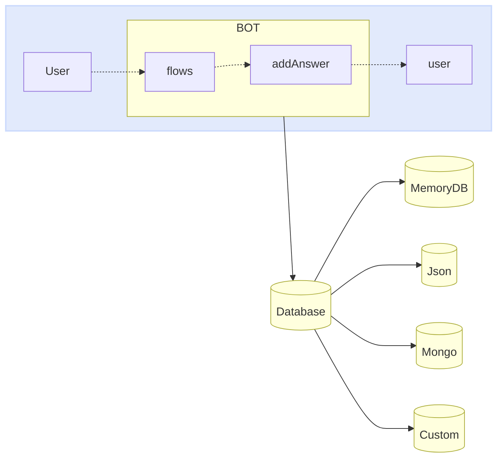

import { Contributors } from '@/components/Contributors'

export const description =
  'Neste guia, falaremos sobre o que acontece quando algo dá errado enquanto você trabalha com a API.'

# Databases

Assim como os fornecedores podem ser facilmente trocados entre adaptadores, podemos fazer o mesmo com a base de dados. Agora, o importante a entender é como funciona.
O principal objectivo do banco de dados dentro da inicializa32necer ao bot um registo de diferentes eventos que ocorreram entre diferentes conversas.

Muitas pessoas o usam como um histórico de bate-papo (na verdade, ele também pode ser usado para esse fim), mas você pode encontrar dados estranhos em seus registros porque ele armazena não apenas mensagens, mas também eventos.


<Warning>
Conectores: [MemoryDB](databases#memory-db), [Json](databases#json), [Mongo](databases#mongo), [MySQL](databases#my-sql), [Postgres](databases#postgres)
</Warning>




Cada banco de dados pode precisar ajustar as chaves de Acesso, Configuração, entre outras propriedades que serão implementadas como configuração da classe implementada.
<CodeGroup>
```ts {{ title: 'memory-database.ts' }}
import { MemoryDB } from "@bot-whatsapp/bot";

export type IDatabase = typeof MemoryDB
export const adapterDB = new MemoryDB();
```

```ts {{ title: 'json-database.ts' }}
import { JsonFileDB } from '@bot-whatsapp/database-json';

export type IDatabase = typeof JsonFileDB
export const adapterDB = new JsonFileDB({ filename: 'db.json' });
```

```ts {{ title: 'mongo-database.ts' }}
import { MongoDB } from '@bot-whatsapp/database-mongo'

export type IDatabase = typeof MongoDB
export const adapterDB = new MongoDB({
    dbUri: MONGO_DB_URI,
    dbName: MONGO_DB_NAME,
})
```

```ts {{ title: 'mysql-database.ts' }}
import { MysqlDB } from '@bot-whatsapp/database-mysql'

export type IDatabase = typeof MysqlDB
export const adapterDB = new MysqlDB({
    host: MYSQL_DB_HOST,
    user: MYSQL_DB_USER,
    database: MYSQL_DB_NAME,
    password: MYSQL_DB_PASSWORD,
})
```

```ts {{ title: 'postgres-database.ts' }}
import { PostgreSQLDB } from '@bot-whatsapp/database-postgres'

export type IDatabase = typeof PostgreSQLDB
export const adapterDB = new PostgreSQLDB({
    host: POSTGRES_DB_HOST,
    user: POSTGRES_DB_USER,
    database: POSTGRES_DB_NAME,
    password: POSTGRES_DB_PASSWORD,
    port: +POSTGRES_DB_PORT,
})
```

</CodeGroup>

Abaixo encontrará mais informações sobre cada uma destas bases de dados.

---

## Memory

Do [WhatsApp Business Platform](https://business.whatsapp.com/products/business-platform) permite que as médias e grandes empresas comuniquem com os seus clientes em grande escala. Você pode iniciar conversas com os clientes em apenas alguns minutos, enviar-lhes notificações de atendimento ao cliente ou atualizações de compra, oferecer-lhes um nível de serviço personalizado e fornecer suporte através do canal de sua escolha.

<Warning>
Lembre-se de que os seguintes requisitos devem ser atendidos para implementar o provedor meta na produção. [More information](/databases/memory)
</Warning>

<CodeGroup>
```ts {{ title: 'memory-database.ts' }}
import { MemoryDB } from "@bot-whatsapp/bot";

export type IDatabase = typeof MemoryDB
export const adapterDB = new MemoryDB();
```
```ts {{ title: 'app.ts' }}
import { createBot, createProvider, createFlow, addKeyword } from '@bot-whatsapp/bot'
import { IProvider, adapterProvider } from './meta-provider';
import { IDatabase, adapterDB } from './memory-database';

const welcomeFlow = addKeyword<IProvider, IDatabase>(['hello', 'hi']).addAnswer('Ey! welcome')

const main = async () => {
    await createBot({
        flow: createFlow([welcomeFlow]),
        provider: adapterProvider,
        database: adapterDB
    })
}

main()
```
</CodeGroup>

---

## Json

[Twilio](https://www.twilio.com/en-us/messaging/channels/whatsapp) é uma plataforma de desenvolvimento que permite aos programadores criar aplicações de comunicação em nuvem e sistemas web. As APIs de comunicação da Twilio permitem que as empresas forneçam a experiência de comunicação certa para seus clientes em aplicativos da web e móveis. Ao usar as APIs Twilio, os desenvolvedores podem adicionar rapidamente essa funcionalidade a um aplicativo, como mensagens de voz, chamadas de vídeo, mensagens de texto e muito mais.

<Warning>
Lembre-se de que os seguintes requisitos devem ser atendidos para implementar o provedor meta na produção. [More information](/providers/twilio)
</Warning>

<CodeGroup>
```ts {{ title: 'json-database.ts' }}
import { JsonFileDB } from '@bot-whatsapp/database-json';

export type IDatabase = typeof JsonFileDB
export const adapterDB = new JsonFileDB({ filename: 'db.json' });
```
```ts {{ title: 'app.ts' }}
import { createBot, createProvider, createFlow, addKeyword } from '@bot-whatsapp/bot'
import { IDatabase, adapterDB } from './json-database';
import { IProvider, adapterProvider } from './twilio-provider';

const welcomeFlow = addKeyword<IProvider, IDatabase>(['hello', 'hi']).addAnswer('Ey! welcome')

const main = async () => {
    await createBot({
        flow: createFlow([welcomeFlow]),
        provider: adapterProvider,
        database: adapterDB
    })
}

main()
```
</CodeGroup>

---

## Mongo

[Baileys](https://whiskeysockets.github.io/) é um projeto de código aberto que permite enviar mensagens, receber mensagens e dezenas de outras funcionalidades através da implementação do WebSocket numa versão do whatsapp.
É um projeto com grande trajetória impulsionado por pessoas com grande conhecimento do assunto, você pode aprofundar nesta biblioteca diretamente em sua documentação ou [repository](https://github.com/WhiskeySockets/Baileys).

Como este é um provedor gratuito que emula a interface da web do whatsapp, você deve digitalizar o QR para fazer login.

<Warning>
Lembre-se de que os seguintes requisitos devem ser atendidos para implementar o provedor meta na produção. [More information](/providers/baileys)
</Warning>

<CodeGroup>
```ts {{ title: 'mongo-database.ts' }}
import { MongoDB } from '@bot-whatsapp/database-mongo'

export type IDatabase = typeof MongoDB
export const adapterDB = new MongoDB({
    dbUri: MONGO_DB_URI,
    dbName: MONGO_DB_NAME,
})
```
```ts {{ title: 'app.ts' }}
import { createBot, createProvider, createFlow, addKeyword, MemoryDB } from '@bot-whatsapp/bot'
import { IProvider, adapterProvider } from './baileys-provider';
import { IDatabase, adapterDB } from './mongo-database';

const welcomeFlow = addKeyword<IProvider, IDatabase>(['hello', 'hi']).addAnswer('Ey! welcome')

const main = async () => {
    await createBot({
        flow: createFlow([welcomeFlow]),
        provider: adapterProvider,
        database: adapterDB
    })
}

main()
```
</CodeGroup>

---

## MySQL

[Venom](https://github.com/orkestral/venom) é um projeto de código aberto que utiliza JavaScript para criar barcos de alto desempenho para o WhatsApp. Ele suporta uma ampla gama de interações, incluindo atendimento ao cliente, envio de mídia, reconhecimento de frases baseado em IA e vários projetos arquitetônicos personalizados para o WhatsApp.
Você pode visitar seus [official](https://orkestral.io/) site como o repositório para entender outros recursos que você pode usar.


Como este é um provedor gratuito que emula a interface da web do whatsapp, você deve digitalizar o QR para fazer login.

<Warning>
Lembre-se de que os seguintes requisitos devem ser atendidos para implementar o provedor meta na produção. [More information](/providers/venom)
</Warning>

<CodeGroup>
```ts {{ title: 'mysql-database.ts' }}
import { MysqlDB } from '@bot-whatsapp/database-mysql'

export type IDatabase = typeof MysqlDB
export const adapterDB = new MysqlDB({
    host: MYSQL_DB_HOST,
    user: MYSQL_DB_USER,
    database: MYSQL_DB_NAME,
    password: MYSQL_DB_PASSWORD,
})
```
```ts {{ title: 'app.ts' }}
import { createBot, createProvider, createFlow, addKeyword, MemoryDB } from '@bot-whatsapp/bot'
import { IProvider, adapterProvider } from './venom-provider';
import { IDatabase, adapterDB } from './mysql-database';

const welcomeFlow = addKeyword<IProvider, IDatabase>(['hello', 'hi']).addAnswer('Ey! welcome')

const main = async () => {
    await createBot({
        flow: createFlow([welcomeFlow]),
        provider: adapterProvider,
        database: adapterDB
    })
}

main()
```
</CodeGroup>

---

## Postgres

[WPPConnect](https://wppconnect.io) é um projeto de código aberto desenvolvido pela comunidade JavaScript com o objetivo de exportar funções do WhatsApp Web para o nó, que pode ser usado para apoiar a criação de qualquer interação, como atendimento ao cliente, envio de mídia, reconhecimento de inteligência baseado em frases artificial e muitas outras coisas, use sua imaginação
Você pode visitar seu site oficial como o [repository](https://github.com/wppconnect-team/wppconnect) para entender outros recursos que você pode usar.

Como este é um provedor gratuito que emula a interface da web do whatsapp, você deve digitalizar o QR para fazer login.

<Warning>
Lembre-se de que os seguintes requisitos devem ser atendidos para implementar o provedor meta na produção. [More information](/providers/wpp-connect)
</Warning>

<CodeGroup>
```ts {{ title: 'postgres-database.ts' }}
import { PostgreSQLDB } from '@bot-whatsapp/database-postgres'

export type IDatabase = typeof PostgreSQLDB
export const adapterDB = new PostgreSQLDB({
    host: POSTGRES_DB_HOST,
    user: POSTGRES_DB_USER,
    database: POSTGRES_DB_NAME,
    password: POSTGRES_DB_PASSWORD,
    port: +POSTGRES_DB_PORT,
})
```
```ts {{ title: 'app.ts' }}
import { createBot, createProvider, createFlow, addKeyword, MemoryDB } from '@bot-whatsapp/bot'
import { IProvider, adapterProvider } from './wppconnect-provider';
import { IDatabase, adapterDB } from './postgres-database';

const welcomeFlow = addKeyword<IProvider, IDatabase>(['hello', 'hi']).addAnswer('Ey! welcome')

const main = async () => {
    await createBot({
        flow: createFlow([welcomeFlow]),
        provider: adapterProvider,
        database: adapterDB
    })
}

main()
```
</CodeGroup>

---

<Contributors users={['leifermendez', 'elimeleth']} />