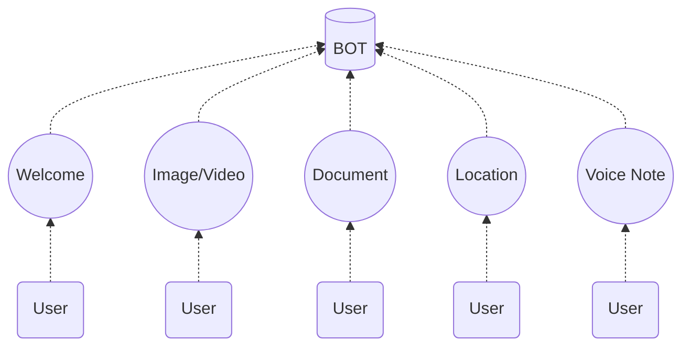
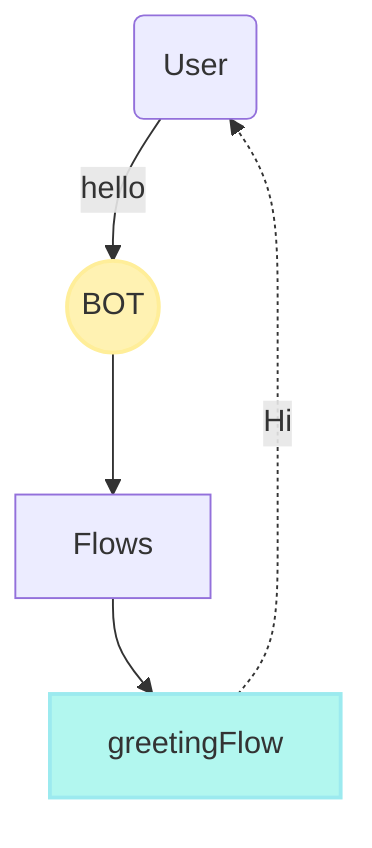

import { Contributors } from '@/components/Contributors'
import { Resources } from '@/components/Resources'
import { Guides } from '@/components/Guides'

export const description =
  'Neste guia, falaremos sobre o que acontece quando algo dá errado enquanto você trabalha com a API.'

# Events

Às vezes, os usuários enviam mensagens como uma imagem, um vídeo ou mensagens de localização especial, entre outras, para receber e iniciar uma conversa quando chega uma mensagem desse tipo, podemos usar os eventos.



---

## Default  {{ tag: 'WELCOME'  }}

Quando um usuário envia uma mensagem de" texto " que não existe em uma palavra-chave em outro fluxo, o evento de boas-vindas será acionado por padrão, que é o evento padrão.

Vamos imaginar o caso em que uma pessoa escreve a palavra `Thank you!`

<CodeGroup>
```ts {{ title: 'app.ts' }}
  import { addKeyword, EVENTS } from '@builderbot/bot'
  
  const welcomeFlow = addKeyword(EVENTS.WELCOME).addAnswer('Ey welcome?')
  const greetingFlow = addKeyword(['hello','hi']).addAnswer('Hi!')
```
```js {{ title: 'app.js' }}
  const { addKeyword, EVENTS } = require('@builderbot/bot')
  
  const welcomeFlow = addKeyword(EVENTS.MEDIA).addAnswer('Message hello')
```
</CodeGroup>

<RowCenter>
  <Col>
  ```mermaid
flowchart TB
    A(User) --"Thank you!"--> B((BOT))
    B --> C[Flows]
    C --> G["welcomeFlow"]
    G -. Ey welcome? .-> A

  style B fill:#fff2b2,stroke:#ffee99,stroke-width:2px
  style G fill:#b2f7ef,stroke:#9ceaef,stroke-width:2px
```
  </Col>
  <Col>

  </Col>
</RowCenter>

Podemos ver no diagrama acima que o bot faz uma pesquisa em todos os fluxos para obter o melhor fluxo que pode responder à palavra-chave "Obrigado", mas como não encontra o "WELCOME" é acionado.

---

## Received Image or Video {{ tag: 'MEDIA'  }}

Quando um usuário envia uma imagem ou um vídeo, o evento de mídia, que é o evento padrão, será acionado por padrão. Isto é ideal para quando precisamos que eles enviem informações e precisamos armazená-las.

<CodeGroup>
```ts {{ title: 'app.ts' }}
  import { addKeyword, EVENTS } from '@builderbot/bot'
  
  const mediaFlow = addKeyword(EVENTS.MEDIA).addAnswer('I received a media image/video')
```
```js {{ title: 'app.js' }}
  const { addKeyword, EVENTS } = require('@builderbot/bot')
  
  const mediaFlow = addKeyword(EVENTS.MEDIA).addAnswer('I received a media image/video')
```
</CodeGroup>

<Note>
Para salvar o arquivo de mídia, você deve invocar a função saveFile do provedor que está usando.
</Note>

<CodeGroup>
```ts {{ title: 'app.ts' }}
  import { addKeyword, EVENTS } from '@builderbot/bot'
  import { BaileysProvider } from '@builderbot/provider-baileys'

  const mediaFlow = addKeyword<BaileysProvider>(EVENTS.MEDIA)
  .addAnswer('I received a media image/video', async (ctx, { provider }) => {
    const localPath = await provider.saveFile(ctx, {path:'...'})
    //console.log(localPath)
  })
```
```js {{ title: 'app.js' }}
  const { addKeyword, EVENTS } = require('@builderbot/bot')
  const { BaileysProvider } = require('@builderbot/bot')
  
  const mediaFlow = addKeyword(EVENTS.MEDIA)
  .addAnswer('I received a media image/video', async (ctx, { provider }) => {
    const localPath = await provider.saveFile(ctx, {path:'...'})
    //console.log(localPath)
  })
```
</CodeGroup>

---

## Received Document {{ tag: 'DOCUMENT'  }}

Quando um usuário envia um documento, o evento DOCUMENT será acionado por padrão, que é o evento padrão.
<CodeGroup>
```ts {{ title: 'app.ts' }}
  import { addKeyword, EVENTS } from '@builderbot/bot'
  
  const documentFlow = addKeyword(EVENTS.DOCUMENT)
  .addAnswer("Wow! I'm sorry I can't read this document right now", async (ctx, { provider }) => {
    const localPath = await provider.saveFile(ctx, {path:'...'})
    //console.log(localPath)
  })
```
```js {{ title: 'app.js' }}
  const { addKeyword, EVENTS } = require('@builderbot/bot')
  
  const documentFlow = addKeyword(EVENTS.DOCUMENT)
  .addAnswer("Wow! I'm sorry I can't read this document right now", async (ctx, { provider }) => {
    const localPath = await provider.saveFile(ctx, {path:'...'})
    //console.log(localPath)
  })
```
</CodeGroup>

---

## Received Location {{ tag: 'LOCATION'  }}

<Note>
A localização deve ser enviada via WhatsApp, ainda não permite links de localização de aplicativos externos
</Note>
Quando Seu chatbot precisa acessar a localização de um usuário, é importante garantir que o local seja enviado diretamente do aplicativo WhatsApp para obter resultados. Uma vez que o lugar é recebido, você pode executar um log de console de ctx para ver os detalhes do lugar recebido.

O contexto de localização recebido será algo como isto em console:

```bash
ctx:  {
  ...
  message: Message {
    locationMessage: LocationMessage {
      degreesLatitude: -2.1462137699127197,
      degreesLongitude: -79.88981628417969,
      name: 'Doctor Miguel Angel Jijón Teran',
      address: 'Doctor Miguel Angel Jijón Teran, Guayaquil, Ecuador',
    },
  },
  body: '_event_location__0d5c9f57-0909-44a1-995f-902f9df3b21f',
  name: 'yeyodev 👨🏾‍💻',
  from: '593000000000'
}
```
Isso exibirá a latitude e a longitude do usuário no console, permitindo que você utilize efetivamente os dados de localização para a funcionalidade do seu chatbot.

Para aceder aos dados de localização, pode utilizar a seguinte abordagem:

<CodeGroup>
```ts {{ title: 'location.flow.ts' }}
import { EVENTS, addKeyword } from "@builderbot/bot";

export default addKeyword(EVENTS.LOCATION)
.addAnswer("I have received your location!", null, async (ctx) => {
  const userLatitude = ctx.message.locationMessage.degreesLatitude;
  const userLongitude = ctx.message.locationMessage.degreesLongitude;
})
```
```js {{ title: 'location.flow.js' }}
const { EVENTS, addKeyword } = require("@builderbot/bot");

export default addKeyword(EVENTS.LOCATION)
.addAnswer("I have received your location!", null, async (ctx) => {
  const userLatitude = ctx.message.locationMessage.degreesLatitude;
  const userLongitude = ctx.message.locationMessage.degreesLongitude;
})
```
</CodeGroup>

---

## Received Voice Note {{ tag: 'VOICE_NOTE' }}

Quando um utilizador envia uma nota de voz, o VOICE_NOTE evento será acionado por padrão, que é o evento destinado a esse comportamento, é importante entender que uma nota de voz é diferente de um arquivo de imagem ou vídeo.

<CodeGroup>
```ts {{ title: 'app.ts' }}
  import { addKeyword, EVENTS } from '@builderbot/bot'
  
  const voiceNoteFlow = addKeyword(EVENTS.VOICE_NOTE)
  .addAnswer('Give me a second to hear you!', async (ctx, { provider }) => {
    const localPath = await provider.saveFile(ctx, {path:'...'})
    //console.log(localPath)
  })
  
```
```js {{ title: 'app.js' }}
  const { addKeyword, EVENTS } = require('@builderbot/bot')
  
  const voiceNoteFlow = addKeyword(EVENTS.VOICE_NOTE)
  .addAnswer('Give me a second to hear you!', async (ctx, { provider }) => {
    const localPath = await provider.saveFile(ctx, {path:'...'})
    //console.log(localPath)
  })
```
</CodeGroup>

---

<Guides />

<Resources />

<Contributors users={['leifermendez', 'elimeleth']} />