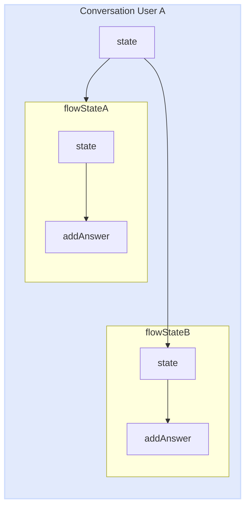
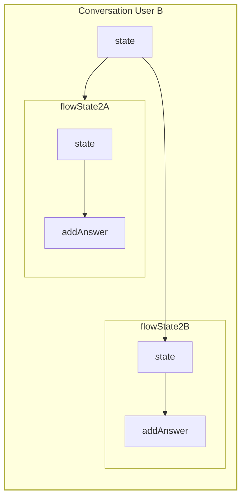
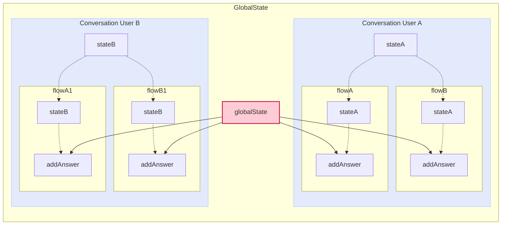
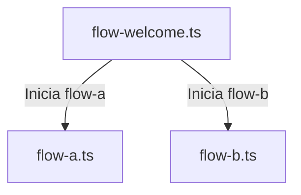

import { Contributors } from '@/components/Contributors'

export const description =
'Neste guia, falaremos sobre o que acontece quando algo dá errado enquanto você trabalha com a API.'

# Métodos

## Estado

Em muitas ocasiões, você precisará compartilhar dados entre fluxos e não importa se você modularizou seu projeto em arquivos diferentes, você pode usar o estado na função de retorno de chamada para poder acessar o estado individual de cada usuário.

Vamos imaginar o caso em que você tem dois fluxos.
Fluxo A: responsável pela coleta de dados do Usuário.
Fluxo B: responsável por gerar um registro no banco de dados.
mas ambos os fluxos são Arquivos independentes

__Lembre-se__ que o estado é independente por conversa entre Usuário e bot.

<CodeGroup>
```ts {{ title:' app.ts'}}
import { createFlow, MemoryDB, createProvider } from '@bot-whatsapp/bot';
// ...
import flowA from'./ flows/flow-a'
import flowB from'./ flows/flow-b'

const main = async () => {

const adapterDB = new MemoryDB()
const adapterFlow = createFlow([flowA, flowB])
const adapterProvider = createProvider(BaileysProvider)

adapterProvider.initHttpServer (3000)

await createBot ({
flow: adapterFlow,
fornecedor: adapterProvider,
banco de dados: adapterDB,
})
}
```
```ts {{ title: 'flow-A. ts'}}
import { addKeyword, addAction } from '@bot-whatsapp/bot';

const flowA = addKeyword('register')
.addAnswer('qual o seu nome?', {capture: true }, async (ctx, { state }) => {
const responseName = ctx.corpo
await state.update ({ name: responseName })
})
.addAnswer('Qual é o seu e-mail?', {capture: true }, async (ctx, { state }) => {
const responseEmail = ctx.corpo
await state.update({ email: responseEmail })
})

export default flowA
```
```ts {{ title: 'flow-B. ts'}}
import { addKeyword } from '@bot-whatsapp/bot';

const flowB = addKeyword('resume')
.addAnswer('ok seu nome é...', null, async ( _ , { state, flowDynamic}) => {
const name = estado.get ('nome')
await flowDynamic (nome)
})
.addAnswer('ok seu e-mail está...', null, async ( _ , { state, flowDynamic}) => {
const email = estado.get ('email')
await flowDynamic(email)
})
.addAnswer('ok seu resumo é..', null, async ( _ , { state, flowDynamic}) => {
const allState = estado.getMyState()
await flowDynamic ('nome:${allState.name}, Email: ${allState.e-mail}')
})


export default flowB
```
</CodeGroup>

Cada histórico de conversas com o Usuário é totalmente independente, desta forma evitamos misturar conversas.


<RowCenter>





</RowCenter>


<Warning>
É importante entender que o estado é volátil, não permeia em lugar nenhum. Se você está preocupado com o nível de desempenho, pode ver [here](https://github.com/codigoencasa/bot-whatsapp/blob/d8eb94cae36fb233f5283c8d44c6c0307d26a978/packages/bot/src/context/stateClass.ts#L7), mas vou te poupar tempo dizendo que é um [mapa](https://developer.mozilla.org/en-US/docs/Web/JavaScript/Reference/Global_Objects/Map)
</Warning>

---

## GlobalState

Muito semelhante a [state](/methods#state) existe outro método chamado GlobalState para compartilhar um estado global do bot entre diferentes fluxos. O principal uso desse método é compartilhar dados que podem mudar e que toda conversa entre bot e usuário pode acessar.

Abaixo você pode ver um exemplo prático em que usamos o globalState para usá-lo como um switch para permitir ou não que o bot responda, Não importa quem escreva para ele.

<CodeGroup>
```ts {{ title:' app.ts'}}
import { createFlow, MemoryDB, createProvider } from '@bot-whatsapp/bot';
// ...
fluxo de importaçãobem-vindo de'./ flows/flow-welcome'
import flowOnOff from'./ flows/flow-on-off'

const main = async () => {

const adapterDB = new MemoryDB()
const adapterFlow = createFlow([flowWelcome, flowOnOff])
const adapterProvider = createProvider(BaileysProvider)

adapterProvider.initHttpServer (3000)

await createBot ({
flow: adapterFlow,
fornecedor: adapterProvider,
banco de dados: adapterDB,
})
}
```
```ts {{ title:' flow-on-off.ts'}}
import { addKeyword, addAction } from '@bot-whatsapp/bot';

const flowOnOff = addKeyword('turnOffBot')
.addAction(async (ctx, { globalState, flowDynamic, endFlow}) => {
const offOrOn = !globalState.get<boolean>('enable')
await globalState.update ({ enable: offOrOn })

if (!offOrOn) {
return endFlow ('Bot is: OFF')
}
await flowDynamic ('Bot is: ON')
})
.addAnswer('message...')

export default flowOnOff

```
```ts {{ title:' flow-welcome.ts'}}
import { addKeyword } from '@bot-whatsapp/bot';

const flowWelcome = addKeyword('oi')
.addAction(async ( _ , { globalState, endFlow }) => {
const offOrOn = !globalState.get<boolean>('enable')
if (!offOrOn) return endFlow()
})
.addAnswer('Welcome to...')

export default flowWelcome

```
</CodeGroup>




---

## State/GlobalState Options {{ not: 'true'}}

Ambos os métodos, como state e global estate, contêm opções e funcinalides semelhantes, que dependendo do caso de uso podem ser muito úteis.

## Clear {{ not: 'true'}}

<Row>
<Col>
Este método permite que o estado seja limpo globalmente ou de forma independente. Tecnicamente limpa o mapa.

Disponível em: __state__, __globalState__
</Col>
<Col sticky>
<CodeGroup>
```ts
.addAnswer('..', null, async ( _ , { state }) => {
state.clear()
})
.addAction(async ( _ , { globalState }) => {
globalState.clear()
})
```
</CodeGroup>

</Col>
</Row>

## Update {{ not: 'true'}}

<Row>
<Col>
Para adicionar ou atualizar um valor no estado temos disponível o método update. Este método recebe um objeto que se o valor não existir o cria e retorna um novo objeto com todos os valores.
É importante entender que é uma promessa evitar comportamentos raros adicionando o ' await'

Disponível em: __state__, __globalState__
</Col>
<Col sticky>
<CodeGroup>
```ts
.addAnswer('..', null, async ( _ , { state }) => {
await state.update ({nome: 'Joe', Idade: '33'})
await state. update({email:'test@test.com'})
})
.addAction(async ( _ , { globalState }) => {
await globalState.update ({nome: 'Joe', Idade: '33'})
await globalState. update({email:'test@test.com'})
})
```
</CodeGroup>

</Col>
</Row>


## Get {{ not: 'true'}}

<Row>
<Col>
Quando precisamos recuperar os valores do Estado podemos fazer isso individualmente chamando pelo nome da propriedade da seguinte forma.

Disponível em: __state__, __globalState__
</Col>
<Col sticky>
<CodeGroup>
```ts
.addAnswer('..', null, async ( _ , { state }) => {
state.get ('propertyName')
})
.addAction(async ( _ , { globalState }) => {
globalState.get ('propertyName')
})
```
</CodeGroup>

</Col>
</Row>

## GetMyState {{ not: 'true'}}

<Row>
<Col>
Outra maneira de recuperar todo o objeto state pertencente a uma conversa independente do Usuário é usando getMyState

Disponível em: __estado__
</Col>
<Col sticky>
<CodeGroup>
```ts
.addAnswer('..', null, async ( _ , { state }) => {
state.getMyState()
})
```
</CodeGroup>
</Col>
</Row>

## GetAllState {{ not: 'true'}}

<Row>
<Col>
Quando estamos trabalhando com o globalState e queremos recuperar todas as propriedades objeto com seus respectivos valores você pode usar getAllState

Disponível em: __globalState__
</Col>
<Col sticky>
<CodeGroup>
```ts
.addAnswer('..', null, async ( _ , { globalState }) => {
globalState.getAllState()
})
```
</CodeGroup>
</Col>
</Row>

---

## FlowDynamic

Muitas vezes você precisará enviar mensagens vindas de uma chamada de API ou dados dinâmicos da base de dados ou de processos. Neste caso você deve usar 'flowDynamic'.

<CodeGroup>
```ts {{ title:' flow-standalone.ts'}}
import { addKeyword } from '@bot-whatsapp/bot';

const flowStandAlone = addKeyword('register')
.addAnswer('qual o seu nome?', { capture: true }, async (ctx, { flowDynamic }) => {
const responseName = ctx.corpo
//.... db.insert ({name:responseName})
await flowDynamic ('obrigado pelo registro ${responseName}')
})

export default flowStandAlone
```
```ts {{ title:' flow-multiline.ts'}}
import { addKeyword } from '@bot-whatsapp/bot';

const flowStandAlone = addKeyword('register')
.addAnswer('Olá!', null, async (ctx, { flowDynamic }) => {
await flowDynamic(
[
'Como você está?',
'Estou bem'
]
)
})

export default flowStandAlone
```
```ts {{ title:' flow-list.ts'}}
import { addKeyword } from '@bot-whatsapp/bot';

const flowProducts = addKeyword('produtos')
.addAction( async ( _ , { flowDynamic }) => {
const dataAPI = await fetch('http://your-api.example.com/products')
const data = await dataAPI.json () as {nome: string, foto:string}[]
const parseDataToFlow = data.map (item => ({body: 'Item: ${item.name}', media: item.foto}))
await flowDynamic(parseDataToFlow)
})

export default flowProducts
```

</CodeGroup>

<Error>
Não é recomendado enviar muitas mensagens seguidas porque o [provider] (/concepts#provider) pode determinar que é spam.
</Error>

Se você deseja enviar uma lista de produtos é recomendável enviar alguns produtos entre 4 a 8 e você pode perguntar ao usuário qual categoria de produtos e outros detalhes filtrar e poder responder com a lista de produtos ideal.

---

## Flowdynamic Options {{ not: 'true'}}

<Row>
<Col>

<Properties>
<Property name=" body " type="string">
Você pode enviar uma mensagem dentro de um objeto usando a propriedade body. É ideal quando você precisa enviar uma mensagem além da mensagem para enviar uma mídia ou para colocar um atraso.
</Property>
<Property name= "delay" type="number">
Este é o número de milissegundos que decorrerão antes que a mensagem seja enviada.
</Property>
<Property name=" media " type="string">
A url ou caminho local do arquivo a ser enviado, deve ser uma string de texto e se for uma URL deve ser pública.
</Property>
</Properties>


</Col>
<Col sticky>

<CodeGroup>
```ts
const flow = addKeyword('register')
.addAction(async ( _ , { flowDynamic }) => {

await flowDynamic([{ body: 'Thanks ${responseName}'}])

await flowDynamic ([{
body: 'mensagem com atraso de 2 segundos`,
atraso: 2000
}])

await flowDynamic ([{
corpo: 'olha isso`,
mídia: `https://i.imgur.com/0HpzsEm.png`
}])

await flowDynamic ([{
corpo: 'olha isso`,
mídia: join('assets','file.pdf')
}])

})
```

</CodeGroup>

</Col>
</Row>

---

## FallBack

A função fallBack () é um recurso fundamental dentro do fluxo de interação de um bot, usado para lidar com respostas inválidas ou inesperadas do Usuário. Quando um usuário fornece uma mensagem que não corresponde a nenhuma palavra-chave ou resposta esperada, o bot pode invocar a função fallBack() para repetir a última mensagem e aguardar uma resposta válida.

Para integrar a função fallBack () ao fluxo de interação do bot, ela é usada dentro do método [addAnswer()] (/add-functions#add-answer) ou [addAction ()] (/add-functions#add-action). Dentro desse método, é definida uma condição que verifica se a resposta do Usuário é válida ou não. Caso a resposta não atenda aos critérios esperados, fallBack() é chamado para repetir a última mensagem e solicitar uma resposta válida. Por exemplo:

<CodeGroup>

```ts {{ title: 'flow-validate-email-custom-error.ts'}}
import { addKeyword } from '@bot-whatsapp/bot';

const flowEmailRegister = addKeyword('Olá')
.addAnswer('Qual é o seu e-mail?', {capture: true}, (ctx, {fallBack }) => {
if (!ctx.corpo.includes ('@')) {
return fallBack ('Ups! não é um email válido');
} else {
// db.insert ({email:ctx.body})
}
});
```
```ts {{ title:' flow-validate-email-default-error.ts'}}
import { addKeyword } from '@bot-whatsapp/bot';

const flowEmailRegister = addKeyword('Olá')
.addAnswer('Qual é o seu e-mail?', {capture: true}, (ctx, {fallBack }) => {
if (!ctx.corpo.includes ('@')) {
return fallBack ();// repita a última pergunta Qual é o seu email?
} else {
// db.insert ({email:ctx.body})
}
});
```

</CodeGroup>

---
## EndFlow

A função endFlow é usada em aplicativos de bate-papo ou interfaces de usuário conversacionais para encerrar um fluxo de interação com o usuário. Imagine um cenário em que você está coletando informações de um usuário em várias etapas, como seu nome, endereço de E-mail e número de telefone, e a cada etapa o usuário tem a opção de cancelar a operação atual.

Usando o endFlow, você pode fornecer ao usuário uma maneira fácil de cancelar a transação a qualquer momento. Por exemplo, você pode apresentar um botão ou comando que o usuário pode ativar para indicar que deseja interromper o processo atual. Depois que o endFlow é acionado, o fluxo de interação é encerrado e uma mensagem final pode ser exibida para o usuário, informando que a solicitação foi cancelada.

Em resumo, o endFlow melhora a experiência do usuário, fornecendo uma saída clara e fácil de usar, caso ele decida abandonar o processo em qualquer estágio do fluxo de interação. Isso ajuda a garantir uma experiência de usuário mais tranquila e satisfatória em aplicativos conversacionais.


```ts {{ title: 'flow-validate-email-custom-error.ts'}}
const flowRegister = addKeyword(['Hi'])
.addAnswer(
['Olá!', 'Para enviar o formulário preciso de alguns dados...', 'Escreva seu * nome*'],
{ capture: true },

async (ctx, { flowDynamic, endFlow, state}) => {
if (ctx.body === 'cancel') {
return endFlow ('sua solicitação foi cancelada');
}
await state.update ({nome: ctx.body})
return flowDynamic ('prazer em conhecê-lo *${ctx.body}*, vamos continuar...');
}
)
.addAnswer(
['Eu também preciso dos seus sobrenomes'],
{ capture: true },

async (ctx, { flowDynamic, endFlow, state}) => {
if (ctx.body === 'cancel') {
return endFlow();
}
await state.update ({sobrenome: ctx.body})
return flowDynamic ('Perfect *${ctx.body}*, finalmente...');
}
)
```


---

## GotoFlow

A função` gotoFlow ' permite a transição suave entre diferentes fluxos de interação em um aplicativo conversacional. Esse método é útil quando você precisa separar a lógica de interação em diferentes fluxos e direcionar o usuário de um fluxo para outro de acordo com determinadas condições ou eventos.

Por exemplo, suponha que em uma aplicação de assistente virtual você tenha um fluxo para usuários cadastrados e outro para usuários não cadastrados. Com o 'gotoFlow', é possível direcionar um usuário recém-registrado do fluxo de usuário não registrado para o fluxo de usuário registrado, ou vice-versa, proporcionando uma experiência personalizada e consistente para cada tipo de usuário.

No código fornecido, é mostrado como usar o 'gotoFlow' para direcionar o usuário ao fluxo correspondente de acordo com seu status de cadastro. Isso ajuda a modularizar a lógica do aplicativo e facilita o gerenciamento de vários fluxos de conversa.

<CodeGroup>

```ts {{ title:' flow-welcome.ts'}}
import { addKeyword, EVENTS } from '@bot-whatsapp/bot';

const flowWelcome = addKeyword('oi')
.addAnswer('Bem-vindo!', null, async (ctx, { gotoFlow }) => {
// db.get(...)
const userRegistered = true;

if (userRegistered) return gotoFlow(flowRegistered);

return gotoFlow(flowUserNotRegistered);
});
export default flowWelcome
```
```ts {{ title: 'flow-A. ts'}}
import { addKeyword, EVENTS } from '@bot-whatsapp/bot';

const flowA = addKeyword(eventos.Ação)
.addAction(async ( _ , { flowDynamic }) => {
const mockUser = "Leifer";
await flowDynamic ('Hello ${mockUser}! Bem-vindo de volta.');
});
export default flowA
```
```ts {{ title: 'flow-B. ts'}}
import { addKeyword, EVENTS } from '@bot-whatsapp/bot';

const flowB = addKeyword(eventos.Ação)
.addAnswer('é sua primeira vez aqui! Qual é o seu endereço de E-mail?',
{ capture: true }, async ( _ , { flowDynamic, gotoFlow }) => {
await flowDynamic ('beneath registramos você! Bem-vindo ao');
return gotoFlow(flowRegistered);
});
export default flowB
```
```ts {{ title:' app.ts'}}
import { createFlow, MemoryDB, createProvider } from '@bot-whatsapp/bot';
// ...
fluxo de importaçãobem-vindo de'./ flows/flow-welcome'
import flowA from'./ flows/flow-a'
import flowB from'./ flows/flow-b'

const main = async () => {

const adapterDB = new MemoryDB()
const adapterFlow = createFlow([flowWelcome, flowA, flowB])
const adapterProvider = createProvider(BaileysProvider)

adapterProvider.initHttpServer (3000)

await createBot ({
flow: adapterFlow,
fornecedor: adapterProvider,
banco de dados: adapterDB,
})
}
```
</CodeGroup>

<Error>
É importante observar que a implementação do gotoFlow deve ter um retorno antes
</Error>



---

## Lista negra

Muitas vezes precisaremos adicionar ou gerenciar uma lista de nuemers que não Queremos interagir com nosso bot. Para eles existe uma lista negra que contém uma série de métodos para adicionar, remover e revisar números.
Imagine um caso em que você queira falar com um contato sem a intervenção do bot. Você poderia usar este mecanismo

<CodeGroup>

```ts {{ title:' http-mute.ts'}}
const flowMain = addKeyword<BaileysProvider>(eventos.Bem-vindo)
.addAction(async ( _ , { flowDynamic}) => {
await flowDynamic ('Hola buenas!!')
})

await createBot ({
banco de dados: new MemoryDB(),
flow: createFlow ([flowMain]),
provedor: createProvider(BaileysProvider),
})

adapterProvider.initHttpServer(3001)
adapterProvider.http.servidor.post ('/mute-number', handleCtx(async (bot, req, res) => {
await bot.blacklist.add ('340000000')// adicionado à lista negra
res.end('ok número silenciado')
}))
```
```ts {{ title:' flow-mute.ts'}}
import { addKeyword } from '@bot-whatsapp/bot';

const flowMute = addKeyword('oi')
.addAction (async (ctx, { flowDynamic, blacklist }) => {
// const dataFromDb = db.findOne ({de:ctx.from}) simualte DB query
const dataFromDb = {muted:true}
if (dataFromDb.mudo) {
blacklist.add(ctx.de)
await flowDynamic('${ctx.from}! adicionado à lista negra');
} else {
blacklist.remover (ctx.de)
await flowDynamic('${ctx.from}! removido da lista negra');
}

});
export default flowMute
```
```ts {{ title:' flow-check-if.ts'}}
import { addKeyword } from '@bot-whatsapp/bot';

const flowCheckIf = addKeyword('oi')
.addAction(async (ctx, { flowDynamic, blacklist}) => {
const dataCheck = blacklist.checkIf(ctx.de)
await flowDynamic('Muted: ${dataCheck}');

});
export default flowCheckIf
```
</CodeGroup>

---

<Contributors users={['leifermendez']}/>