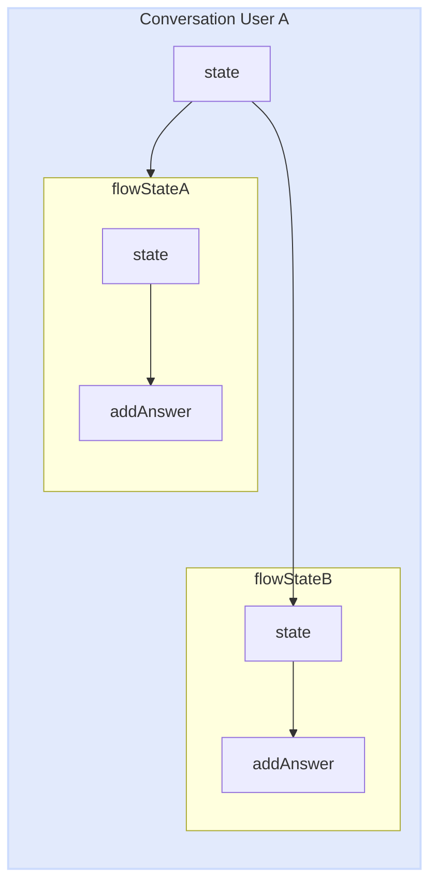
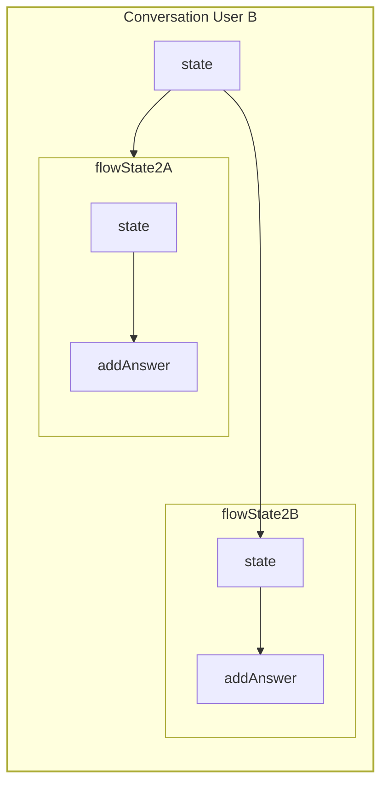
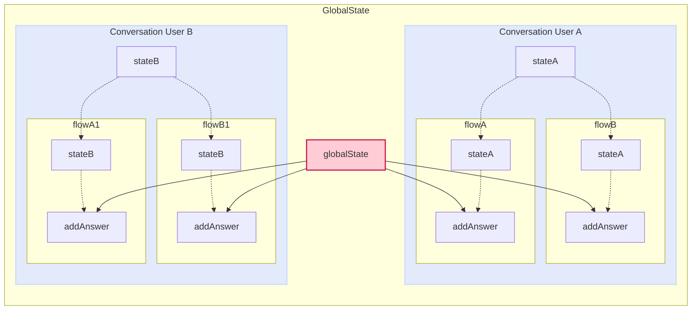
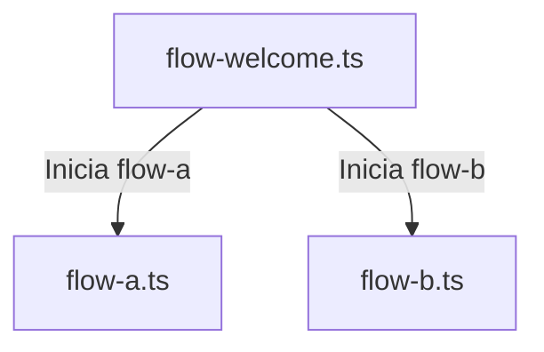

import { Contributors } from '@/components/Contributors'
import { Resources } from '@/components/Resources'
import { Guides } from '@/components/Guides'

export const description =
  'In this guide, we will talk about what happens when something goes wrong while you work with the API.'

# Methods

## State

Em muitas ocasiões, você precisará compartilhar dados entre fluxos e não importa se modularizou seu projeto em arquivos diferentes, você pode usar o estado na função de retorno de chamada para poder acessar o estado individual de cada usuário.

Vamos imaginar o caso em que você tem dois fluxos.
Fluxo A: responsável pela recolha de dados do utilizador.
Fluxo B: responsável por gerar um registo na base de dados.
mas ambos os fluxos são ficheiros independentes

__ Lembre-se__ que o estado é independente por conversa entre o Usuário e o bot.

<CodeGroup>
```ts {{ title: 'app.ts' }}
  import { createFlow, MemoryDB, createProvider } from '@bot-whatsapp/bot';
  // ...
  import flowA from './flows/flow-a'
  import flowB from './flows/flow-b'

  const main = async () => {

      const adapterDB = new MemoryDB()
      const adapterFlow = createFlow([flowA, flowB])
      const adapterProvider = createProvider(BaileysProvider)

      adapterProvider.initHttpServer(3000)

      await createBot({
          flow: adapterFlow,
          provider: adapterProvider,
          database: adapterDB,
      })
  }
```
```ts {{ title: 'flow-a.ts' }}
  import { addKeyword, addAction } from '@bot-whatsapp/bot';

  const flowA = addKeyword('register')
    .addAnswer('What is your name?', { capture: true }, async (ctx, { state }) => {
      const responseName = ctx.body
      await state.update({ name: responseName })
    })
    .addAnswer('What is your email?', { capture: true }, async (ctx, { state }) => {
      const responseEmail = ctx.body
      await state.update({ email: responseEmail })
    })

  export default flowA
```
```ts {{ title: 'flow-b.ts' }}
  import { addKeyword } from '@bot-whatsapp/bot';

  const flowB = addKeyword('resume')
    .addAnswer('ok your name is...', null, async (_, { state, flowDynamic }) => {
      const name = state.get('name')
      await flowDynamic(name)
    })
    .addAnswer('ok your email is...', null, async (_, { state, flowDynamic }) => {
      const email = state.get('email')
      await flowDynamic(email)
    })
    .addAnswer('ok your summary is..', null, async (_, { state, flowDynamic }) => {
      const allState = state.getMyState()
      await flowDynamic(`Name:${allState.name}, Email: ${allState.email}`)
    })


  export default flowB
```
</CodeGroup>

Cada histórico de conversas com o utilizador é totalmente independente, desta forma evitamos misturar conversas.

  





<Warning>
É importante entender que o estado é volátil, não permeia em lugar nenhum. Se você está preocupado com o nível de desempenho, pode vê-lo [here](https://github.com/codigoencasa/bot-whatsapp/blob/d8eb94cae36fb233f5283c8d44c6c0307d26a978/packages/bot/src/context/stateClass.ts#L7), but I'll save you time by telling you that it is a [Map](https://developer.mozilla.org/en-US/docs/Web/JavaScript/Reference/Global_Objects/Map)
</Warning>

---

## GlobalState

Muito semelhante ao [state](/methods#state) existe outro método chamado estado Global para compartilhar um estado global do bot entre diferentes fluxos. O principal uso desse método é compartilhar dados que podem mudar e que todas as conversas entre o bot e o usuário podem acessar.

Abaixo, você pode ver um exemplo prático em que usamos o globalState para usá-lo como um switch para permitir ou não que o bot responda, independentemente de quem escreve nele.

<CodeGroup>
```ts {{ title: 'app.ts' }}
  import { createFlow, MemoryDB, createProvider } from '@bot-whatsapp/bot';
  // ...
  import flowWelcome from './flows/flow-welcome'
  import flowOnOff from './flows/flow-on-off'

  const main = async () => {

      const adapterDB = new MemoryDB()
      const adapterFlow = createFlow([flowWelcome, flowOnOff])
      const adapterProvider = createProvider(BaileysProvider)

      adapterProvider.initHttpServer(3000)

      await createBot({
          flow: adapterFlow,
          provider: adapterProvider,
          database: adapterDB,
      })
  }
```
```ts {{ title: 'flow-on-off.ts' }}
  import { addKeyword, addAction } from '@bot-whatsapp/bot';

  const flowOnOff = addKeyword('turnOffBot')
    .addAction(async (ctx, { globalState, flowDynamic, endFlow }) => {
      const offOrOn = !globalState.get<boolean>('enable')
      await globalState.update({ enable: offOrOn })

      if(!offOrOn){
        return endFlow(`Bot is: OFF`)
      }
      await flowDynamic(`Bot is: ON`)
    })
    .addAnswer('message...')

  export default flowOnOff

```
```ts {{ title: 'flow-welcome.ts' }}
  import { addKeyword } from '@bot-whatsapp/bot';

  const flowWelcome = addKeyword('hi')
    .addAction(async (_, { globalState, endFlow }) => {
      const offOrOn = !globalState.get<boolean>('enable')
      if(!offOrOn) return endFlow()
    })
    .addAnswer('Welcome to...')

  export default flowWelcome

```
</CodeGroup>




---

## State/GlobalState Options {{ not:'true' }}

Ambos os métodos, como estado e estado global, contêm opções e funcionalidades semelhantes, que, dependendo do caso de uso, podem ser muito úteis.

## Clear {{ not:'true' }}

<Row>
  <Col>
Este método permite que o estado seja limpo globalmente ou de forma independente. Tecnicamente, limpa o mapa.

Disponível em: __state__, __globalState__
  </Col>
  <Col sticky>
    <CodeGroup>
    ```ts
    .addAnswer('..', null, async (_, { state }) => {
      state.clear()
    })
    .addAction(async (_, { globalState }) => {
      globalState.clear()
    })
    ```
    </CodeGroup>

  </Col>
</Row>

## Update {{ not:'true' }}

<Row>
  <Col>
Para adicionar ou atualizar um valor no estado, temos disponível o método update. Este método recebe um objeto que, se o valor não existir, o cria e retorna um novo objeto com todos os valores.
É importante entender que é uma promessa evitar comportamentos raros adicionando o `await`

Disponível em: __state__, __globalState__
  </Col>
  <Col sticky>
    <CodeGroup>
    ```ts
    .addAnswer('..', null, async (_, { state }) => {
      await state.update({name:'Joe', age:'33'})
      await state.update({email:'test@test.com'})
    })
    .addAction(async (_, { globalState }) => {
      await globalState.update({name:'Joe', age:'33'})
      await globalState.update({email:'test@test.com'})
    })
    ```
    </CodeGroup>

  </Col>
</Row>


## Get {{ not:'true' }}

<Row>
  <Col>
Quando precisamos recuperar os valores de Estado, podemos fazê-lo individualmente chamando pelo nome da propriedade da seguinte forma.

Disponível em: __state__, __globalState__
  </Col>
  <Col sticky>
    <CodeGroup>
    ```ts
    .addAnswer('..', null, async (_, { state }) => {
      state.get('propertyName')
    })
    .addAction(async (_, { globalState }) => {
      globalState.get('propertyName')
    })
    ```
    </CodeGroup>

  </Col>
</Row>

## GetMyState {{ not:'true' }}

<Row>
  <Col>
Outra maneira de recuperar todo o objeto de estado pertencente a uma conversa independente do Usuário é usando getMyState

Disponível em: __state__
  </Col>
  <Col sticky>
    <CodeGroup>
    ```ts
    .addAnswer('..', null, async (_, { state }) => {
      state.getMyState()
    })
    ```
    </CodeGroup>
  </Col>
</Row>

## GetAllState {{ not:'true' }}

<Row>
  <Col>
Quando estamos trabalhando com o estado global e queremos recuperar todos os objetos properties com seus respectivos valores, você pode usar getAllState

Disponível em: __globalState__
  </Col>
  <Col sticky>
    <CodeGroup>
    ```ts
    .addAnswer('..', null, async (_, { globalState }) => {
      globalState.getAllState()
    })
    ```
    </CodeGroup>
  </Col>
</Row>

---

## FlowDynamic

Muitas vezes, você precisará enviar mensagens provenientes de uma chamada de API ou dados dinâmicos do banco de dados ou de processos. Neste caso, deve utilizar `flowDynamic`.

<CodeGroup>
```ts {{ title: 'flow-standalone.ts' }}
  import { addKeyword } from '@bot-whatsapp/bot';

  const flowStandAlone = addKeyword('register')
    .addAnswer('What is your name?', { capture: true }, async (ctx, { flowDynamic }) => {
      const responseName = ctx.body
      //.... db.insert({name:responseName})
      await flowDynamic(`Thanks for register ${responseName}`)
    })

  export default flowStandAlone
```
```ts {{ title: 'flow-multiline.ts' }}
  import { addKeyword } from '@bot-whatsapp/bot';

  const flowStandAlone = addKeyword('register')
    .addAnswer('Hello!', null, async (ctx, { flowDynamic }) => {
      await flowDynamic(
        [
          `How are you?`,
          `I'm fine`
        ]
      )
    })

  export default flowStandAlone
```
```ts {{ title: 'flow-list.ts' }}
  import { addKeyword } from '@bot-whatsapp/bot';

  const flowProducts = addKeyword('products')
    .addAction( async (_, { flowDynamic }) => {
      const dataAPI = await fetch('http://your-api.example.com/products')
      const data = await dataAPI.json() as {name:string, photo:string}[]
      const parseDataToFlow = data.map(item => ({body:`Item: ${item.name}`, media:item.photo}))
      await flowDynamic(parseDataToFlow)
    })

  export default flowProducts
```

</CodeGroup>

<Error>
Não é recomendado enviar muitas mensagens seguidas porque o [provider](/concepts#provider) may determine that it is spam. 
</Error>

Se você deseja enviar uma lista de produtos, recomenda-se enviar alguns produtos entre 4 e 8 e você pode perguntar ao usuário qual categoria de produtos e outros detalhes filtrar e ser capaz de responder com a lista de produtos ideal.

---

## FlowDynamic Options {{ not: 'true' }}

<Row>
  <Col>

    <Properties>
      <Property name="body" type="string">
Você pode enviar uma mensagem dentro de um objeto usando a propriedade body. É ideal quando você precisa enviar uma mensagem para além da mensagem para enviar uma mídia ou para colocar um atraso.
      </Property>
      <Property name="delay" type="number">
Este é o número de milissegundos que decorrerão antes de a mensagem ser enviada.
      
      </Property>
      <Property name="media" type="string">
O url ou caminho local do ficheiro a enviar deve ser uma cadeia de texto e, se for um URL, deve ser público.
      
      </Property>
    </Properties>


  </Col>
  <Col sticky>

    <CodeGroup>
    ```ts
const flow = addKeyword('register')
    .addAction(async (_, { flowDynamic }) => {

      await flowDynamic([{ body: `Thanks  ${responseName}` }])

      await flowDynamic([{ 
        body: `message with 2 seconds delay`,
        delay: 2000 
       }])

      await flowDynamic([{ 
        body: `Look at this`,
        media: `https://i.imgur.com/0HpzsEm.png` 
      }])

      await flowDynamic([{ 
        body: `Look at this`,
        media: join('assets','file.pdf') 
      }])

    })
    ```

    </CodeGroup>

  </Col>
</Row>

---

## FallBack

A função fallBack() é um recurso fundamental dentro do fluxo de interação de um bot, usado para lidar com respostas inválidas ou inesperadas do Usuário. Quando um usuário fornece uma mensagem que não corresponde a nenhuma palavra-chave ou resposta esperada, o bot pode invocar a função fallBack() para repetir a última mensagem e aguardar uma resposta válida.

Para integrar a função fallBack() no fluxo de interação do bot, ela é usada dentro do [addAnswer()](/add-functions#add-answer) or [addAction()](/add-functions#add-action) método. Nesse método, é definida uma condição que verifica se a resposta do Usuário é válida ou não. Caso a resposta não atenda aos critérios esperados, fallBack() é chamado para repetir a última mensagem e solicitar uma resposta válida. Por exemplo:

<CodeGroup>

```ts {{ title: 'flow-validate-email-custom-error.ts' }}
import { addKeyword } from '@bot-whatsapp/bot';

const flowEmailRegister = addKeyword('hello')
  .addAnswer('What is your email?', {capture:true}, (ctx, { fallBack }) => {
    if (!ctx.body.includes('@')) {
      return fallBack(`Ups! is not a valid email`);
    } else {
      // db.insert({email:ctx.body})
    }
  });
```
```ts {{ title: 'flow-validate-email-default-error.ts' }}
import { addKeyword } from '@bot-whatsapp/bot';

const flowEmailRegister = addKeyword('hello')
  .addAnswer('What is your email?', {capture:true}, (ctx, { fallBack }) => {
    if (!ctx.body.includes('@')) {
      return fallBack(); //repeat the last question What is your email?
    } else {
      // db.insert({email:ctx.body})
    }
  });
```

</CodeGroup>

---

## EndFlow

A função endFlow é usada em aplicativos de bate-papo ou interfaces de usuário conversacionais para encerrar um fluxo de interação com o usuário. Imagine um cenário em que você está coletando informações de um usuário em várias etapas, como nome, endereço de E-mail e número de telefone, e em cada etapa o usuário tem a opção de cancelar a operação atual.

Ao usar o endFlow, você pode fornecer ao usuário uma maneira fácil de cancelar a transação a qualquer momento. Por exemplo, você pode apresentar um botão ou comando que o usuário pode ativar para indicar que deseja interromper o processo atual. Uma vez que o endFlow é acionado, o fluxo de interação é encerrado e uma mensagem final pode ser exibida ao usuário, informando-o de que a solicitação foi cancelada.

Em resumo, o endFlow melhora a experiência do utilizador, proporcionando uma saída clara e fácil de utilizar, caso este decida abandonar o processo em qualquer fase do fluxo de interacção. Isso ajuda a garantir uma experiência de usuário mais suave e satisfatória em aplicativos de conversação.

```ts {{ title: 'flow-validate-email-custom-error.ts' }}
const flowRegister = addKeyword(['Hi'])
  .addAnswer(
    ['Hello!', 'To submit the form I need some data...', 'Write your *Name*'],
    { capture: true },

    async (ctx, { flowDynamic, endFlow, state }) => {
      if (ctx.body === 'cancel') {
        return endFlow(`Your request has been canceled`);
      }
      await state.update({name:ctx.body})
      return flowDynamic(`Nice to meet you *${ctx.body}*, let's continue...`);
    }
  )
  .addAnswer(
    ['I also need your last names'],
    { capture: true },

    async (ctx, { flowDynamic, endFlow, state }) => {
      if (ctx.body === 'cancel') {
        return endFlow();
      }
      await state.update({lastName:ctx.body})
      return flowDynamic(`Perfect *${ctx.body}*, finally...`);
    }
  )
```


---

## GotoFlow

A função `gotoFlow` permite a transição suave entre diferentes fluxos de interação em uma aplicação conversacional. Esse método é útil quando você precisa separar a lógica de interação em fluxos diferentes e direcionar o usuário de um fluxo para outro de acordo com certas condições ou eventos.

Por exemplo, suponha que, em um aplicativo de assistente virtual, você tenha um fluxo para usuários registrados e outro para usuários não registrados. Com o `gotoFlow`, é possível direcionar um usuário recém-registrado do fluxo de usuário não registrado para o fluxo de usuário registrado, ou vice-versa, proporcionando uma experiência personalizada e consistente para cada tipo de usuário.

No código fornecido, é mostrado como usar `gotoFlow` para direcionar o Usuário para o fluxo correspondente de acordo com seu status de registro. Isto ajuda a modularizar a lógica da aplicação e facilita a gestão de múltiplos fluxos de conversação.

<CodeGroup>

```ts {{ title: 'flow-welcome.ts' }}
  import { addKeyword, EVENTS } from '@bot-whatsapp/bot';

  const flowWelcome = addKeyword('hi')
    .addAnswer('Welcome!', null, async (ctx, { gotoFlow }) => {
        // db.get(...)
        const userRegistered = true;

        if (userRegistered) return gotoFlow(flowRegistered);

        return gotoFlow(flowUserNotRegistered);
    });
  export default flowWelcome
```
```ts {{ title: 'flow-a.ts' }}
  import { addKeyword, EVENTS } from '@bot-whatsapp/bot';

  const flowA = addKeyword(EVENTS.ACTION)
      .addAction(async (_, { flowDynamic }) => {
          const mockUser = "Leifer";
          await flowDynamic(`Hello ${mockUser}! Welcome back.`);
      });
  export default flowA
```
```ts {{ title: 'flow-b.ts' }}
  import { addKeyword, EVENTS } from '@bot-whatsapp/bot';

  const flowB = addKeyword(EVENTS.ACTION)
    .addAnswer(`It's your first time here! What's your email address?`, 
      { capture: true }, async (_, { flowDynamic, gotoFlow }) => {
        await flowDynamic('¡We have registered you! Welcome to');
        return gotoFlow(flowRegistered);
    });
  export default flowB
```
```ts {{ title: 'app.ts' }}
  import { createFlow, MemoryDB, createProvider } from '@bot-whatsapp/bot';
  // ...
  import flowWelcome from './flows/flow-welcome'
  import flowA from './flows/flow-a'
  import flowB from './flows/flow-b'

  const main = async () => {

      const adapterDB = new MemoryDB()
      const adapterFlow = createFlow([flowWelcome, flowA, flowB])
      const adapterProvider = createProvider(BaileysProvider)

      adapterProvider.initHttpServer(3000)

      await createBot({
          flow: adapterFlow,
          provider: adapterProvider,
          database: adapterDB,
      })
  }
```
</CodeGroup>

<Error>
É importante notar que a implementação do go to Flow deve ter um retorno antes
</Error>



---

## Blacklist

Muitas vezes, precisaremos adicionar ou gerenciar uma lista de números que não Queremos interagir com nosso bot. Para eles, existe uma lista negra que contém uma série de métodos para adicionar, remover e rever números.
Imagine um caso em que você deseja falar com um contato sem a intervenção do bot. Você poderia usar este mecanismo

<CodeGroup>

```ts {{ title: 'http-mute.ts' }}
    const flowMain = addKeyword<BaileysProvider>(EVENTS.WELCOME)
        .addAction(async (_, { flowDynamic}) => {
            await flowDynamic('Hola buenas!!')
        })

    await createBot({
        database: new MemoryDB(),
        flow: createFlow([flowMain]),
        provider: createProvider(BaileysProvider),
    })

    adapterProvider.initHttpServer(3001)
    adapterProvider.http.server.post('/mute-number', handleCtx(async (bot, req, res) => {
        await bot.blacklist.add(`340000000`) // added to blacklist
        res.end('ok number muted')
    }))
```
```ts {{ title: 'flow-mute.ts' }}
  import { addKeyword } from '@bot-whatsapp/bot';

  const flowMute = addKeyword('hi')
      .addAction(async (ctx, { flowDynamic, blacklist }) => {
          // const dataFromDb = db.findOne({from:ctx.from}) simualte db query
          const dataFromDb = {muted:true}
          if(dataFromDb.muted) {
            blacklist.add(ctx.from)
            await flowDynamic(`${ctx.from}! added to blacklist`);
          } else {
            blacklist.remove(ctx.from)
            await flowDynamic(`${ctx.from}! removed from blacklist`);
          }
  
      });
  export default flowMute
```
```ts {{ title: 'flow-check-if.ts' }}
  import { addKeyword } from '@bot-whatsapp/bot';

  const flowCheckIf = addKeyword('hi')
      .addAction(async (ctx, { flowDynamic, blacklist }) => {
          const dataCheck = blacklist.checkIf(ctx.from)
          await flowDynamic(`Muted: ${dataCheck}`);
  
      });
  export default flowCheckIf
```
</CodeGroup>

---

<Guides />

<Resources />

<Contributors users={['leifermendez','lualreye', 'elimeleth']} />
