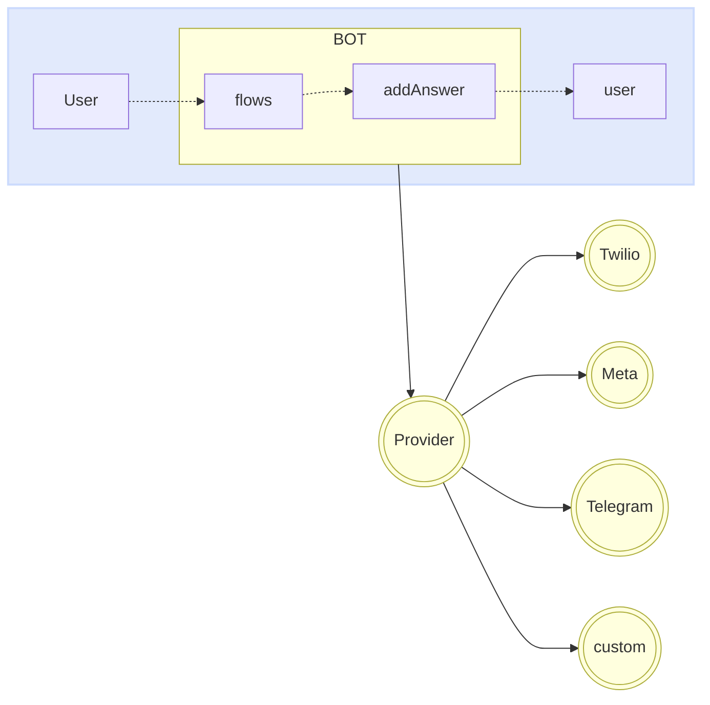

import { Contributors } from '@/components/Contributors'

export const description =
  'In this guide, we will talk about what happens when something goes wrong while you work with the API.'

# Providers

Os provedores são responsáveis por fornecer a ponte de comunicação entre seu bot e __whatsapp__, __telegram__ ou provedor personalizado.

Você pode alterar seu provedor com muita facilidade, sem afetar a lógica do seu bot.
É tão simples quanto implementar o conector do provedor de sua escolha. No momento, temos integrações com mais de quatro fornecedores.

<Warning>
Whatsapp: [Meta](providers#meta), [Twilio](providers#twilio), [Baileys](providers#baileys), [WPPConnect](providers#wpp-connect), [Venom](providers#venom). [Telegram](/plugins/telegram)
</Warning>




Cada provedor pode precisar ajustar chaves de acesso, Configurações, entre outras propriedades que geralmente são passadas como um objeto na função `createProvider`.

<CodeGroup>
```ts {{ title: 'meta-provider.ts' }}
import { createProvider } from "@builderbot/bot";
import { MetaProvider } from '@builderbot/provider-meta';

export type IProvider = typeof MetaProvider
export const adapterProvider = createProvider(MetaProvider, {
    jwtToken: 'jwtToken',
    numberId: 'numberId',
    verifyToken: 'verifyToken',
    version: 'v16.0',
})
```

```ts {{ title: 'twilio-provider.ts' }}
import { createProvider } from "@builderbot/bot";
import { TwilioProvider } from '@builderbot/provider-twilio';

export type IProvider = typeof TwilioProvider
export const adapterProvider = createProvider(TwilioProvider, {
    accountSid: 'YOUR_ACCOUNT_SID',
    authToken: 'YOUR_ACCOUNT_TOKEN',
    vendorNumber: '+14155238886',
    publicUrl: "public_url", //optional
});
```

```ts {{ title: 'baileys-provider.ts' }}
import { createProvider } from "@builderbot/bot";
import { BaileysProvider } from '@builderbot/provider-baileys';

export type IProvider = typeof BaileysProvider
export const adapterProvider = createProvider(BaileysProvider)
```

```ts {{ title: 'venom-provider.ts' }}
import { createProvider } from "@builderbot/bot";
import { VenomProvider } from '@builderbot/provider-venom';

export type IProvider = typeof VenomProvider
export const adapterProvider = createProvider(VenomProvider)
```

```ts {{ title: 'wppconnect-provider.ts' }}
import { createProvider } from "@builderbot/bot";
import { WPPConnectProvider } from '@builderbot/provider-wppconnect';

export type IProvider = typeof WPPConnectProvider
export const adapterProvider = createProvider(WPPConnectProvider)
```

</CodeGroup>

Abaixo encontrará mais informações sobre cada um destes fornecedores.
---

## Meta

The [WhatsApp Business Platform](https://business.whatsapp.com/products/business-platform) permite que as médias e grandes empresas comuniquem com os seus clientes em grande escala. Você pode iniciar conversas com os clientes em apenas alguns minutos, enviar-lhes notificações de atendimento ao cliente ou atualizações de compra, oferecer-lhes um nível de serviço personalizado e fornecer suporte através do canal de sua escolha.

<Warning>
Lembre-se de que os seguintes requisitos devem ser atendidos para implementar o provedor meta na produção. [More information](/providers/meta)
</Warning>

<CodeGroup>
```ts {{ title: 'meta-provider.ts' }}
import { createProvider } from "@builderbot/bot";
import { MetaProvider } from '@builderbot/provider-meta';

export type IProvider = typeof MetaProvider
export const adapterProvider = createProvider(MetaProvider, {
    jwtToken: 'jwtToken',
    numberId: 'numberId',
    verifyToken: 'verifyToken',
    version: 'v16.0',
})
```
```ts {{ title: 'app.ts' }}
import { createBot, createProvider, createFlow, addKeyword, MemoryDB } from '@builderbot/bot'
import { IProvider, adapterProvider } from './meta-provider';

const welcomeFlow = addKeyword<IProvider, MemoryDB>(['hello', 'hi']).addAnswer('Ey! welcome')

const main = async () => {
    await createBot({
        flow: createFlow([welcomeFlow]),
        provider: adapterProvider,
        database: new MemoryDB()
    })
}

main()
```
</CodeGroup>

---

## Twilio

[Twilio](https://www.twilio.com/en-us/messaging/channels/whatsapp) é uma plataforma de desenvolvimento que permite aos desenvolvedores construir aplicações de comunicação em nuvem e sistemas web. As APIs de comunicação da Twilio permitem que as empresas forneçam a experiência de comunicação certa para seus clientes em aplicativos da web e móveis. Ao usar as APIs Twilio, os desenvolvedores podem adicionar rapidamente essa funcionalidade a um aplicativo, como mensagens de voz, chamadas de vídeo, mensagens de texto e muito mais.

<Warning>
Lembre-se de que os seguintes requisitos devem ser atendidos para implementar o provedor meta na produção.[More information](/providers/twilio)
</Warning>

<CodeGroup>
```ts {{ title: 'twilio-provider.ts' }}
import { createProvider } from "@builderbot/bot";
import { TwilioProvider } from '@builderbot/provider-twilio';

export type IProvider = typeof TwilioProvider
export const adapterProvider = createProvider(TwilioProvider, {
    accountSid: 'YOUR_ACCOUNT_SID',
    authToken: 'YOUR_ACCOUNT_TOKEN',
    vendorNumber: '+14155238886',
    publicUrl: "public_url", //optional
});
```
```ts {{ title: 'app.ts' }}
import { createBot, createProvider, createFlow, addKeyword, MemoryDB } from '@builderbot/bot'
import { IProvider, adapterProvider } from './twilio-provider';

const welcomeFlow = addKeyword<IProvider, MemoryDB>(['hello', 'hi']).addAnswer('Ey! welcome')

const main = async () => {
    await createBot({
        flow: createFlow([welcomeFlow]),
        provider: adapterProvider,
        database: new MemoryDB()
    })
}

main()
```
</CodeGroup>

---

## Baileys

[Baileys](https://whiskeysockets.github.io/) é um projeto de código aberto que permite enviar mensagens, receber mensagens e dezenas de outras funcionalidades através da implementação do WebSocket numa versão do whatsapp.
É um projeto com grande trajetória impulsionado por pessoas com grande conhecimento do assunto, você pode aprofundar nesta biblioteca diretamente em sua documentação ou [repository](https://github.com/WhiskeySockets/Baileys).

Como este é um provedor gratuito que emula a interface da web do whatsapp, você deve digitalizar o QR para fazer login.

<Warning>
Lembre-se de que os seguintes requisitos devem ser atendidos para implementar o provedor meta na produção. [More information](/providers/baileys)
</Warning>

<CodeGroup>
```ts {{ title: 'baileys-provider.ts' }}
import { createProvider } from "@builderbot/bot";
import { BaileysProvider } from '@builderbot/provider-baileys';

export type IProvider = typeof BaileysProvider
export const adapterProvider = createProvider(BaileysProvider)

```
```ts {{ title: 'baileys-provider-extend.ts' }}
import { createProvider } from "@builderbot/bot";
import { BaileysProvider } from '@builderbot/provider-baileys';

export type IProvider = typeof BaileysProvider
export const adapterProvider = createProvider(BaileysProvider, {
        browser: ['Ubuntu', 'Chrome', '20.0.04'],
        gifPlayback: true,
        name: 'botname',
        phoneNumber: '88888',
        useBaileysStore: true,
        usePairingCode: true
})
```
```ts {{ title: 'app.ts' }}
import { createBot, createProvider, createFlow, addKeyword, MemoryDB } from '@builderbot/bot'
import { IProvider, adapterProvider } from './baileys-provider';

const welcomeFlow = addKeyword<IProvider, MemoryDB>(['hello', 'hi']).addAnswer('Ey! welcome')

const main = async () => {
    await createBot({
        flow: createFlow([welcomeFlow]),
        provider: adapterProvider,
        database: new MemoryDB()
    })
}

main()
```
</CodeGroup>

---

## Venom

[Venom](https://github.com/orkestral/venom) é um projeto de código aberto que utiliza JavaScript para criar barcos de alto desempenho para o WhatsApp. Ele suporta uma ampla gama de interações, incluindo atendimento ao cliente, envio de mídia, reconhecimento de frases baseado em IA e vários projetos arquitetônicos personalizados para o WhatsApp.
Você pode visitar seus [official](https://orkestral.io/) site como o repositório para entender outros recursos que você pode usar.

Como este é um provedor gratuito que emula a interface da web do whatsapp, você deve digitalizar o QR para fazer login.

<Warning>
Lembre-se de que os seguintes requisitos devem ser atendidos para implementar o provedor meta na produção. [More information](/providers/venom)
</Warning>

<CodeGroup>
```ts {{ title: 'venom-provider.ts' }}
import { createProvider } from "@builderbot/bot";
import { VenomProvider } from '@builderbot/provider-venom';

export type IProvider = typeof VenomProvider
export const adapterProvider = createProvider(VenomProvider)
```
```ts {{ title: 'venom-provider-extend.ts' }}
import { createProvider } from "@builderbot/bot";
import { VenomProvider } from '@builderbot/provider-venom';

export type IProvider = typeof VenomProvider
export const adapterProvider = createProvider(VenomProvider, {
        gifPlayback:true,
        name:'botname'
})
```
```ts {{ title: 'app.ts' }}
import { createBot, createProvider, createFlow, addKeyword, MemoryDB } from '@builderbot/bot'
import { IProvider, adapterProvider } from './venom-provider';

const welcomeFlow = addKeyword<IProvider, MemoryDB>(['hello', 'hi']).addAnswer('Ey! welcome')

const main = async () => {
    await createBot({
        flow: createFlow([welcomeFlow]),
        provider: adapterProvider,
        database: new MemoryDB()
    })
}

main()
```
</CodeGroup>

---

## WPPConnect

[WPPConnect](https://wppconnect.io) é um projeto de código aberto desenvolvido pela comunidade JavaScript com o objetivo de exportar funções do WhatsApp Web para o nó, que pode ser usado para apoiar a criação de qualquer interação, como atendimento ao cliente, envio de mídia, reconhecimento de inteligência baseado em frases artificial e muitas outras coisas, use sua imaginação
Você pode visitar seu site oficial como o [repository](https://github.com/wppconnect-team/wppconnect) para entender outros recursos que você pode usar.

Como este é um provedor gratuito que emula a interface da web do whatsapp, você deve digitalizar o QR para fazer login.

<Warning>
Lembre-se de que os seguintes requisitos devem ser atendidos para implementar o provedor meta na produção. [More information](/providers/wpp-connect)
</Warning>

<CodeGroup>
```ts {{ title: 'wppconnect-provider.ts' }}
import { createProvider } from "@builderbot/bot";
import { WPPConnectProvider } from '@builderbot/provider-wppconnect';

export type IProvider = typeof WPPConnectProvider
export const adapterProvider = createProvider(WPPConnectProvider)
```
```ts {{ title: 'wppconnect-provider-extend.ts' }}
import { createProvider } from "@builderbot/bot";
import { WPPConnectProvider } from '@builderbot/provider-wppconnect';

export type IProvider = typeof WPPConnectProvider
export const adapterProvider = createProvider(WPPConnectProviderClass, {
        name:'botname'
})
```
```ts {{ title: 'app.ts' }}
import { createBot, createProvider, createFlow, addKeyword, MemoryDB } from '@builderbot/bot'
import { IProvider, adapterProvider } from './wppconnect-provider';

const welcomeFlow = addKeyword<IProvider, MemoryDB>(['hello', 'hi']).addAnswer('Ey! welcome')

const main = async () => {
    await createBot({
        flow: createFlow([welcomeFlow]),
        provider: adapterProvider,
        database: new MemoryDB()
    })
}

main()
```
</CodeGroup>

---

<Contributors users={['leifermendez']} />