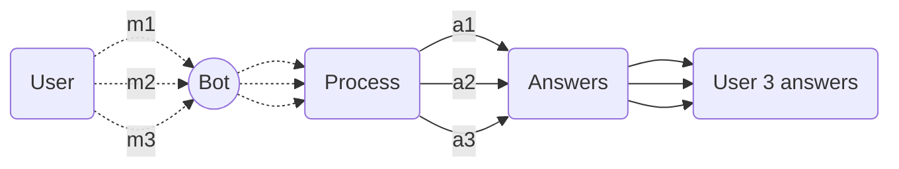
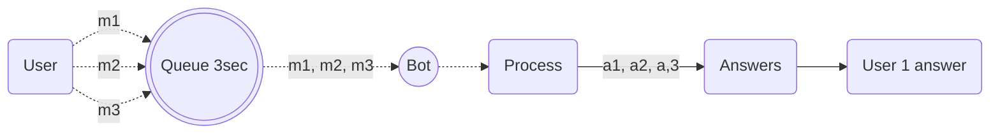

import { Contributors } from '@/components/Contributors'
import { Resources } from '@/components/Resources'
import { Guides } from '@/components/Guides'

export const description = 'Implementar filas de mensagens para uma melhor gestão dos recursos'

# Fast Entires

Em muitos casos, os utilizadores escrevem frequentemente mensagens individuais num curto período de tempo. O comportamento usual do bot é responder a cada mensagem de forma independente, o que pode ser um comportamento irritante em alguns casos de uso.

Para este outro tipo de ambientes, você pode implementar uma funcionalidade que você pode criar para ter uma margem de 3000ms para o Usuário escrever uma mensagem, e cada vez que ele escreve uma mensagem em um tempo inferior a 3000ms ele irá acumular todas as mensagens e, em seguida, após o tempo de Margem, o bot interpretará tudo como uma única conversa.



Aplicando esta aplicação, o que se consegue é que, antes de passar para a fase de processamento, todas as mensagens independentes (3) tornam-se uma (1) e são processadas como uma mensagem independente.

Obrigado __[robmoncayonabux](https://github.com/robmoncayonabux)__ para compartilhar esta solução útil para um caso de uso muito particular.


Neste exemplo, dizemos __3000ms_ _ que é igual a 3 segundos, mas você pode modificar isso ao seu gosto em `MESSAGE_GAP_SECONDS`

<CodeGroup>

```ts {{ title: 'fast-entires.ts' }}
interface Message {
  text: string;
  timestamp: number;
}

const messageQueue: Message[] = [];

const MESSAGE_GAP_SECONDS = 3000;

let messageTimer: NodeJS.Timeout | null = null;

/**
* Adds a message to the queue for later processing.
* @param messageText The text of the message to add to the queue.
* @returns A promise that resolves when the message queue is processed.
*/
async function enqueueMessage(messageText: string): Promise<void> {
  messageQueue.push({ text: messageText, timestamp: Date.now() });

  return new Promise((resolve) => {
      if (messageTimer) {
          clearTimeout(messageTimer);
      }

      messageTimer = setTimeout(() => {
          resolve(processMessageQueue());
      }, MESSAGE_GAP_SECONDS);
  });
}

/**
* Processes the message queue by combining all messages into a single string and clearing the queue.
* @returns The combined string of all messages in the queue.
*/
function processMessageQueue(): string {
  if (messageQueue.length === 0) {
      return '';
  }

  const combinedMessage = messageQueue.map(message => message.text).join(" ");
  messageQueue.length = 0;
  return combinedMessage;
}

export { enqueueMessage, processMessageQueue };
```
```ts {{ title: 'app.ts' }}
import { enqueueMessage } from './utils/fast-entires'

import { createBot, createProvider, createFlow, addKeyword, MemoryDB } from '@bot-whatsapp/bot'
import { BaileysProvider } from '@bot-whatsapp/provider-baileys'

const welcomeFlow = addKeyword<BaileysProvider, MemoryDB>(['hello', 'hi'])
.addAction(async(ctx) => {
  const body = await enqueueMessage(ctx.body) // all message merged!
  console.log(body)
})


const main = async () => {

    const adapterDB = new MemoryDB()
    const adapterFlow = createFlow([welcomeFlow])
    const adapterProvider = createProvider(BaileysProvider)

    adapterProvider.initHttpServer(3000)

    await createBot({
        flow: adapterFlow,
        provider: adapterProvider,
        database: adapterDB,
    })
}

main()
```
</CodeGroup>

Lembre-se de que esta é uma solução alternativa, e é possível que a sua implementação possa ser melhorada.
----

<Guides />

<Resources />

<Contributors users={['leifermendez','robmoncayonabux', 'elimeleth']} />