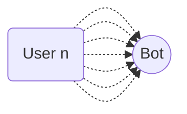

import { Contributors } from '@/components/Contributors'
import { Resources } from '@/components/Resources'
import { Guides } from '@/components/Guides'

export const description = 'Implement message queues for better resource management'

# Queue

## How to implement and manage Queue Limit {{not:'true'}}

A estrutura, por padrão, implementa um gerenciador de filas com base em promessas de trabalho por usuário.
Se já compreende o conceito e se encontra num ambiente em que recebe um número considerável de mensagens recorrentes num curto período de tempo e percebe que responde a um grande número de utilizadores, mas não a todos. Você pode tentar estender a configuração da fila de processos.

__Imagine o caso__ em que recebe mais de 60 mensagens de mais de 60 pessoas num período muito curto de tempo inferior a 20 segundos, por exemplo


É muito provável que ele não responda a todos os usuários, uma vez que a configuração padrão do bot é definida para lidar com uma quantidade menor de processos, mas é muito fácil de modificar.

```bash {{ title: 'app.ts' }}
const main = async () => {

    await createBot({
        database: new MemoryDB(),
        provider: createProvider(BaileysProvider),
        flow: createFlow([...])
    }, {
        queue: {
            timeout: 20000, //👌
            concurrencyLimit: 50 //👌
        }
    })
}
```
----
<Properties>
  <Property name="timeout" type="number">
Número de milissegundos utilizados como duração máxima para a execução de uma função assíncrona. __default 20000__
  </Property>
  <Property name="concurrencyLimit" type="number">
Número de processos paralelos que podem ser executados ao mesmo tempo. __default 15__
  </Property>

</Properties>

---

<Guides />

<Resources />

<Contributors users={['leifermendez','robmoncayonabux', 'elimeleth']} />